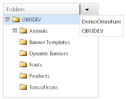
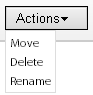
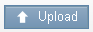
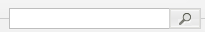
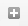
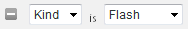
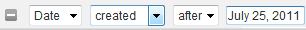

# バナーについて {#about-banners}

バナーを使用して、Webサイト上のバナー広告を管理できます。

## バナーの使用{#concept_5BBE01FEC6134393B43CC917C8CC64DA}

<!-- 

c_about_banners.xml

 -->

Webサイトにバナー広告を追加する方法は2つあります。

1つ目の方法は、ターゲットとSearch&amp;Promoteを使用してバナーを追加する方法です。 バナーは、顧客がWebサイトを検索したときに表示されるHTMLコードスニペットです。 バナーには、GIF、JPEG、PNG形式のテキストまたは画像を含めるか、その両方を組み合わせることができます。 プリセットサイズから選択するか、ページに合わせて独自のカスタムサイズを定義することができます。 バナーの表示に使用するHTMLコードでは、使用するフォントスタイルや境界線などを指定することもできます。 このバナーオファーの追加方法は、基本機能を追加するものであり、追加のソフトウェアは必要ありません。

2つ目の方法は、Dynamic Media ManagementおよびPublishing ServiceのAdobeDynamic Mediaクラシックを使用することです。 有効なAdobeのDynamic Mediaクラシックアカウントを使用すると、Dynamic Mediaクラシックを使用して、ターゲットやSearch&amp;Promoteに直接バナーコンテンツを管理および配信できます。 サイト検索/マーチャンダイジングでは、Dynamic Mediaクラシックアカウントへのアクセスを設定します。 次に、Dynamic Mediaクラシックメディアブラウザを開き、バナーとして使用するダイナミックメディアアセットを選択します。

>[!NOTE]
>
>サイト検索/マーチャンダイジングで動的なメディアアセットをバナーとして使用する前に、アセットは最初にアップロードされ、Scene7パブリッシングシステムでの公開用に準備されます。 サイト検索/マーチャンダイジング内からアセットをアップロードし、Scene7パブリッシングシステムによる投稿の準備を自動的に行わせることができます。 または、すべてのアセットをScene7パブリッシングシステム内からアップロードして公開できます。

## バナーとAdobe Scene7Publishing Systemの統合{#section_D4D7ADEA6A6348E68EDA138E184FE579}

画像、動的バナー、および画像テンプレートやFlashテンプレートなどのテンプレートを含む、サイト検索/マーチャンダイジングでは、Dynamic Mediaクラシックのアセットタイプをバナーとして使用できます。

テンプレートは、Adobe Photoshop®などの画像編集アプリケーションのレイヤーファイルのような、動的に作成され、アドレス指定可能なレイヤー画像ファイルです。 静的な画像ファイルとは異なり、テンプレートにはパラメーターを含めることができます。 パラメータを使用して、可変の画像のプロパティや画像コンテンツをカスタマイズできます。

>[!NOTE]
>
>また、Scene7Publishing Systemの印刷テンプレートを使用して、レイアウトベースのデザインからテンプレートを作成したり、Adobe IllustratorやAdobe InDesignのファイルを作成したりすることもできます。

『Dynamic Mediaクラシック(Scene7)ユーザガイド』の[印刷テンプレート](https://help.adobe.com/en_US/scene7/using/WSFBFBAD30-2694-4b18-B7CE-894F9FC5CDDF.html)を参照してください。

テンプレートには、任意の数の画像レイヤーとテキストレイヤーを含めることができます。 レイヤーPSDファイルなど、レイヤーを含む静的ファイルをテンプレートに変換したり、Dynamic Mediaクラシックでテンプレートを作成したりできます。 Scene7パブリッシングシステムにアップロードしたフォントを使用して、テンプレート内にテキストレイヤーを作成できます。 テンプレートにテキストを追加した後、テキストの位置揃え、フォント、フォントサイズ、色を変更して、書式を設定できます。

Dynamic Mediaクラシックのパラメータ画面を使用して、テンプレートのあらゆる要素をアドレス指定可能なパラメータに変換できます。 その際、使用するレイヤー画像や、テンプレートで使用するテキスト値を変更できます。 パラメータはURL文字列と共に渡され、パラメータを変更することでImage Serverで生成される返信画像を動的にカスタマイズできます。

Dynamic Mediaクラシックを使用してテンプレートを作成し、レイヤーのプロパティをパラメータ化してバナーで使用する方法についても詳しく説明しています。

『Dynamic Mediaクラシック(Scene7)ユーザガイド』の「[基本テンプレート](https://help.adobe.com/en_US/scene7/using/WS60B68844-9054-4099-BF69-3DC998A04D3C.html)」を参照してください。

**アセットのアップロードと公開**

アセットをサイト検索/マーチャンダイジングのバナーで使用するには、Dynamic Mediaクラシックでアップロードして公開する必要があります。 この前提条件には、画像テンプレートまたはFlashテンプレートで使用されるアセットも含まれます。 デジタルアセットのアップロードと公開は、Dynamic Mediaクラシックアカウントを使用して行います。 または、サイト検索/マーチャンダイジングを使用してデジタルアセットをアップロードし、アップロードの設定に基づいて自動的にDynamic Mediaクラシックに公開させることもできます。 アップロードおよび公開されていないアセットを選択しようとすると、操作を続行する前に、ユーザーインターフェイスに通知され、アップロードのオプションが与えられます。

Scene7パブリッシングシステムを使用したデジタルアセットのアップロードと公開についても詳しく説明しています。

『Dynamic Mediaクラシック(Scene7)ユーザガイド』の「[アセットのアップロードと公開](https://help.adobe.com/en_US/scene7/using/WS3673AD39-098B-4f08-8A24-CA51261B7366.html)」を参照してください。

>[!NOTE]
>
>Dynamic Mediaクラシックアセットビューアでアップロード機能を使用するには、使用するDynamic Mediaクラシックアカウントのロールが「SPS会社管理者」に設定済みであることを確認します。

『Dynamic Mediaクラシック(Scene7)ユーザガイド』の「[管理設定](https://help.adobe.com/en_US/scene7/using/WS662101DF-D697-47a7-A7D8-B52FD8E94438.html)」を参照してください。

**ビジネス・ルールを使用したバナー内のDynamic Media・クラシック・テンプレート・パラメータの変更**

Dynamic Media Classicのアセットをバナーとして追加した場合、[!DNL Business Rules]の[!DNL Visual Rule Builder]を使用して、Webサイトの任意のバナー領域に追加できます。 例えば、バナーは他のバナーと同様に、検索結果ページに追加します。 また、Dynamic Mediaクラシックテンプレートの初期設定のパラメータ値を、必要に応じてカスタマイズすることで上書きすることもできます。 この機能を使用すると、様々なマーケティングメッセージや異なるエンドポイントへのハイパーリンクを使用して、Dynamic Mediaクラシックテンプレートをカスタマイズできます。

「[新しいビジネスルールの追加](../c-about-rules-menu/c-about-business-rules.md#task_BD3B31ED48BB4B1B8F1DCD3BFA2528E7)」も参照してください。

「[ビジネスルールの編集](../c-about-rules-menu/c-about-business-rules.md#task_375CFA75D1D94D9E92A35DE1228E5087)」も参照してください。

## バナーの追加{#task_549D02B5F73B4158B105A94E39D937B7}

[!DNL Banners]を使って、バナー広告とWebサイト上の広告の配置場所を管理できます。 バナーを追加すると、検索時に表示されるHTMLコードスニペットを使用して画像を外部参照します。

<!-- 

t_adding_a_new_banner.xml

 -->

有効なAdobeのDynamic Mediaクラシックアカウントをお持ちの場合は、Scene7パブリッシングシステムを介してバナー広告を追加できます。

「AdobeDynamic Mediaクラシック](../c-about-design-menu/c-about-banners.md#task_AD1E0C00A9E04B1FA819EB93288786B3)を使用したバナーの追加」を参照してください。[

「[AdobeのDynamic Mediaクラシックアカウントへのアクセスを設定する](../c-about-settings-menu/c-about-account-options-menu.md#task_CEFF88C2033D41D0B2FE86C435EDAC6D)」を参照してください。

**バナーを追加するには**

1. 製品メニューで、**[!UICONTROL Design]**/**[!UICONTROL Banners]**&#x200B;をクリックします。
1. [!DNL Banners]ページの&#x200B;**[!UICONTROL Add Banner]**&#x200B;ドロップダウンリストで、**[!UICONTROL HTML code]**&#x200B;を選択します。
1. [!DNL Add Banner]ダイアログボックスで、必要なオプションを設定します。

   <table> 
    <thead> 
      <tr> 
      <th colname="col1" class="entry"> 
オプション 
 </th> 
      <th colname="col2" class="entry"> 
説明 
 </th> 
      </tr> 
    </thead>
    <tbody> 
      <tr> 
      <td colname="col1"> 
名前 
 </td> 
      <td colname="col2"> 
必須。バナーの名前を識別します。 バナーをビジネスルールのビジュアルルールビルダーで追加するとき、バナーの名前を使用してバナーを参照します。 名前はバナーに表示されません。 
 
「<a href="../c-about-rules-menu/c-about-business-rules.md#task_BD3B31ED48BB4B1B8F1DCD3BFA2528E7" type="task" format="dita" scope="local">新しいビジネスルールの追加」を参照してください。</a> 
 </td> 
      </tr> 
      <tr> 
      <td colname="col1"> 
バナーHTML 
 </td> 
      <td colname="col2"> 
 バナーに関連付けられたHTMLコードを貼り付けることができます。 
 
HTMLコードは、 
        <code>
          &lt;style&gt; 
        </code>タグまたは 
        <code>
          &lt;script&gt; 
        </code>タグ。 例えば、次のコードブロックは、横置きの上部タイプのテキストバナー用です。<code> &lt;div&nbsp;style="width:&nbsp;684px;&nbsp;background-image:&nbsp;url('https://www.brough.com/blackb.gif');&nbsp; 
          padding-top:&nbsp;10px;&nbsp;padding-bottom:&nbsp;10px;&nbsp;color:&nbsp;white;&nbsp;font-family:&nbsp;verdana;&nbsp; 
          text-align:&nbsp;center;&nbsp;font-size:&nbsp;20px;"&gt;&nbsp;Sound&nbsp;Study&nbsp;ships&nbsp;free!&nbsp;&lt;/div&gt; </code>次の例では、コードのブロックはフルスプラッシュ画像用です。<code> &lt;img&amp;nbsp;src='https://geometrixx.com/images/GEOAds/geometrixx-beauty-home-01.jpg'&amp;nbsp;border="0"&amp;nbsp;/&gt; </code> 
 </td> 
      </tr> 
      <tr> 
      <td colname="col1"> 
タイプ 
 </td> 
      <td colname="col2"> 
次の種類のバナーを指定します。 
        <ul id="ul_6423AEDB9E664049989EB529D63C4A62"> 
          <li id="li_BF6CD60B3ED748D49CFFB9C5D607661C">  [新しいタイプ]   
サイズや名前など、必要なバナーの種類を指定できます。 
 </li> 
          <li id="li_1A29AB22AD644E60A12298187B5E898E">  フルスプラッシュ   
このタイプのバナーの設定寸法は、幅が680ピクセル、高さが650ピクセルです。 オプションで種類の名前を指定するか、バナーの種類自体の名前をデフォルトの名前にすることができます。 
 </li> 
          <li id="li_2BE06D013CB54DDE851051BFC038BB57">  水平上   
 バナーはWebサイトの上部に配置されます。 このタイプは、バナーの左または右にハイパーリンクを追加する場合に便利です。 このタイプのバナーの設定寸法は、幅が468ピクセル、高さが60ピクセルです。 オプションで種類の名前を指定するか、バナーの種類自体の名前をデフォルトの名前にすることができます。 
 </li> 
          <li id="li_EC35AB92234749F08AA8A9BD26D0EA8D">  水平上部 — 全幅   
このタイプは、新しいバナーを追加した場合のデフォルトです。 バナーはWebサイトの上部に配置され、ページの幅いっぱいに表示されます。 このタイプのバナーの設定寸法は、幅が670ピクセル、高さが150ピクセルです。 オプションで種類の名前を指定するか、バナーの種類自体の名前をデフォルトの名前にすることができます。 
 </li> 
        </ul> 
 </td> 
      </tr> 
      <tr> 
      <td colname="col1"> 
タグ 
 </td> 
      <td colname="col2"> 
バナーに関連付けるタグまたは「キーワード」を追加します。 多数のバナーを使用する場合、タグを追加すると、バナーの検索を絞り込むのに役立ち、必要に応じて適切なバナーをすばやく見つけることができます。 追加したタグを削除することもできます。 
 </td> 
      </tr> 
    </tbody> 
    </table>

1. クリック **[!UICONTROL Save]**.
1. （オプション）次のいずれかの操作を行います。

   * **[!UICONTROL History]**&#x200B;をクリックして、行った変更を元に戻します。

      [「履歴」オプションの使用](../t-using-the-history-option.md#task_70DD3F87A67242BBBD2CB27156F43002)を参照してください。

   * クリック **[!UICONTROL Live]**.

      [ライブ設定の表示](../c-about-staging.md#task_401A0EBDB5DB4D4CA933CBA7BECDC10F)を参照してください。

   * クリック **[!UICONTROL Push Live]**.

      [プッシュステージ設定をライブにする](../c-about-staging.md#task_44306783B4C0408AAA58B471DAF2D9A4)を参照してください。

## バナーの編集{#task_D4081083BE7B40F5A003D1A2F1435AEA}

[!DNL Edit Banner]を使用して、バナー名、バナーHTML、バナーのタイプ、関連するタグなどを変更します。

<!-- 

t_editing_a_banner.xml

 -->

サイト検索とマーチャンダイジングを使用してバナーを追加した場合は、AdobeDynamic Mediaクラシックを使用してバナーを編集することもできます。

「AdobeDynamic Mediaクラシック](../c-about-design-menu/c-about-banners.md#task_C3E782477FBF428ABEA220751781ACA9)を使用したバナーの編集」も参照してください。[

**バナーを編集するには**

1. 製品メニューで、**[!UICONTROL Design]**/**[!UICONTROL Banners]**&#x200B;をクリックします。
1. [!DNL Banners]ページで、をクリックします。

   編集するバナーサムネールの上に配置します。
1. [!DNL Edit Banner]ページで、必要なオプションを設定します。

   [バナーの追加](../c-about-design-menu/c-about-banners.md#task_549D02B5F73B4158B105A94E39D937B7)のオプションの表を参照してください。
1. バナーの編集が終了したら、「**[!UICONTROL Save]**」をクリックします。
1. （オプション）次のいずれかの操作を行います。

   * **[!UICONTROL History]**&#x200B;をクリックして、行った変更を元に戻します。

      [「履歴」オプションの使用](../t-using-the-history-option.md#task_70DD3F87A67242BBBD2CB27156F43002)を参照してください。

   * クリック **[!UICONTROL Live]**.

      [ライブ設定の表示](../c-about-staging.md#task_401A0EBDB5DB4D4CA933CBA7BECDC10F)を参照してください。

   * クリック **[!UICONTROL Push Live]**.

      [プッシュステージ設定をライブにする](../c-about-staging.md#task_44306783B4C0408AAA58B471DAF2D9A4)を参照してください。

## AdobeDynamic Mediaクラシック{#task_AD1E0C00A9E04B1FA819EB93288786B3}を使用したバナーの追加

[!DNL Banners]を使ってWebサイトのバナー広告を管理できます。 AdobeDynamic Mediaクラシックを使用してバナーを追加する場合、Scene7パブリッシングシステムにアップロードした任意のデジタルアセットから選択できます。

<!-- 

t_adding_a_banner_using_adobe_scene7.xml

 -->

AdobeDynamic Mediaクラシックを使用してバナーを追加するには、有効なDynamic Mediaクラシックアカウントへのアクセスが設定されていることを確認してください。

「[AdobeのDynamic Mediaクラシックアカウントへのアクセスを設定する](../c-about-settings-menu/c-about-account-options-menu.md#task_CEFF88C2033D41D0B2FE86C435EDAC6D)」を参照してください。

**AdobeDynamic Mediaクラシックを使用してバナーを追加するには**

1. 製品メニューで&#x200B;**[!UICONTROL Design]**/**[!UICONTROL Banners.]**&#x200B;をクリックします
1. [!DNL Banners]ページの&#x200B;**[!UICONTROL Add Banner]**&#x200B;ドロップダウンリストで、**[!UICONTROL Adobe Scene7]**&#x200B;をクリックします。
1. [!DNL Pick an Asset]ダイアログボックスの左ペインで、ユーザーインターフェイスのナビゲーションオプションを使用して、バナーに使用するデジタルアセットが格納されているフォルダーを探します。

   アセットナビゲーションオプションを除き、その他のすべてのオプションは、追加または編集のために選択したデジタルアセットに依存します。

   サイト検索/マーチャンダイジングの新しいバナーに使用するアセットを見つけるには、アセットナビゲーションオプションを使用します。 ナビゲーションオプションは、選択したすべての種類のデジタルアセットに適用されます。

   >[!NOTE]
   >
   >[!DNL Change Parameters]ダイアログボックスのバナーを編集すると、アセットのナビゲーションオプションは表示されません。

   「AdobeDynamic Mediaクラシック](../c-about-design-menu/c-about-banners.md#task_C3E782477FBF428ABEA220751781ACA9)を使用したバナーの編集」を参照してください。[

   **アセットナビゲーションオプション**

   <table> 
    <thead> 
      <tr> 
      <th colname="col1" class="entry"> 
ナビゲーションオプション 
 </th> 
      <th colname="col2" class="entry"> 
説明 
 </th> 
      </tr> 
    </thead>
    <tbody> 
      <tr> 
      <td colname="col1"> 
  
 </td> 
      <td colname="col2"> 
特定の会社のDynamic Mediaクラシックアカウントをドロップダウンリストから選択し、そのアカウント内のデジタルアセットフォルダーに移動できます。 
 
フォルダを選択すると、アセットを選択ダイアログボックスの右側のウィンドウに、そのフォルダに含まれる使用可能なデジタルアセットがすべて表示されます。 
 </td> 
      </tr> 
      <tr> 
      <td colname="col1"> 
  
 </td> 
      <td colname="col2"> 
フォルダーナビゲーション履歴を前後に移動できます。 
 </td> 
      </tr> 
      <tr> 
      <td colname="col1"> 
  
 </td> 
      <td colname="col2"> 
選択したフォルダーに表示されているデジタルアセットのリストを更新します。 
 
アクションドロップダウンリストを使用して選択したアセットを移動、削除、名前変更する場合は、このコントロールをクリックする必要があります。 
 </td> 
      </tr> 
      <tr> 
      <td colname="col1"> 
  
 </td> 
      <td colname="col2"> 
デジタルアセットをリスト表示で表示します。 リストには、各アセットの関連するアイコンまたはサムネール画像、ファイル名、デジタルアセットタイプ、サイズ、（該当する場合）および最後に編集された日付が表示されます。 
 
グリッド表示には、選択したフォルダー内のデジタルアセットが、アイコン、サムネールまたはその両方として表示されます。 
 </td> 
      </tr> 
      <tr> 
      <td colname="col1"> 
  
 </td> 
      <td colname="col2"> 
リスト表示では、選択したデジタルアセットを移動、削除または名前変更できます。 
 
グリッド表示では、選択した1つ以上のデジタルアセットを移動または削除できます。 
 </td> 
      </tr> 
      <tr> 
      <td colname="col1"> 
  
 </td> 
      <td colname="col2"> 
アップロードダイアログボックスを開き、選択したデジタルアセットをデスクトップまたは外部サーバーからアップロードして、バナーとして使用できるようにします。 
 
アセットをアップロードすると、公開ジョブが自動的にScene7公開システムにスケジュールされます。 
 
<a href="../c-about-design-menu/c-about-banners.md#task_AD1E0C00A9E04B1FA819EB93288786B3" type="reference" format="dita" scope="local">AdobeDynamic Mediaクラシック</a>を使用したバナーの追加のオプションの表を参照してください。 
 
Scene7パブリッシングシステムを使用したデジタルアセットのアップロードと公開についても詳しく説明しています。 
 
『Scene7パブリッシングシステムユーザガイド』の「<a href="https://help.adobe.com/en_US/scene7/using/WS3673AD39-098B-4f08-8A24-CA51261B7366.html" scope="external" format="html">アセットのアップロードと公開</a>」を参照してください。 
 </td> 
      </tr> 
      <tr> 
      <td colname="col1"> 
  
 </td> 
      <td colname="col2"> 
デジタルアセットをキーワードで検索したり、選択したフォルダー内のファイルの場所や関連付けられたサブフォルダーで検索したりできます。 
 
検索フィールドをクリックすると、オプションのフィルターフィールドが自動的に追加されます。 
 </td> 
      </tr> 
      <tr> 
      <td colname="col1"> 
  
 </td> 
      <td colname="col2"> 
別のアセットフィルターを追加して、種類別または特定の日付別に、表示されるデジタルアセットのリストをさらに絞り込むことができます。 
 </td> 
      </tr> 
      <tr> 
      <td colname="col1"> 
  
 </td> 
      <td colname="col2"> 
表示するデジタルアセットのリストを絞り込み、Flash、画像、テンプレート、任意など特定の種類のアセットのみを表示します。 
 
をクリックして、検索からフィルターを削除します。 
 </td> 
      </tr> 
      <tr> 
      <td colname="col1"> 
  
 </td> 
      <td colname="col2"> 
表示するデジタルアセットのリストを絞り込み、特定の日付より前または特定の日付より後に作成または編集されたアセットのみを表示します。 
 
をクリックして、検索からフィルターを削除します。 
 </td> 
      </tr> 
      <tr> 
      <td colname="col1"> 
  
 </td> 
      <td colname="col2"> 
スライダを左右にドラッグして、デジタルアセットパネルの表示全体を拡大または縮小できます。 
 </td> 
      </tr> 
    </tbody> 
    </table>

   **プロパティのオプション**

   Flashテンプレート、画像テンプレートまたは画像を選択すると、「プロパティ」オプションが表示されます。 選択したデジタルアセットに応じて、一部のオプションを使用できるわけではありません。

   <table> 
    <thead> 
      <tr> 
      <th colname="col1" class="entry"> 
プロパティオプション 
 </th> 
      <th colname="col2" class="entry"> 
説明 
 </th> 
      </tr> 
    </thead>
    <tbody> 
      <tr> 
      <td colname="col1"> 
名前 
 </td> 
      <td colname="col2"> 
テンプレートまたは画像のわかりやすい名前（空白は除く）。 ユーザがアセットをさらに識別しやすいように、名前に画像サイズを含めることもできます。 
 </td> 
      </tr> 
      <tr> 
      <td colname="col1"> 
形式 
 </td> 
      <td colname="col2"> 
画像または画像テンプレートの形式を指定します。 
 
次の形式から選択できます。 
 
        <ul id="ul_9A19421BCC424CF585645049DCB87F10"> 
        <li id="li_A4913D783BD547F9AFA1A259C56EC2B3">jpeg </li> 
        <li id="li_66237D7BE8754FB0B0088CE5A02C0214">png </li> 
        <li id="li_4EDDFD7C8AB04677BEC20EFC9AEBBF1F">png-alpha </li> 
        <li id="li_4FCB03C29AE647ACBAF5105016DF7579">gif </li> 
        <li id="li_B884BD7DFF1845FAA9C58EF09B888A77">gif-alpha </li> 
        </ul> 
このオプションは、Flashテンプレートには適用されません。 
 </td> 
      </tr> 
      <tr> 
      <td colname="col1"> 
クォリティ 
 </td> 
      <td colname="col2"> 
JPEGまたはGIF形式の画像の圧縮レベルを制御します。 この設定は、ファイルサイズと画質の両方に影響します。 画質は1～100です。 
 
スライダを左右にドラッグすると、プレビューウィンドウの画像が更新され、画質の変化が反映されます。 
 
このオプションは、Flashテンプレートには適用されません。 
 </td> 
      </tr> 
      <tr> 
      <td colname="col1"> 
幅 
 </td> 
      <td colname="col2"> 
デジタルアセットの幅をピクセル単位で指定します。 このディメンションは、Webサイトを訪問した顧客がアセットを表示する幅です。 
 
このオプションは、Flashテンプレートには適用されません。 
 </td> 
      </tr> 
      <tr> 
      <td colname="col1"> 
高さ 
 </td> 
      <td colname="col2"> 
デジタルアセットの高さをピクセル単位で指定します。 このディメンションは、Webサイトを訪問した顧客がアセットを表示する高さです。 
 
このオプションは、Flashテンプレートには適用されません。 
 </td> 
      </tr> 
    </tbody> 
    </table>

   **バナーリンクのオプション**

   「バナーリンク」オプションは、バナーの画像または画像テンプレートを選択した場合にのみ表示されます。

   <table> 
    <thead> 
      <tr> 
      <th colname="col1" class="entry"> 
バナーリンクオプション 
 </th> 
      <th colname="col2" class="entry"> 
説明 
 </th> 
      </tr> 
    </thead>
    <tbody> 
      <tr> 
      <td colname="col1"> 
リンク URL 
 </td> 
      <td colname="col2"> 
顧客が画像をクリックしたときにバナーのリンク先となるURLアドレスを指定します。 
 
バナーをリンクしない場合は、「リンクURL」フィールドを空欄にします。 
 </td> 
      </tr> 
      <tr> 
      <td colname="col1"> 
Target 
 </td> 
      <td colname="col2"> 
新しいブラウザーウィンドウや新しいタブなど、リンクされたバナーを開く場所を指定します。 
 </td> 
      </tr> 
    </tbody> 
    </table>

   **リンクの変更オプション**

   「リンクを変更」オプションは、バナーのFlashテンプレートを選択した場合にのみ表示されます。

   <table> 
    <thead> 
      <tr> 
      <th colname="col1" class="entry"> 
リンクの変更オプション 
 </th> 
      <th colname="col2" class="entry"> 
説明 
 </th> 
      </tr> 
    </thead>
    <tbody> 
      <tr> 
      <td colname="col1"> 
  
 </td> 
      <td colname="col2"> 
Flashテンプレートで使用されているURLリンクフィールドを編集できます。 
 </td> 
      </tr> 
    </tbody> 
    </table>

   **テキストを置換オプション**

   「テキストを置換」オプションは、編集可能なテキストレイヤーを含むバナーのFlashテンプレートを選択した場合にのみ表示されます。

   Flashテンプレート内のテキストに対して行った変更は、プレビューウィンドウに反映されます。

   >[!NOTE]
   >
   >「cow」を「apple」に置き換える検索および置換コマンドを追加し、次に「apple」を「orange」に置き換える2番目のコマンドを作成した場合、2番目のコマンドは有効になりません。

   <table> 
    <thead> 
      <tr> 
      <th colname="col1" class="entry"> 
「テキストを置換」オプション 
 </th> 
      <th colname="col2" class="entry"> 
説明 
 </th> 
      </tr> 
    </thead>
    <tbody> 
      <tr> 
      <td colname="col1"> 
  
 </td> 
      <td colname="col2"> 
検索と置換のフィールドを追加します。 
 </td> 
      </tr> 
      <tr> 
      <td colname="col1"> 
  
 </td> 
      <td colname="col2"> 
「検索と置換」フィールドを削除し、以前に使用したテキストを復元します。 
 </td> 
      </tr> 
      <tr> 
      <td colname="col1"> 
検索 
 </td> 
      <td colname="col2"> 
Flashテンプレートのレイヤー内の、リンクされていないテキストの検索語を入力できます。 
 </td> 
      </tr> 
      <tr> 
      <td colname="col1"> 
Replace 
 </td> 
      <td colname="col2"> 
検索するテキストの代わりに挿入するテキストを指定できます。 
 
このフィールドで Enter キーを押すと、プレビューーウィンドウが更新され、置換後のテキストが表示されます。 
 </td> 
      </tr> 
    </tbody> 
    </table>

   **パラメーターオプション**

   「パラメータ」オプションは、バナーに対して画像テンプレートまたはFlashテンプレートを選択した場合にのみ表示されます。 実際のパラメーターのオプションは、Scene7Publishing Systemでテンプレートを作成しパラメータ化した方法によって異なります。 例えば、テンプレートをパラメータ化して、テキスト、フォントスタイル、価格、送料無料に使用する特別コード、バナー内の画像のサイズ、使用する別の画像を参照するなどの変更を可能にする場合があります。

   >[!NOTE]
   >
   >パラメーターに対して行った変更は、ビジネスルールによって上書きされる可能性があることに注意してください。 パラメーターは、デフォルトとして機能します。デフォルトとして機能するのは、パラメーターを変更するビジネスルールが作成されていない場合のみです。

   「[新しいビジネスルールの追加](../c-about-rules-menu/c-about-business-rules.md#task_BD3B31ED48BB4B1B8F1DCD3BFA2528E7)」を参照してください。

   「[ビジネスルールの編集](../c-about-rules-menu/c-about-business-rules.md#task_375CFA75D1D94D9E92A35DE1228E5087)」を参照してください。

   **レイヤーの表示/非表示の切り替えオプション**

   「レイヤーの表示/非表示を切り替え」オプションは、バナーのFlashテンプレートを選択した場合にのみ適用されます。

   <table> 
    <thead> 
      <tr> 
      <th colname="col1" class="entry"> 
レイヤーの表示/非表示の切り替えオプション 
 </th> 
      <th colname="col2" class="entry"> 
説明 
 </th> 
      </tr> 
    </thead>
    <tbody> 
      <tr> 
      <td colname="col1"> 
  
 </td> 
      <td colname="col2"> 
Flashテンプレートファイルを構成する様々なレイヤーの表示/非表示を切り替えます。 
 
レイヤの表示/非表示を切り替えるたびに、プレビューウィンドウが更新され、表示が更新されます。 
 </td> 
      </tr> 
    </tbody> 
    </table>

   （オプション）バナーに使用するデジタルアセットが、選択したフォルダーで使用できない場合は、アップロードが必要な場合があります。 **[!UICONTROL Upload]**&#x200B;をクリックし、目的のファイルとオプションを選択します。 ファイルが選択したフォルダーにアップロードされます。

   >[!NOTE]
   >
   >Scene7アセットビューアでアップロード機能を使用する場合は、使用するScene7アカウントに、「SPS会社管理者」というロールが既に設定されていることを確認してください。

   『Scene7パブリッシングシステムユーザガイド』の「[管理設定](https://help.adobe.com/en_US/scene7/using/WS662101DF-D697-47a7-A7D8-B52FD8E94438.html)」を参照してください。

   **基本オプション**

   <table> 
    <thead> 
      <tr> 
      <th colname="col1" class="entry"> 
オプション 
 </th> 
      <th colname="col2" class="entry"> 
説明 
 </th> 
      </tr> 
    </thead>
    <tbody> 
      <tr> 
      <td colname="col1"> 
参照 
 </td> 
      <td colname="col2"> 
 アップロード、公開、バナーとしての使用を選択するファイルを参照できます。 
 </td> 
      </tr> 
      <tr> 
      <td colname="col1"> 
 上書き 
 </td> 
      <td colname="col2"> 
アップロードしたファイルは、選択したフォルダ内にある同じファイル名の既存のファイルと置き換えられます。 
 </td> 
      </tr> 
      <tr> 
      <td colname="col1"> 
電子メールの設定 
 </td> 
      <td colname="col2"> 
 アップロードに関して受け取る電子メール通知を選択できます。また、アップロードジョブに関連する通知を受け取らないようにすることもできます。 
 </td> 
      </tr> 
    </tbody> 
    </table>

   **詳細オプション**

   PostScript(EPS)画像ファイルまたはIllustrator(AI)画像ファイルをアップロードする場合、様々な方法でそれらのファイルをフォーマットできます。 ファイルをラスタライズし、印刷テンプレート用にFXGに変換し、透明な背景を維持し、解像度を選択し、カラースペースを選択することができます。

   PSD(Photoshopドキュメントファイル)は、Dynamic Mediaクラシックでテンプレートを作成する際に最もよく使用されるファイルです。 PSDファイルをアップロードする場合、ファイルから自動的にDynamic Mediaクラシックテンプレートを作成できます（**[!UICONTROL Create Template]**&#x200B;オプションを選択）。

   Scene7Publishing Systemでは、ファイルを使用してテンプレートを作成すると、レイヤーを持つPSDファイルから複数の画像が作成されます。各レイヤーに対して1つのイメージが作成されます。

   <table> 
    <thead> 
      <tr> 
      <th colname="col1" class="entry"> 
オプショングループ名 
 </th> 
      <th colname="col02" class="entry"> 
オプション 
 </th> 
      <th colname="col2" class="entry"> 
説明 
 </th> 
      </tr> 
    </thead>
    <tbody> 
      <tr> 
      <td colname="col1"> 
カラープロファイルオプション 
 </td> 
      <td colname="col02"> 
カラープロファイル 
 </td> 
      <td colname="col2"> 
 次のオプションから選択できます。 
 
        <ul id="ul_6927BC08CA2647EDB2C85DAD2B82AE31"> 
        <li id="li_CA3F44FF9C0F4CE987DCB0AF9303C2E4">  SRGBに変換   
SRGB(Standard Red Green Blue)に変換します。 Webページに画像を表示する場合のカラースペースには、SRGBを使用することをお勧めします。 
 </li> 
        <li id="li_FCCEE6B14CCD4246ADA152932010ABF1">  元のカラースペースを保持   
元のカラースペースが保持されます。 
 </li> 
        </ul> </td> 
      </tr> 
      <tr> 
      <td colname="col1"> 
画像編集オプション 
 </td> 
      <td colname="col02"> 
クリッピングパスからマスクを作成 
 </td> 
      <td colname="col2"> 
画像のクリッピングパス情報に基づいて、画像のマスクを作成します。 このオプションは、画像編集アプリケーションで作成された画像で、クリッピングパスが作成されたものに適用されます。 
 </td> 
      </tr> 
      <tr> 
      <td colname="col1"> 
PostScriptオプション 
 
Illustratorオプション 
 </td> 
      <td colname="col02"> 
処理中 
 </td> 
      <td colname="col2"> 
  「ラスタライズ」  オプションを選択すると、ファイル内のベクトルグラフィックがビットマップ形式に変換されます。 
 </td> 
      </tr> 
      <tr> 
      <td colname="col1"> 
 Postscriptオプション 
 
Illustratorオプション 
 </td> 
      <td colname="col02"> 
 解像度 
 </td> 
      <td colname="col2"> 
 解像度設定を指定します。 この設定は、ファイルの1インチあたりに表示されるピクセル数(ppi)を決定します。 デフォルトは 150 です。 
 </td> 
      </tr> 
      <tr> 
      <td colname="col1"> 
 PostScriptオプション 
 
Illustratorオプション 
 </td> 
      <td colname="col02"> 
 カラースペース 
 </td> 
      <td colname="col2"> 
Illustratorファイルのカラースペースを選択できます。 RGBカラースペースは、オンライン表示に適しています。 
 
次のカラースペースオプションから選択できます。 
 
        <ul id="ul_0E83E2762A574480B243F963A7FB2ACD"> 
        <li id="li_B9FEC7D220D04CCABACD30839051DAE4">  自動検出   
 PDFファイルのカラースペースが保持されます。 
 </li> 
        <li id="li_ED0EB3B12BCF41C7AFC435447010B6FF">  RGBとしてレンダリング   
 RGBカラースペースに変換します。 
 </li> 
        <li id="li_3FB5DD8887C540BC97148A4D63B38F72">  CMYKとしてレンダリング   
 CMYKカラースペースに変換します。 
 </li> 
        <li id="li_6C018D3A4B254880AD41896E9F4AF3D9">  グレースケールとして強制   
 グレースケールカラースペースに変換します。 
 </li> 
        </ul> </td> 
      </tr> 
      <tr> 
      <td colname="col1"> 
 PostScriptオプション 
 
Illustratorオプション 
 </td> 
      <td colname="col02"> 
 透明な背景を維持 
 </td> 
      <td colname="col2"> 
ファイルの背景の透明度を維持します。 
 </td> 
      </tr> 
      <tr> 
      <td colname="col1"> 
Photoshopオプション 
 </td> 
      <td colname="col02"> 
 レイヤーを維持 
 </td> 
      <td colname="col2"> 
PSDにレイヤーがある場合は、そのレイヤーを個別のアセットにリッピングします。 アセットレイヤーとPSDとの関連付けは維持されます。 
 </td> 
      </tr> 
      <tr> 
      <td colname="col1"> 
 Photoshopオプション 
 </td> 
      <td colname="col02"> 
テンプレートの作成 
 </td> 
      <td colname="col2"> 
 PSDファイルのレイヤーからテンプレートを作成します。 
 </td> 
      </tr> 
      <tr> 
      <td colname="col1"> 
 Photoshopオプション 
 </td> 
      <td colname="col02"> 
 テキストを抽出 
 </td> 
      <td colname="col2"> 
 顧客がバナー内でキーワードを検索できるように、テキストを抽出します。 
 </td> 
      </tr> 
      <tr> 
      <td colname="col1"> 
Photoshopオプション 
 </td> 
      <td colname="col02"> 
 レイヤーを拡張 
 </td> 
      <td colname="col2"> 
リッピングされた画像レイヤーを背景レイヤーのサイズに拡大します。 
 </td> 
      </tr> 
      <tr> 
      <td colname="col1"> 
Photoshopオプション 
 </td> 
      <td colname="col02"> 
 レイヤー名 
 </td> 
      <td colname="col2"> 
PSDファイル内のレイヤーは、個別の画像としてアップロードされます。 以下のオプションから選択して、Scene7パブリッシングシステムでこれらの画像に名前を付ける方法を決定できます。 
 
        <ul id="ul_C2A25177A07740CA90B32C638304D39F"> 
        <li id="li_477D5BFF7238454BBF0E04B22DE378F7">  PSDファイルのレイヤー名を使用   
PSDファイル内のレイヤー名が画像名になります。 例えば、元のPSDファイルで価格タグという名前のレイヤーは、価格タグという名前の画像になります。 ただし、PSDファイルのレイヤー名が初期設定のPhotoshopレイヤー名（背景、レイヤー1、レイヤー2など）の場合、画像名は、初期設定のレイヤー名ではなく、PSDファイルのレイヤー番号に従って付けられます。 
 </li> 
        <li id="li_EB4173B884FC41328CFBDE27DA6D43AA">  PSDファイル名と付加番号を使用   
PSDファイルのレイヤー番号が画像名になり、元のレイヤー名は無視されます。 画像には、Photoshopのファイル名とレイヤー番号を付けて名前を付けます。 例えば、 Spring Ad.psd というファイルの2番目のレイヤーは、Photoshopにデフォルト以外の名前が付けられていた場合でも、 Spring Ad_2 という名前が付けられます。 
 </li> 
        <li id="li_10B2D2DE2FD24BD08DB56D1D95ABA53D">  PSDファイル名とレイヤー名または番号を使用   
画像には、PSDファイルの後にレイヤー名またはレイヤー番号が続く名前が付けられます。 PSDファイル内のレイヤー名が初期設定のPhotoshopレイヤー名の場合は、レイヤー番号が使用されます。 例えば、 SpringAd というPSDファイル内の Price Tag という名前のレイヤーには、 Spring Ad_Price Tag という名前が付けられます。 レイヤー2 レイヤー2 のデフォルト名を持つレイヤーは、 Spring Ad_2 という名前が付けられます。 
 </li> 
        <li id="li_5E57AC0719D4484B9C9BD14DB42B4455">  PSDファイル名に基づいたフォルダの作成   
PSDのファイル名を使用して、レイヤー画像のフォルダーを作成します。 
 </li> 
        </ul> </td> 
      </tr> 
      <tr> 
      <td colname="col1"> 
Photoshopオプション 
 </td> 
      <td colname="col02"> 
アンカー 
 </td> 
      <td colname="col2"> 
PSDファイルから作成されたレイヤーコンポジションから生成されたテンプレートに画像をアンカーする方法を指定します。 
 
デフォルトでは、アンカーが中央に配置されます。 中央のアンカーを使用すると、置換画像の縦横比に関係なく、置換画像を同じスペースに最も適切に埋めることができます。 この画像を置き換える縦横比が異なる画像は、テンプレートを参照し、パラメータの置き換えを使用する場合、同じスペースを効果的に占有します。 アプリケーションで、テンプレートに割り当てられたスペースを置換画像が埋める必要がある場合は、別の設定に変更します。 
 </td> 
      </tr> 
      <tr> 
      <td colname="col1"> 
PDFオプション 
 </td> 
      <td colname="col02"> 
処理中 
 </td> 
      <td colname="col2"> 
  「ラスタライズ」  オプションを選択すると、PDFファイルのページがリッピングされ、ベクトルグラフィックがビットマップ画像に変換されます。  
        <!--Choose this option to create an eCatalog. (This option is thedefault.)--> 
 </td> 
      </tr> 
      <tr> 
      <td colname="col1"> 
PDFオプション 
 </td> 
      <td colname="col02"> 
 解像度 
 </td> 
      <td colname="col2"> 
解像度設定を指定します。 この設定は、PDFファイルで表示する1インチあたりのピクセル数(ppi)を指定します。 デフォルトは 150 です。 
 </td> 
      </tr> 
      <tr> 
      <td colname="col1"> 
PDFオプション 
 </td> 
      <td colname="col02"> 
 カラースペース 
 </td> 
      <td colname="col2"> 
PDFファイルのカラースペースを選択できます。 ほとんどのPDFファイルには、RGBとCMYKの両方のカラー画像が含まれています。 RGBカラースペースは、オンライン表示に適しています。 
 
次のカラースペースオプションから選択できます。 
 
        <ul id="ul_44A8C39DEB21473F9375E3962F14D3C6"> 
        <li id="li_1046FA0017934C5EB7C0100F8F78507D">  自動検出   
 PDFファイルのカラースペースが保持されます。 
 </li> 
        <li id="li_561CCF705EDD451993D2DA2EB33F05F7">  RGBとしてレンダリング   
 RGBカラースペースに変換します。 
 </li> 
        <li id="li_D9E8CF61C40140979484EDEF7DAD2C44">  CMYKとしてレンダリング   
 CMYKカラースペースに変換します。 
 </li> 
        <li id="li_F3606B45C0F84BA594263EA12243F67A">  グレースケールとして強制   
 グレースケールカラースペースに変換します。 
 </li> 
        </ul> </td> 
      </tr> 
      <tr> 
      <td colname="col1"> 
PDFオプション 
 </td> 
      <td colname="col02"> 
複数ページのPDFからeCatalogを自動生成 
 </td> 
      <td colname="col2"> 
 PDFファイルからeCatalogを自動的に作成します。 eCatalogの名前は、アップロードしたPDFファイルに従って付けられます。 
 </td> 
      </tr> 
      <tr> 
      <td colname="col1"> 
 PDFオプション 
 </td> 
      <td colname="col02"> 
キーワードの抽出 
 </td> 
      <td colname="col2"> 
PDFファイルから単語を抽出し、キーワードでファイルを検索できるようにします。 
 </td> 
      </tr> 
    </tbody> 
    </table>

1. 右側のウィンドウで、目的の画像、Flashまたはテンプレートファイルをクリックします。

   [!DNL Pick An Asset]ポップアップウィンドウが表示されます。
1. （オプション）[!DNL Pick An Asset]ポップアップウィンドウの[!DNL Actions]ドロップダウンリストで、次のいずれかの操作を行います。

   * クリック **[!UICONTROL Move]**. [!DNL Select a folder to move to]ダイアログボックスで、デジタルアセットを移動するフォルダーを選択します。 クリック **[!UICONTROL Move]**.

      別のフォルダーに移動する複数のデジタルアセットを選択することもできます。

   * クリック **[!UICONTROL Delete]**. [!DNL Delete Selected Assets]ダイアログボックスで、**[!UICONTROL Delete]**&#x200B;をクリックします。

      フォルダーから削除する複数のデジタルアセットを選択することもできます。

   * クリック **[!UICONTROL Rename]**. [!DNL Enter a new name for]ダイアログボックスのテキストフィールドに、デジタルアセットの新しい名前を入力します。 クリック **[!UICONTROL Rename]**.

1. （オプション）選択したデジタルアセットに応じて、[!DNL Pick an Asset]ポップアップウィンドウの左ペインで、目的のオプションを設定します。
1. アセットをクリックして、バナーとして使用するアセットを選択します。
1. （オプション）次のいずれかの操作を行います。

   * **[!UICONTROL History]**&#x200B;をクリックして、行った変更を元に戻します。

      [「履歴」オプションの使用](../t-using-the-history-option.md#task_70DD3F87A67242BBBD2CB27156F43002)を参照してください。

   * クリック **[!UICONTROL Live]**.

      [ライブ設定の表示](../c-about-staging.md#task_401A0EBDB5DB4D4CA933CBA7BECDC10F)を参照してください。

   * クリック **[!UICONTROL Push Live]**.

      [プッシュステージ設定をライブにする](../c-about-staging.md#task_44306783B4C0408AAA58B471DAF2D9A4)を参照してください。

## AdobeDynamic Mediaクラシック{#task_C3E782477FBF428ABEA220751781ACA9}を使用したバナーの編集

[!DNL Edit Banner]を使用して、AdobeDynamic Mediaクラシックを使用して追加したバナーのプロパティとパラメータを変更します。

<!-- 

t_editing_a_banner_using_adobe_scene7.xml

 -->

HTMLコードを追加してバナーを追加した場合は、代わりにsite search/merchandisingを使用してバナーを編集します。

「[バナーの編集](../c-about-design-menu/c-about-banners.md#task_D4081083BE7B40F5A003D1A2F1435AEA)」も参照してください。

**AdobeDynamic Mediaクラシックを使用してバナーを編集するには**

1. 製品メニューで、**[!UICONTROL Design]**/**[!UICONTROL Banners]**&#x200B;をクリックします。
1. [!DNL Banners]ページで、バナーウィンドウの左下隅にS7アイコンが表示されたバナーサムネールの上にあるをクリックします。
1. [!DNL Change Parameter]ページで、必要なオプションを設定します。
1. バナーの編集が終了したら、「**[!UICONTROL Save]**」をクリックします。
1. （オプション）次のいずれかの操作を行います。

   * **[!UICONTROL History]**&#x200B;をクリックして、行った変更を元に戻します。

      [「履歴」オプションの使用](../t-using-the-history-option.md#task_70DD3F87A67242BBBD2CB27156F43002)を参照してください。

   * クリック **[!UICONTROL Live]**.

      [ライブ設定の表示](../c-about-staging.md#task_401A0EBDB5DB4D4CA933CBA7BECDC10F)を参照してください。

   * クリック **[!UICONTROL Push Live]**.

      [プッシュステージ設定をライブにする](../c-about-staging.md#task_44306783B4C0408AAA58B471DAF2D9A4)を参照してください。

## バナーの削除{#task_32F3BADC481E4E8984B2AA04B96052EB}

不要になったステージバナーや、一度に使用したいステージバナーを削除したり、グループとして使用したい場合は、そのバナーを削除できます。

<!-- 

t_deleting_banners.xml

 -->

**バナーを削除するには**

1. 製品メニューで、**[!UICONTROL Design]**/**[!UICONTROL Banners]**&#x200B;をクリックします。
1. （オプション）次の操作を1つ以上行います。

   * [!DNL Banners]ページで、**[!UICONTROL Find banner of type]**&#x200B;ドロップダウンリストから検索したいバナータイプを選択します。 必要に応じて、「**[!UICONTROL with tag]**」テキストフィールドにタグ名を指定するか、「**[!UICONTROL with name]**」テキストフィールドにバナータイプ名を指定します。 クリック **[!UICONTROL Find.]**

   * **[!UICONTROL Sort]**&#x200B;ドロップダウンリストで、バナーのリストを順序付ける方法を選択します。
   * **[!UICONTROL Show]**&#x200B;ドロップダウンリストで、表示している現在のページに読み込むバナーの数を選択します。

1. 次のいずれかを実行します。

   * 任意のバナーボックスの左上隅で、削除する各バナーのチェックボックスをクリックします。
   * [!DNL Banners]ページの上部のバーで、**[!UICONTROL Select all]**&#x200B;をチェックして、現在表示されているページに読み込まれているすべてのバナーを選択します。

1. **[!UICONTROL Bulk Actions]**&#x200B;ドロップダウンリストで、**[!UICONTROL Delete]**&#x200B;をクリックします。
1. [!DNL Confirmation Action]ダイアログボックスで、**[!UICONTROL OK]**&#x200B;をクリックします。
1. （オプション）次のいずれかの操作を行います。

   * **[!UICONTROL History]**&#x200B;をクリックして、行った変更を元に戻します。

      [「履歴」オプションの使用](../t-using-the-history-option.md#task_70DD3F87A67242BBBD2CB27156F43002)を参照してください。

   * クリック **[!UICONTROL Live]**.

      [ライブ設定の表示](../c-about-staging.md#task_401A0EBDB5DB4D4CA933CBA7BECDC10F)を参照してください。

   * クリック **[!UICONTROL Push Live]**.

      [プッシュステージ設定をライブにする](../c-about-staging.md#task_44306783B4C0408AAA58B471DAF2D9A4)を参照してください。

## バナーのプレビュー{#task_6AB1F81A984A4DC2ACACD1FE030545E2}

[!DNL Banners]ページに追加したバナーを参照して、フルサイズの表示を行うことができます。 テンプレート内のバナーに影響するCSSは表示されません。

<!-- 

t_previewing_banners.xml

 -->

**プレビューバナーを作成するには**

1. 製品メニューで、**[!UICONTROL Design]**/**[!UICONTROL Banners]**&#x200B;をクリックします。
1. （オプション）次の操作を1つ以上行います。

   * [!DNL Banners]ページで、**[!UICONTROL Find banner of type]**&#x200B;ドロップダウンリストから検索したいバナータイプを選択します。 必要に応じて、「**[!UICONTROL with tag]**」テキストフィールドにタグ名を指定するか、「**[!UICONTROL with name]**」テキストフィールドにバナータイプ名を指定します。 クリック **[!UICONTROL Find.]**

   * **[!UICONTROL Sort]**&#x200B;ドロップダウンリストで、バナーのリストを順序付ける方法を選択します。
   * **[!UICONTROL Show]**&#x200B;ドロップダウンリストで、表示している現在のページに読み込むバナーの数を選択します。

1. [!DNL Banners]ページで、バナーのサムネールをクリックして、フルサイズで表示します。
1. 次のいずれかを実行します。

   * バナープレビューダイアログボックスで、左または右の矢印をクリックして、追加したフルサイズのバナーに移動して表示します。
   * 閉じるボタンをクリックしてバナープレビューダイアログボックスを閉じ、[!DNL Banners]ページに戻ります。

## バナーをライブにプッシュ{#task_161F4FEC8362474296A566E64BF05B97}

選択した1つ以上のバナーをWebサイトにライブにプッシュできます。

<!-- 

t_pushing_banners_live.xml

 -->

または、必要に応じて、[!DNL Banners]ページの下部にある&#x200B;**[!UICONTROL Push Live]**&#x200B;オプションを使用して、すべての変更をバナーにプッシュできます。

[プッシュステージ設定をライブにする](../c-about-staging.md#task_44306783B4C0408AAA58B471DAF2D9A4)を参照してください。

**バナーをライブにプッシュするには**

1. 製品メニューで、**[!UICONTROL Design]**/**[!UICONTROL Banners]**&#x200B;をクリックします。
1. （オプション）次の操作を1つ以上行います。

   * [!DNL Banners]ページで、**[!UICONTROL Find banner of type]**&#x200B;ドロップダウンリストから検索したいバナータイプを選択します。 必要に応じて、「**[!UICONTROL with tag]**」テキストフィールドにタグ名を指定するか、「**[!UICONTROL with name]**」テキストフィールドにバナータイプ名を指定します。 クリック **[!UICONTROL Find]**.

   * **[!UICONTROL Sort]**&#x200B;ドロップダウンリストで、バナーのリストを順序付ける方法を選択します。
   * **[!UICONTROL Show]**&#x200B;ドロップダウンリストで、表示している現在のページに読み込むバナーの数を選択します。

1. 次のいずれかを実行します。

   * 任意のバナーボックスの左上隅で、削除する各バナーのチェックボックスをクリックします。
   * [!DNL Banner]ページの上部のバーで、**[!UICONTROL Select all]**&#x200B;をチェックして、現在表示されているページに読み込まれているすべてのバナーを選択します。

1. **[!UICONTROL Bulk Actions]**&#x200B;ドロップダウンリストで、**[!UICONTROL Push live]**&#x200B;をクリックします。
1. [!DNL Confirmation Action]ダイアログボックスで、**[!UICONTROL OK]**&#x200B;をクリックします。
1. （オプション）[!DNL Banners]ページで、**[!UICONTROL History]**&#x200B;をクリックして、行った変更を元に戻します。

   [「履歴」オプションの使用](../t-using-the-history-option.md#task_70DD3F87A67242BBBD2CB27156F43002)を参照してください。
