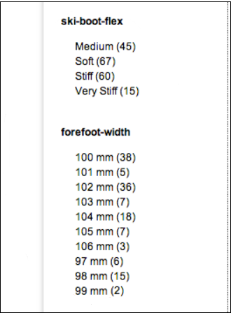
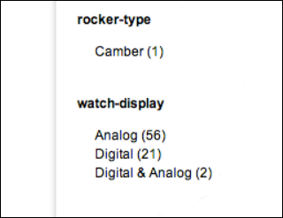
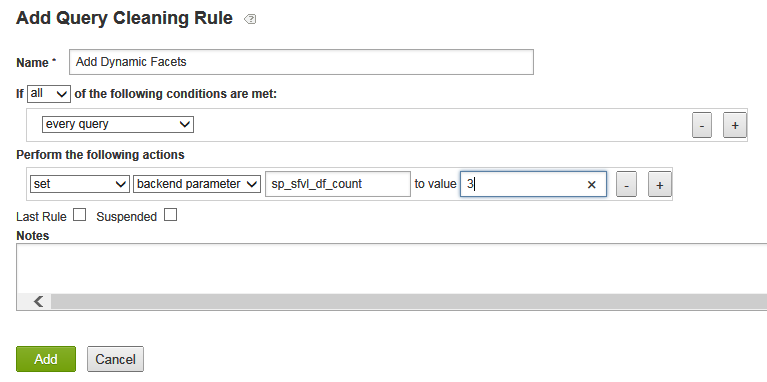
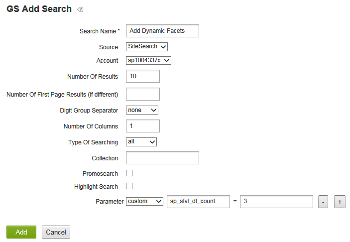
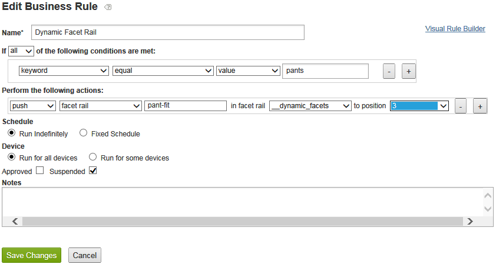

# 動的ファセットについて{#about-dynamic-facets}

動的ファセットを使用して、検索時に新しい範囲選択を自動的に作成します。 必要に応じて、各動的ファセットフィールドを、AdobeSearch&amp;Promoteアカウント内の最大1つのテーブル名に関連付けることができます。 検索時に、これらのテーブルの関係を、検索に関係する動的ファセットフィールドに適用します。

## 動的ファセットの使用{#concept_E65A70C9C2E04804BF24FBE1B3CAD899}

>[!NOTE]
>
>この機能は、デフォルトでは[!DNL Adobe Search&Promote]では有効になっていません。 お使いの機能をアクティブにするには、テクニカルサポートにお問い合わせください。

動的ファセットを使用しない場合は、関連する属性を「スロット」に結合し、特定の検索で同種のスロットのみを表示する必要がありました。 つまり、「shoe size」や「ring size」など、論理属性の値を1つだけ含めることができます。 このメソッドは、一意の大きな属性セットを持つ適切な検索時パフォーマンスを提供しました。

ただし、動的なファセット設定を使用する場合は、コア検索が効率的に追跡できるファセットの数に制限はありません。 数百もの動的ファセットを定義できます。このファセットから、コア検索は特定の検索に対して「上位`N`動的ファセット」を返します。`N`は通常、10 ～ 20以下の値です。 この方法により、属性をスロットする必要がなくなり、Webサイト全体で属性に固有の動的ファセットを作成できるようになりました。

## 動的なファセットは何ですか。{#section_254EE034BCAD4250A5D09FBF6158C4A5}

Webサイト全体でまだ入力されておらず、検索のサブセットにのみ表示されるファセットは、動的にするには適しています。 例えば、「forefoot width」という名前のファセットは、靴やブーツを検索する場合にのみ入力できます。 一方、「Face Numeral Style」という名前の別のファセットは、「Roman」と「Arabic」の値を指定できる場合、腕時計または時計を検索するときにのみ表示されます。

アカウントに多数のこのようなファセットがある場合、検索パフォーマンスが向上し、必ずすべての検索で可能なファセットのセット全体を選択する代わりに、動的ファセットを使用できるようになります。 「SKU」や「ブランド」などの汎用ファセットは、通常すべての検索の結果と共に表示するのに適していますが、通常は動的ファセットとしては適しません。

## ファセットとメタタグフィールドとの関係{#section_2869E5FCDA8B431A87BC6E5573F2B0A0}

ファセットは、メタタグフィールドの上に構築されます。 metaタグフィールドは、[!DNL Adobe Search&Promote]の低レベルで中核的な検索レイヤー機能です。 一方、ファセットはGS（ガイド付き検索）の一部で、AdobeSearch&amp;Promoteの高レベルなプレゼンテーション層です。 ファセット自体のメタタグフィールドは、ファセットに関する情報を何も持っていません。 動的ファセットを設定する場合は、最初にファセットを追加し、次に「動的ファセット」オプションを選択してメタタグフィールドを追加し、識別されたファセットを動的に設定します。

>[!NOTE]
>
>**[!UICONTROL Design > Navigation > Facets]**&#x200B;には「動的ファセット」設定はありません。 ファセットの「動的」とは、基になる「meta tag field」が&#x200B;**[!UICONTROL Settings > Metadata > Definitions]**&#x200B;で設定された動的なものであることです。

## 動的ファセットのアクション{#section_BC699A05E2E742EF94D41679163ACE84}の例

「boots」の検索後に表示される動的ファセットの例：



「watches」の検索後に表示される動的ファセットの別の例を次に示します。



詳しくは、

* [バックエンド検索CGIパラメーター](../c-appendices/c-cgiparameters.md#reference_582E85C3886740C98FE88CA9DF7918E8)
* [プレゼンテーションテンプレートタグ](../c-appendices/c-templates.md#reference_F1BBF616BCEC4AD7B2548ECD3CA74C64)
* [トランスポートテンプレートタグ](../c-appendices/c-templates.md#reference_227D199F5A7248049BE1D405C0584751)

## 動的ファセットの設定{#task_D17F484130E448258100BAC1EEC53F39}

Search&amp;Promoteでの動的ファセットの設定を参照してください。

<!-- 

t_configuring_dynamic_facets.xml

 -->

>[!NOTE]
>
>この機能は、AdobeSearch&amp;Promoteでは、デフォルトでは有効になっていません。 お使いの機能をアクティブにするには、テクニカルサポートにお問い合わせください。

動的ファセットの効果が顧客に表示される前に、サイトインデックスを再構築する必要があります。

詳しくは、

* [バックエンド検索CGIパラメーター](../c-appendices/c-cgiparameters.md#reference_582E85C3886740C98FE88CA9DF7918E8)
* [プレゼンテーションテンプレートタグ](../c-appendices/c-templates.md#reference_F1BBF616BCEC4AD7B2548ECD3CA74C64)
* [トランスポートテンプレートタグ](../c-appendices/c-templates.md#reference_227D199F5A7248049BE1D405C0584751)

**動的ファセットを設定するには**

1. ファセットが既に追加されていることを確認します。

   「[新しいファセットの追加](../c-about-design-menu/c-about-facets.md#task_FC07BFFA62CA4B718D6CBF4F2855C89B)」を参照してください。
1. ファセットを追加したら、新しいユーザー定義のmetaタグフィールドにファセットが追加されていることを確認します。

   「[新しいmetaタグフィールドの追加](../c-about-settings-menu/c-about-metadata-menu.md#task_6DF188C0FC7F4831A4444CA9AFA615E5)」を参照してください。
1. 製品メニューで、**[!UICONTROL Settings]**/**[!UICONTROL Metadata]**/**[!UICONTROL Definitions.]**&#x200B;をクリックします。
1. [!DNL Definitions]ページの[!DNL User-defined fields]テーブルの[!DNL Actions]列で、動的にするファセットに関連付けられたメタタグフィールド名の行の鉛筆アイコン（編集）をクリックします。
1. [!DNL Edit Field]ページで、**[!UICONTROL Dynamic Facet]**&#x200B;をチェックします。

   [新しいmetaタグフィールドの追加](../c-about-settings-menu/c-about-metadata-menu.md#task_6DF188C0FC7F4831A4444CA9AFA615E5)のオプションの表を参照してください。
1. クリック **[!UICONTROL Save Changes]**.
1. 青いボックスの&#x200B;**ステージ済みサイトインデックス**&#x200B;を再生成をクリックして、ステージ済みWebサイトインデックスをすばやく再構築します。

   [ライブまたはステージWebサイトのインデックスの再生成](../c-about-index-menu/c-about-regenerate-index.md#task_B28DE40C0E9A475ABCBCBC4FF993AACD)も参照してください。
1. 特定の検索に対して選択する動的ファセットの数を決定します。 このタスクは、次のいずれかの操作を行うことで達成できます。

   * `set`、`backend parameter`、`sp_sfvl_df_count`を実行して値`X`を実行する任意の条件を持つクエリクリーニングルールを作成します。`X`は、検索時に要求する動的ファセットの数です。**[!UICONTROL Add]**&#x200B;をクリックします。

   

   「[クエリクリーニングルールの追加](../c-about-rules-menu/c-about-query-cleaning-rules.md#task_47F43988D3D9485F8AE1DFDA7E00BF54)」を参照してください。

   `sp_sfvl_df_count`の詳細な説明は、表の[バックエンド検索CGIパラメータ](../c-appendices/c-cgiparameters.md#reference_582E85C3886740C98FE88CA9DF7918E8)、行40も参照してください。

   * 検索し追加て、「custom」 `sp_sfvl_df_count`パラメーターを目的の値に設定し、「a1/>」をクリックします。**[!UICONTROL Add]**

   

   「[新しい検索定義の追加](../c-about-settings-menu/c-about-searching-menu.md#task_98D3A168AB5D4F30A1ADB6E0D48AB648)」を参照してください。

   `sp_sfvl_df_count`の詳細な説明は、表の[バックエンド検索CGIパラメータ](../c-appendices/c-cgiparameters.md#reference_582E85C3886740C98FE88CA9DF7918E8)、行40も参照してください。

1. 適切なトランスポートテンプレートを編集して、コア検索が返す動的ファセットを出力します。

   「[プレゼンテーションまたはトランスポートテンプレートの編集](../c-about-design-menu/c-about-templates.md#task_800E0E2265C34C028C92FEB5A1243EC3)」を参照してください。

   例えば、トランスポートテンプレートの名前が`guided.tpl`であるとします。 その場合は、製品メニューで&#x200B;**[!UICONTROL Design > Templates]**&#x200B;をクリックします。 [!DNL Templates]ページで、テーブル内の`guided.tpl`を探します。 その後、名前の一番右にある&#x200B;**[!UICONTROL Edit]**&#x200B;をクリックします。 編集ページで、`</facets>`の末尾に次のコードブロックを追加します。JSON出力：

   ```
   ... 
   }<search-dynamic-facet-fields>, 
           { 
               "name" : "<search-dynamic-facet-field-name>", 
               "dynamic-facet" : 1, 
               "values" : [<search-field-value-list quotes="yes" commas="yes" data="values" sortby="values" encoding="json" />], 
               "counts" : [<search-field-value-list quotes="yes" commas="yes" data="results" sortby="values" />] 
   
           }</search-dynamic-facet-fields> 
   ...
   ```

1. 動的ファセットを出力するには、適切なプレゼンテーションテンプレートを編集します。

   「[プレゼンテーションまたはトランスポートテンプレートの編集](../c-about-design-menu/c-about-templates.md#task_800E0E2265C34C028C92FEB5A1243EC3)」を参照してください。

   例えば、シミュレーターでコンテンツを出力するために使用する`sim.tmpl`という名前のテンプレートがあるとします。 そのテンプレートを編集するには、製品メニューで&#x200B;**[!UICONTROL Design > Templates]**&#x200B;をクリックします。 [!DNL Templates]ページで、テーブル内の`sim.tmpl`を探します。 その後、名前の一番右にある&#x200B;**[!UICONTROL Edit]**&#x200B;をクリックします。 編集ページで、テンプレートのファセット表示領域内に以下を追加します。

   ```
   <h6>DF RAIL</h6> 
   <guided-facet-rail gsname="__dynamic_facets"> 
               <guided-facet ><!-- behavior=Normal --> 
               <div class="facet-block" id="facet"> 
               <p><b><guided-facet-display-name /></b></p> 
               <ul> 
                   <guided-facet-values> 
                       <guided-if-facet-value-equals-length-threshold> 
               </ul> 
               <ul id="brand" style="display:none"> 
                       </guided-if-facet-value-equals-length-threshold> 
                       <guided-if-facet-value-selected> 
                           <li><guided-facet-value> [<guided-lt>a href="<guided-facet-value-undo-path />"<guided-gt>X</a>]</li> 
                       <guided-else-facet-value-selected> 
                           <li><guided-facet-link><guided-facet-value></guided-facet-link> (<guided-facet-count>) </li> 
                       </guided-if-facet-value-selected> 
                   </guided-facet-values> 
               </ul> 
               <guided-if-facet-long> 
                 <br /><guided-lt />a href="#" onclick="moreless(this,'brand');return false;" <guided-gt /><button style="font-size:10px;">VIEW MORE</button></a> 
               </guided-if-facet-long> 
               </div> 
               </guided-facet> 
   </guided-facet-rail> 
   <h6>/DF RAIL</h6>
   ```

   また、必要に応じて、`json.tmpl`など、他のプレゼンテーションテンプレートと同様の変更を行います。

   `guided-facet-rail`タグの`gsname`には`__dynamic_facets`を必ず指定してください。 このタグは、特定の検索に対して返される動的ファセットを出力するために予約された、事前定義のファセットパネルです。

   オプションで、**[!UICONTROL Rules > Business Rules]**&#x200B;を介して、次に示すように&#x200B;**[!UICONTROL Advanced Rule Builder]**&#x200B;を使用して、この特別なファセットパネルを編集することもできます。

   

   「[新しいビジネスルールの追加](../c-about-rules-menu/c-about-business-rules.md#task_BD3B31ED48BB4B1B8F1DCD3BFA2528E7)」も参照してください。
