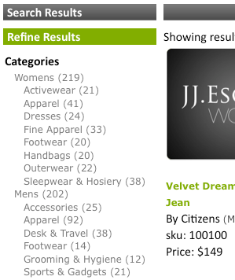

# ファセットについて{#about-facets}

ファセットを使用すると、プレゼンテーションレイヤーをカスタマイズし、ユーザーに対して、検索結果を詳しく調べるためのガイド付き検索を提供できます。

## ファセットの使用{#concept_FA912B3B41EE493DB2F492D188457FF5}

例えば、ツールを販売するWebサイトの訪問者がレンチの検索を実行したとします。 会社では、次の2つのファセットを使用できます。1つは検出されたすべてのブランドを指定し、もう1つはレンチサイズを指定します。 顧客は、適切なファセット内の任意のブランドまたはサイズをクリックして、結果を絞り込み、必要な正しいレンチをすばやく見つけることができます。

ファセットは、既存のメタデータ定義に基づくことができます。 メタデータでファセットが日付型として定義されている場合、ファセットは日付範囲ファセットとして表示されます。

[!DNL Staged Facets]ページの表には、追加された各ファセットを構成する設定の一般的な概要が表示されます。 新しいファセットを追加したり、既存のファセットを編集または削除したりできます。 ファセットに加えた変更は、ページの右上隅近くにある&#x200B;**[!UICONTROL History]**&#x200B;を使用して元に戻すことができます。

ファセット設定は、デフォルトでステージングされ、変更をテストしてから実稼動状態に移行します。

[ステージングについて](../c-about-staging.md#concept_08B8F3CA1F4241108F14BA7FC7806CA7)を参照してください。

**[!UICONTROL View Live Settings]**&#x200B;を使用すると、ステージ設定を現在のライブ設定と比較できます。 **[!UICONTROL View Staged Settings]**&#x200B;を使用して、ステージング領域に戻ります。 stagedアイテムの場合、設定のライブバージョンは読み取り専用です。 したがって、ステージ設定をライブにすることで操作します。 ステージングされたファセットに対して行った変更が完了したら、**[!UICONTROL Push Live]**&#x200B;をクリックして変更をライブにします。

## 日付範囲ファセット{#section_FEFFF6B5B6534456913189FEF559BA58}

メタデータで型Dateとして定義されたファセットは、他のファセットとは異なる扱いを受けます。 一連の値として扱われるのではなく、開始日付、終了日またはその両方を含む日付範囲として扱われます。

日付範囲ファセットには、開始日の値が含まれ、その後に「BTW」（「次の範囲内」の場合）、終了日が続きます。 日付は次の2つの形式で指定します。

mm-dd-yyyy

年 / 月 / 日

4桁の年が必要です。 開始日または終了日のうち少なくとも1つは必須ですが、両方とも必須ではありません。 例えば、「12/1/2007BTW1/4/2009」と指定した場合、2007年12月1日から2009年1月4日の間のすべての日付が意味されます。 ただし、「1-1-2005BTW」は、2005年1月1日以降のすべての日付を意味します。

通常のファセットのように、プレゼンテーションテンプレートタグ`<guided-facet-value/>`を使用して、日付範囲ファセットの値を取得できます。 現在、検索する日付範囲をユーザーが入力できるようにJavaScriptが必要です。 例えば、2つの入力フィールドから開始日と終了日の入力を受け取ることができます。 次に、入力を検証し、（2つの入力フィールドから作成された）新しいファセットの値とファセット名を既存のURLに追加できます。

「[プレゼンテーションテンプレートタグ](../c-appendices/c-templates.md#reference_F1BBF616BCEC4AD7B2548ECD3CA74C64)」を参照してください。

次のコード例は、ページに日付範囲を表示する方法の例です。 既存の日付範囲が選択されている場合は、その日付範囲が表示されます。それ以外の場合は、単純な入力フォームが表示されます。 フォームが送信されると、単純な検証が実行されます。 次に、2つの新しいパラメーターを含む新しいURLにブラウザーを送信します。

* `q#` - 2つの入力フィールドからアセンブリされた、選択した日付範囲を表します。
* `x#`  — ファセットの名前。この例では、日付範囲ファセットの名前は「変更済み」です。

Apacheはセキュリティ上の理由でURLパスに`%2F`を許可しないので、コードの`replace(/%2F/ig, '~2F')`部分が必要です。また、SEO URLを使用する場合はURLパスにクエリが含まれます。 したがって、`/`は通常URL内にあるので、`%2F`ではなく`~2F`としてエンコードされます。

```
<div class="date_range"> 
 <p>Date Range</p> 
 <guided-if-facet-selected gsname="modified"> 
  <guided-facet-values gsname="modified"> 
   <script> 
   var modified_daterange= '<guided-facet-value />'.split(/BTW/) ; 
   if (modified_daterange[0]=='') modified_daterange[0]= '--/--/----' ; 
   if (modified_daterange[1]=='') modified_daterange[1]= '--/--/----' ; 
   document.write('From: ' + modified_daterange[0]) ; 
   document.write('<br>To: ' + modified_daterange[1]) ; 
   </script> 
  </guided-facet-values> 
 
 <guided-else-facet-selected> 
  <form action="#"> 
   From: <input name="dateFrom" size=10> 
   <br>To: <input name="dateTo" size=10> 
   <br><input type="button" value="Go" onclick="goClick(this.form)"> 
  </form> 
  <script> 
  function goClick(f) { 
   if (f.dateFrom.value=='' && f.dateTo.value=='') { 
    alert('You must enter either a From: date or a To: date.') ; 
    return ; 
   } 
   if ( f.dateFrom.value!='' && !f.dateFrom.value.match(/^\d+[\/\-]\d+[\/\-]\d\d\d\d$/) ) { 
    alert('From: date must be in "mm/dd/yyyy" or "mm-dd-yyyy" format.') ; 
    return ; 
   } 
   if ( f.dateTo.value!='' && !f.dateTo.value.match(/^\d+[\/\-]\d+[\/\-]\d\d\d\d$/) ) { 
    alert('To: date must be in "mm/dd/yyyy" or "mm-dd-yyyy" format.') ; 
    return ; 
   } 
   // Note that "/" is encoded as "~2F" instead of "%2F" to avoid Apache 404 error. 
   var new_url= '<guided-current-path />&<guided-query-param-name gsname="q#" offset="0" />=' 
    + encodeURIComponent(f.dateFrom.value).replace(/%2F/ig, '~2F') + 'BTW' 
    + encodeURIComponent(f.dateTo  .value).replace(/%2F/ig, '~2F') 
    + '&<guided-query-param-name gsname="x#" offset="0" />=modified' ; 
   location.href= new_url ; 
  } 
  </script> 
 </guided-if-facet-selected> 
</div>
```

## ネストされたファセットについて{#section_6BC77F38DE9F43D5B6911F8CECB15DFC}

ネストされたファセットは、次のように複数のカテゴリレベルを表示するファセットです。



WomensとMensのカテゴリは、最上位または親のファセットです。 アクセサリや靴などのサブカテゴリは、下部ファセットまたは子ファセットにあります。

現在サポートされているネストされたファセットの深さは2つですが、ドリルダウンリストの任意の場所にできます。

次に、様々なタイプのネストされたファセットの動作を示します。

<table> 
 <thead> 
  <tr> 
   <th colname="col1" class="entry"> <p>ネストされたファセットタイプの動作 </p> </th> 
   <th colname="col2" class="entry"> <p>動作 </p> </th> 
  </tr> 
 </thead>
 <tbody> 
  <tr> 
   <td colname="col1"> <p>標準 </p> </td> 
   <td colname="col2"> <p>通常の入れ子ファセットの動作は、他のファセットが検索を絞り込む場合に縮小するという点です。 </p> <p>ネストされたファセットが選択されている場合は、選択範囲に向かって縮小されます。 親ファセットが選択されている場合、その親のみが残りの子ファセットと共に表示されます。 子ファセットが選択されている場合、ファセットには、選択された親ファセットと選択された子ファセットのみが表示されます。 </p> </td> 
  </tr> 
  <tr> 
   <td colname="col1"> <p>固定 </p> </td> 
   <td colname="col2"> <p>共通のネストされたファセットの動作は、他のファセットまたは検索条件の状態に基づいて、ファセットをできるだけ開いた状態に保とうとする点です。 子ファセットが選択されている場合は、定着深さにカウントされます。 </p> </td> 
  </tr> 
  <tr> 
   <td colname="col1"> <p>複数選択 </p> </td> 
   <td colname="col2"> <p>複数選択ファセットの動作は、ファセットを開いたままにすることです。 新しい選択では、ネストされたファセットがカテゴリの「親」でない限り、他のすべてのファセット選択が消去されます。 この場合、「親」とは、ネストされたファセットの最上位カテゴリではなく、カテゴリファセットを指します。 </p> </td> 
  </tr> 
  <tr> 
   <td colname="col1"> <p>カテゴリの複数選択 </p> </td> 
   <td colname="col2"> <p>複数選択の場合と同様に、ネストされたファセットタイプを次の例外で選択します。 </p> 
    <ul id="ul_D5AB6AF3169A483E8F3FC6D2A2EA3A28"> 
     <li id="li_9308156EF2FF43CE9DFB933F13786C58">このファセットが初めて選択された場合、以前に選択された他のファセットはすべて選択解除されます。 </li> 
     <li id="li_DD96D6802A9C479283212A0FD68C6F85">親ファセットをクリックせずに、親ファセットを直接子ファセットにドリルダウンした場合、または別の親ファセットの兄弟を選択した場合は、以前に選択した他のファセットも選択解除されます。 </li> 
     <li id="li_8BF58F10969B4743986D5D0E0086AD6C">カテゴリ面には親がいるという意味で親を持つことができます この動作は、すべてのネストされたファセットで見つかった親子関係と混同しないでください。 </li> 
    </ul> </td> 
  </tr> 
 </tbody> 
</table>

「[ファセットパネル](../c-about-design-menu/c-about-facet-rails.md#concept_1FDC8BCDFFC84A0889DA670F63D5F6DB)について」も参照してください。

## 新しいファセットの追加{#task_FC07BFFA62CA4B718D6CBF4F2855C89B}

ファセットを追加して、プレゼンテーションレイヤーをカスタマイズし、顧客に対してガイド付き検索を提供して、検索結果を詳細に調べることができます。

<!-- 

t_adding_a_new_facet.xml

 -->

[!DNL Facets]ページのファセットテーブルには、単一のファセットを構成する設定の抜粋が表示されます。 新しいファセットを追加したり、既存のファセットを編集または削除したりできます。 ファセットに対して行った変更は、履歴機能を使用して元に戻すことができます。

>[!NOTE]
>
>Webサイトに表示されるように、プレゼンテーションテンプレートでファセットを参照していることを確認してください。

「[ファセットパネル](../c-about-design-menu/c-about-facet-rails.md#concept_1FDC8BCDFFC84A0889DA670F63D5F6DB)について」も参照してください。

**新しいファセットを追加するには**

1. 新しいファセットを追加する前に、次の手順に進む前に、既に次の操作が完了していることを確認してください。

   * いくつかのメタタグフィールドが既に定義されている。

      「[新しいmetaタグフィールドの追加](../c-about-settings-menu/c-about-metadata-menu.md#task_6DF188C0FC7F4831A4444CA9AFA615E5)」を参照してください。
   * インデックスにメタデータを挿入します。
[フィールドインジェクション定義の追加](../c-about-settings-menu/c-about-metadata-menu.md#task_E86566FA1FF74CF68115C0ADA05172AE)を参照してください。

1. 製品メニューで、**[!UICONTROL Design]**/**[!UICONTROL Navigation]**/**[!UICONTROL Facets.]**&#x200B;をクリックします。
1. [!DNL Facets]ページで、**[!UICONTROL Add New Facet]**&#x200B;をクリックします。
1. [!DNL Add Facet]ページで、必要なオプションを設定します。

   これらの設定は、ファセットの動作とデフォルト表示の両方に影響します。 これらの設定の一部は、プレゼンテーションテンプレートの設定を使用して上書きできます。

   メタデータでファセットが日付型として定義されている場合は、日付範囲として表示されます。

   [日付範囲ファセット](../c-about-design-menu/c-about-facets.md#section_FEFFF6B5B6534456913189FEF559BA58)を参照してください。

   選択したファセットオプションに応じて、すべてのオプションを使用できるわけではありません。

   <!-- 
   r_add_facet_options.xml
   -->

   <table> 
    <thead> 
      <tr> 
      <th colname="col1" class="entry"> <p>オプション </p> </th> 
      <th colname="col2" class="entry"> <p>説明 </p> </th> 
      </tr> 
    </thead>
    <tbody> 
      <tr> 
      <td colname="col1"> <p>ファセット名 </p> </td> 
      <td colname="col2"> <p>特定のファセットの名前を識別します。 </p> <p> <p>注意： 既存のユーザー定義メタデータに基づくファセットのみを持つことができます。 ドロップダウンリストでファセットが使用できない場合は、最初にいくつかのメタデータを定義する必要があります。 </p> </p> <p>「<a href="../c-about-settings-menu/c-about-metadata-menu.md#task_6DF188C0FC7F4831A4444CA9AFA615E5" type="task" format="dita" scope="local">新しいmetaタグフィールドの追加</a>」を参照してください。 </p> <p>フィールドテーブルに基づいてファセットを作成するには、カスタムファセット名を使用し、フィールドテーブル名を指定します。 </p> </td> 
      </tr> 
      <tr> 
      <td colname="col1"> <p>ラベルを表示 </p> </td> 
      <td colname="col2"> <p>メタデータフィールド名（<span class="codeph"> &lt;guided-breadcrumb-label&gt; </span>タグ）やスタンドアロン値（<span class="codeph"> &lt;guided-facet-display-name&gt; </span>タグ）の代わりに、パンくずリストで使用できるファセットのラベルを設定します。 </p> </td> 
      </tr> 
      <tr> 
      <td colname="col1"> <p>動作 </p> </td> 
      <td colname="col2"> <p>3つのファセット動作のいずれかを設定します。 </p> <p> 
      <ul id="ul_67C19E1C16224B9990F04A0D05BD3D05"> 
      <li id="li_6B232C11A61840B68CA59E1F593405A0"> <span class="uicontrol"> 標準 </span> <p>顧客が<span class="uicontrol">通常</span>に設定されているファセットをクリックすると、その項目の検索結果がドリルで表示されます。 このページから、検索結果数をさらに絞り込み、絞り込むことができます。 </p> </li> 
      <li id="li_7D7C43A7F7AB4B84A9B0FEF34627605A"> <span class="uicontrol"> カテゴリ </span> <p>カテゴリファセットは、ナビゲーション要素のように機能します。 これらのファセットは、属性オプションを使用してファセットを表示する前に、通常ドリルスルーするトップレベルファセットです。 他のファセットが選択され、開いたままの場合、カテゴリファセットは狭くなりません。 カテゴリファセット内の別の値をクリックすると、そのカテゴリファセットの親を除く、ページ上の他のすべてのファセットの選択が解除されます。 </p> </li> 
      <li id="li_01255993D71F40DBA8870AA3FEA7D304"> <span class="uicontrol"> カテゴリの複数選択  </span> <p>ファセットは、カテゴリが「OR」されるファセットからの複数の項目の選択をサポートする項目ファセットです。 </p> </li> 
      </ul> 
      <ul id="ul_683F6D3FC8524E65AF303453ADDB6001"> 
        <li id="li_81F504D1D1294666BBBC5EA43B34B712"> <span class="uicontrol"> 固定 </span> <p>顧客が<span class="uicontrol">固定</span>に設定された動作を持つファセットをクリックすると、ドリルダウン中に、選択したオプションを持つファセットが開いたままになります。 このオプションは、顧客が以前の選択を変更できるようにする場合に役立ちます。 </p> </li> 
      </ul> 
      <ul id="ul_8E871D63B09445268C600C8ABC20F6A4"> 
        <li id="li_F88AC5528B0C4751BC4CFE7FA9525857"> <span class="uicontrol"> 複数選択  </span> <p>ファセット内の項目が「OR」されるファセットから複数の項目を選択できます。 このオプションは、色などの小さな属性を示すファセットで役立ち、「赤または黒の靴をサイズで表示」するクエリを作成できるファセットを使用します。 </p> </li> 
      </ul> </p> </td> 
      </tr> 
      <tr> 
      <td colname="col1"> <p>常に表示 </p> </td> 
      <td colname="col2"> <p>通常または共通のファセットの場合、常に顧客に対して表示されたままになるようにファセットを設定します。 </p> <p>このオプションは、<span class="uicontrol">動作</span>ドロップダウンリストから<span class="uicontrol">通常</span>、<span class="uicontrol">カテゴリ</span>、または<span class="uicontrol">定着</span>を選択した場合にのみ使用できます。 </p> </td> 
      </tr> 
      <tr> 
      <td colname="col1"> <p>ファセットの親 </p> </td> 
      <td colname="col2"> <p>このオプションは、<span class="uicontrol">動作</span>ドロップダウンリストから<span class="uicontrol">カテゴリ</span>または<span class="uicontrol">カテゴリ複数選択</span>を選択した場合にのみ使用できます。 </p> <p>カテゴリファセットの親を示します。 カテゴリの親ファセットで選択した項目は、現在のカテゴリファセット内で使用可能な選択肢を絞り込むために使用されます。 顧客がカテゴリファセットを操作する場合、親ファセットの選択は解除されません。 カンマで区切った複数の親を指定できます。 </p> </td> 
      </tr> 
      <tr> 
      <td colname="col1"> <p>定着深度 </p> </td> 
      <td colname="col2"> <p>このオプションは、<span class="uicontrol">動作</span>ドロップダウンリストから<span class="uicontrol">定着</span>を選択した場合にのみ使用できます。 </p> <p>ドリルダウン中に開いたままにするオプションの数を設定します。 </p> </td> 
      </tr> 
      <tr> 
      <td colname="col1"> <p>長さのしきい値 </p> </td> 
      <td colname="col2"> <p>項目数で定義されるファセットの垂直方向の長さ(1 ～ 9999)を設定します。 </p> <p>プレゼンテーションテンプレートが適切に設定されている場合は、この設定を使用して「表示を増やす」を設定できます。 リンクを作成したり、ファセットをスクロール可能なdivにスローするタイミングを決定したりします。 </p> </td> 
      </tr> 
      <tr> 
      <td colname="col1"> <p>長さの切り捨てしきい値 </p> </td> 
      <td colname="col2"> <p>指定したしきい値の後にファセットの項目数を切り捨てます。 </p> <p>実装によっては、何千もの項目が含まれたファセットを持つものもあります。 すべてのデータを送信するのに費用がかかる場合があります。 この設定を使用すると、ファセットを管理可能なレベルにトリミングできます。 並べ替え後にファセットが切り捨てられます。 </p> </td> 
      </tr> 
      <tr> 
      <td colname="col1"> <p>最大値の幅 </p> </td> 
      <td colname="col2"> <p>ファセット値の文字列の長さの制限を指定します(1 ～ 999)。 </p> <p>このオプションは、固定幅レイアウトにファセットを配置し、文字列の折り返しを防ぐ場合に便利です。 デフォルトでは、文字列はしきい値より3文字短く設定されているので、省略記号を追加できます。 </p> </td> 
      </tr> 
      <tr> 
      <td colname="col1"> <p>値の拡張子 </p> </td> 
      <td colname="col2"> <p>ファセットの値が切り捨てられることを示す文字列を指定します。 デフォルトでは、「。..」という文字列が が使用されます。 </p> </td> 
      </tr> 
      <tr> 
      <td colname="col1"> <p>区切り </p> </td> 
      <td colname="col2"> <p>ファセットに適用される区切り区切り区切り値リストで使用する区切り文字を指定します。 </p> <p>使用される区切り文字は、ファセットの基となるメタデータで定義されている区切り文字と同じです。 デフォルトの区切り文字はコンマです。 ただし、XMLに準拠した任意の値を使用できます。 </p> </td> 
      </tr> 
      <tr> 
      <td colname="col1"> <p>並べ替え </p> </td> 
      <td colname="col2"> <p>Webサイト上のファセットの並べ替え方法を指定します。 ファセットは、次の順で並べ替えることができます。 必要に応じて、最大5種類の並べ替えを組み合わせることができます。 </p> 
      <ul id="ul_12987F4DC7B34C63ABC906B59688A174"> 
      <li id="li_3206C96013DF431D90119F594D93D85D"> <span class="uicontrol"> alpha </span> <p>値をアルファベット(0 ～ 9、A ～ Z)順に並べ替えます。句読点も含まれます。 </p> </li> 
      <li id="li_304E4A518FBE48D18D9E9EA7339A3481"> <span class="uicontrol"> alpha（英数字のみ）  </span> <p>値をアルファベット(0 ～ 9、A ～ Z)順に並べ替えます。句読点は無視されます。 </p> </li> 
      <li id="li_CADB888CC514455F9CA379C8EEE490AA"> <span class="uicontrol"> alpha（大文字と小文字は区別されません）  </span> <p>値をアルファベット順(0 ～ 9、A ～ Z)に並べ替えます。大文字と小文字は区切り文字を含め、大文字と小文字は区別しません。 </p> </li> 
      <li id="li_F61122E79AB5413792DA31F8AB1414BD"> <span class="uicontrol"> alpha（大文字と小文字は区別されません。英数字のみ）  </span> <p>値をアルファベット順(0 ～ 9、A ～ Z)に並べ替えます。アルファベット文字の大文字と小文字は無視し、句読点は無視します。 </p> </li> 
      <li id="li_F50CC298ABF046D0A39D5AE5B1261823"> <span class="uicontrol"> count </span> <p>各ファセット値に一致する結果の数を、最大から最小の順に並べ替えます。 </p> </li> 
      <li id="li_32B6AF39E9534762B39B15181DC5AD01"> <span class="uicontrol"> numeric  </span> <p>数値を並べ替えます。 数値を並べ替える場合は、アルファ並べ替えよりもこのオプションの方が優れています。アルファ並べ替えを使用すると、2の前に10が表示されるからです。 </p> </li> 
      <li id="li_CF8E76A7B1184E0C8DCC11B53E31A1DC"> <span class="uicontrol"> split </span> <p>カウントのしきい値でリストを2つの異なるリストに分割します。 しきい値を超えるファセット値は、一番上に移動されます。 しきい値を下回るカウントを持つファセット値は下に移動します。 特定の範囲の値を常に最上位に固定する場合は、分割しきい値が必要です。 </p> </li> 
      <li id="li_4AB8276577384B1099CBA895898205AD"> <span class="uicontrol"> break  </span> <p>特定の値をリストの上または下に強制的に配置します。 例えば、常にリストの下部に「その他」というキーワードを表示させたい場合があります。 改ページソートを使用して、ソートの先頭または末尾に配置する必要のある明示的な値を識別する場合は、上位の値または下位の値を指定する必要があります。 </p> </li> 
      <li id="li_227E96CFED2044FCA2F10B6913B03CFB"> <span class="uicontrol"> ordered  </span> <p>ファセット値は常に固定順(以下に示す<span class="uicontrol">順序</span>リストで定義される区切り文字で区切られた値オプション)にする必要があります。 </p> </li> 
      </ul> </td> 
      </tr> 
      <tr> 
      <td colname="col1"> <p>ファセットのエイリアス </p> </td> 
      <td colname="col2"> <p>既存の検索URLをサポートするために、ファセットエイリアスを使用して、従来のパラメーター名を変更済みにマップしたり、単に別の名前のファセットを作成したりできます。 エイリアスは、受信する要求にのみ適用され、ファセットリンクの作成には使用されません。 </p> </td> 
      </tr> 
      <tr> 
      <td colname="col1"> <p>Facet Rail Name </p> </td> 
      <td colname="col2"> <p>ファセットをアルファベット順、数別、またはカスタムメソッドで並べ替える場合の、ファセットパネルの名前。 </p> <p><a href="../c-about-design-menu/c-about-facet-rails.md#concept_1FDC8BCDFFC84A0889DA670F63D5F6DB" format="dita" scope="local">「Facet Rail」について</a>を参照してください。 </p> </td> 
      </tr> 
      <tr> 
      <td colname="col1"> <p>Order </p> </td> 
      <td colname="col2"> <p>このオプションは、<span class="uicontrol">並べ替え</span>ドロップダウンリストから<span class="uicontrol">並べ替え</span>を選択した場合にのみ使用できます。 </p> <p>使用する順序を指定する値の区切りリストを定義できます。 </p> </td> 
      </tr> 
      <tr> 
      <td colname="col1"> <p>追加 </p> </td> 
      <td colname="col2"> <p>このオプションは、<span class="uicontrol">並べ替え</span>ドロップダウンリストから<span class="uicontrol">並べ替え</span>を選択した場合にのみ使用できます。 </p> <p>順序付けられたリストに値がない場合、値は末尾に追加されます。 </p> </td> 
      </tr> 
      <tr> 
      <td colname="col1"> <p>ゴーストを表示 </p> </td> 
      <td colname="col2"> <p>このオプションは、<span class="uicontrol">並べ替え</span>ドロップダウンリストから<span class="uicontrol">並べ替え</span>を選択した場合にのみ使用できます。 </p> <p>順序付けられたリストで指定された値がない場合、このオプションでは、ファセット内の欠落した各項目に「ghost」というフラグが付けられ、項目の表示が異なります。 </p> </td> 
      </tr> 
      <tr> 
      <td colname="col1"> <p>ネストされたファセット </p> </td> 
      <td colname="col2"> <p>ネストされたファセットには、そのカテゴリとその子のカテゴリが表示されます。 深さは2つのカテゴリしか表示できませんが、ドリルダウンのどこにでも表示できます。 </p> <p>このファセットのデータは、2つのカテゴリレベルを記述する際の規則に従う必要があります。 例えば、ファセット値を「shoes:boots」に設定できます。この場合、親カテゴリは「shoes」、子カテゴリは「boots」になります。 「:」は区切り文字として使用されます。 </p> <p>区切り文字の変更について詳しくは、後述の「Nested Delimiter」を参照してください。 </p> <p>この形式でデータを生成するには、フィルタースクリプトを使用して2つの既存のカテゴリを組み合わせることができます。 「標準」、「カテゴリ」および「共通」の動作は、ネストされたファセットと組み合わせることができます。 </p> </td> 
      </tr> 
      <tr> 
      <td colname="col1"> <p>Nested Parent Name </p> </td> 
      <td colname="col2"> <p>このドロップダウンリストは、「<span class="uicontrol">入れ子ファセット</span>」を選択した場合にのみ使用できます。 </p> <p>親カテゴリを表すフィールドを選択できます。 このフィールドは、親カテゴリとの一致で検索時に使用されます。 </p> </td> 
      </tr> 
      <tr> 
      <td colname="col1"> <p>子名の入れ子 </p> </td> 
      <td colname="col2"> <p>このドロップダウンリストは、「<span class="uicontrol">入れ子ファセット</span>」を選択した場合にのみ使用できます。 </p> <p>子カテゴリを表すフィールドを選択できます。 このフィールドは、子カテゴリとの一致で検索時に使用されます。 </p> </td> 
      </tr> 
      <tr> 
      <td colname="col1"> <p>Nested Facet Delimiter </p> </td> 
      <td colname="col2"> <p>このオプションは、「<span class="uicontrol">ネストされたファセット</span>」を選択した場合にのみ使用できます。 </p> <p>ここに入力した文字は、親カテゴリと子カテゴリをデータから解析するために使用されます。 </p> <p>例えば、「:」を区切り文字として使用し、親が「shoes」で子が「boots」の場合、データは「shoes:boots」としてフォーマットされる必要があります。 </p> </td> 
      </tr> 
      <tr> 
      <td colname="col1"> <p>分割しきい値 </p> </td> 
      <td colname="col2"> <p>このオプションは、<span class="uicontrol">並べ替え</span>ドロップダウンリストから<span class="uicontrol">分割</span>を選択した場合にのみ使用できます。 </p> <p>分割の並べ替えを使用する場合、split-thresholdは、ファセットを2つの異なるリストに分割するカウントを定義します。 しきい値以上のカウント数を持つ値は上に維持され、しきい値より小さい値は下に移動されます。 </p> </td> 
      </tr> 
      <tr> 
      <td colname="col1"> <p>最高値 </p> </td> 
      <td colname="col2"> <p>このオプションは、<span class="uicontrol">並べ替え</span>ドロップダウンリストから「<span class="uicontrol"></span>を区切る」を選択した場合にのみ使用できます。 </p> <p>分割の並べ替えを使用する場合、この区切り形式の値のリストは常にリストの先頭に配置されます。 正規式は使用できますが、次のように中括弧または中括弧で囲む必要があります。{^New .*?},{^非常に新しい。*} </p> </td> 
      </tr> 
      <tr> 
      <td colname="col1"> <p>最低値 </p> </td> 
      <td colname="col2"> <p>このオプションは、<span class="uicontrol">並べ替え</span>ドロップダウンリストから「<span class="uicontrol"></span>を区切る」を選択した場合にのみ使用できます。 </p> <p>分割の並べ替えを使用する場合、この区切り形式の値のリストは常にリストの一番下に配置されます。 正規式は使用できますが、次の例のように中括弧または中括弧で囲む必要があります。{^Old .*?},{^非常に古い。*} </p> </td> 
      </tr> 
    </tbody> 
    </table>

1. クリック **[!UICONTROL Add]**.
1. （オプション）[!DNL Facets]ページで、次のいずれかの操作を行います。

   * **[!UICONTROL History]**&#x200B;をクリックして、行った変更を元に戻します。

      [「履歴」オプションの使用](../t-using-the-history-option.md#task_70DD3F87A67242BBBD2CB27156F43002)を参照してください。

   * クリック **[!UICONTROL Live]**.

      [ライブ設定の表示](../c-about-staging.md#task_401A0EBDB5DB4D4CA933CBA7BECDC10F)を参照してください。

   * クリック **[!UICONTROL Push Live]**.

      [プッシュステージ設定をライブにする](../c-about-staging.md#task_44306783B4C0408AAA58B471DAF2D9A4)を参照してください。

## ネストされたファセットの追加{#task_A132FA7EB7494A6B88E443F2C3FABBBA}

ネストされたファセットを追加して、複数のレベルのカテゴリを表示できます。

<!-- 

t_adding_a_nested_facet.xml

 -->

ネストされたファセットを作成する場合は、次の点に注意してください。

* ネストされたファセットごとに、1つのユーザー定義のmetaタグフィールドが必要です。
* ネストされたファセットは、親ファセットと子ファセットの2つの他のファセットで構成されます。 単一値ファセットまたは複数値ファセットを使用できます。 単一値ファセットと複数値ファセットの混在は許可されません。
* このファセットを検索フィールドテーブルで使用するかどうかを決定する必要があります。 フィールドテーブルには、入れ子になったファセット自体と、その合成ファセットが必要です。
* JSONを使用してネストされたファセットを実装することを検討します。それは簡単です。

* [タスク1 — メタ追加タグ](../c-about-design-menu/c-about-facets.md#task_6944558325204E749C725DCFEF17EF3D)
* [タスク2 -追加事前に形式設定されたデータを生成するフィルタリングスクリプト](../c-about-design-menu/c-about-facets.md#task_2DFED8BCB87B4067A6CE280945D7CAF4)
* [タスク3 -追加新しいファセット](../c-about-design-menu/c-about-facets.md#task_3C11A4159FC44B9494D48594941AF8CF)
* [タスク4 — ガイド付き検索の編集](../c-about-design-menu/c-about-facets.md#task_E50EFD7BBD0F45729C15759EA4F548D8)
* [タスク5 — トランスポートテンプレートの作成](../c-about-design-menu/c-about-facets.md#task_C1FEDEF11D2549DEB1A9C09BFBA64381)
* [タスク6 — プレゼンテーションテンプレートの作成](../c-about-design-menu/c-about-facets.md#task_4B2ABB37B9CD4F3F8AF8E6874227A995)
* [タスク7 — 階層リンクの編集](../c-about-design-menu/c-about-facets.md#task_5E22409528EC4DA284821F82FDCE3438)

>[!NOTE]
>
>このトピックでは、ネストされたファセットをfacet n1と呼びます。

## タスク1追加 — メタタグ{#task_6944558325204E749C725DCFEF17EF3D}

ネストされたファセット追加の日付を保持するための新しいmetaタグフィールド。 複数値のフィールドまたは1つの値のフィールドを指定できます。

1. 製品メニューで、**[!UICONTROL Settings]**/**[!UICONTROL Metadata]**/**[!UICONTROL Definitions]**&#x200B;をクリックします。
1. [!DNL Definitions]ページで、**[!UICONTROL Add New Field]**&#x200B;をクリックします。
1. [!DNL Add Field]ページで、必要なオプションを設定します。

   「[新しいmetaタグフィールドの追加](../c-about-settings-menu/c-about-metadata-menu.md#task_6DF188C0FC7F4831A4444CA9AFA615E5)」を参照してください。
1. クリック **[!UICONTROL Add]**.
1. （オプション）結果をプレビューする場合は、ステージングされたサイトインデックスを再構築します。

   「[ステージングされたWebサイトの増分インデックスの設定](../c-about-index-menu/c-about-incremental-index.md#task_46A367B0786C4C90BFFA5D3F95FD86C0)」を参照してください。

   残りのタスクは、このメタタグフィールドを&#x200B;**n1**&#x200B;と呼びます。

## タスク2 -追加事前にフォーマットされたデータを生成するフィルタリングスクリプト{#task_2DFED8BCB87B4067A6CE280945D7CAF4}

1. 元追加のファセットを次の形式に結合するフィルタリングスクリプト：`<parent_value><nested_delimiter><child_value>`.

   「[フィルタリングスクリプトの追加](../c-about-settings-menu/c-about-filtering-menu.md#task_0AB84FD1133F47F9AA069A79BEA13A22)」を参照してください。

   メタタグフィールドn1の値の例を次に示します。上記の形式を使用します。

   `Womens:Handbags`

   `Womens:Dresses`

   `Mens:Accessories`

   `Mens:Footwear`
1. フィルタリングスクリプトを作成または編集した後、スクリプトをテストします。 正しく表示される場合は、必要に応じてアカウントのインデックスを再作成します。 [!DNL Index Overview]を使ってインデックスをチェックできます。

   次の例は、フィルタリングスクリプトの初期化に含まれる標準的なコンサルティングライブラリがあることを前提としています。 すべてのアカウントは異なるので、フィルタリングスクリプトは自分のアカウントに必要な要件を反映する必要があります。

   **複数値のフィルタリングスクリプトの例**

   ```
   my $doc; 
   { 
   # Slurp all the data into $doc 
   local $/; 
   undef $/; 
   $doc = <>; 
   } 
    # Create n1 field 
    if ( $doc =~ m{<meta\s+name="t1"\s+content="([^\"]*)"}is ) 
    { 
     my @t1arr = split(/\|/, $1); 
     if (scalar @t1arr > 0) 
     { 
      if ( $doc =~ m{<meta\s+name="t2"\s+content="([^\"]*)"}is ) 
      { 
       my @t2arr = split(/\|/, $1); 
   
       if ( scalar @t2arr > 0 ) 
       { 
        my $max = ((scalar @t1arr) < (scalar @t2arr)) ? (scalar @t1arr) : (scalar @t2arr); 
        for (my $i = 0; $i < $max; $i++) 
        { 
         $t1arr[$i] .= ":" . $t2arr[$i]; 
        } 
       } 
      } 
      my $output = join( '|', @t1arr ); 
      $doc =~ s{</head>}{<meta name="n1" content="$output" />\b</head>}is; 
     } 
    } 
    # END: n1 field
   ```

   **単一値のフィルタリングスクリプトの例**

   ```
   # This is a complete example. 
   # This script is designed for index connector where each record 
   # in the XML file is converted into a fake HTML page filled with 
   # meta data tags.  
   my $doc; 
   { 
   # Slurp all the data 
   local $/; 
   undef $/; 
   $doc = <>; 
   } 
   # All legitimate index connector data has key in its URL. 
   # Process the page if and only if it is coming from index connector and 
   # it is not the first entry point page.  Entry point pages don't have key 
   # in the URL. 
   if ($main::search_url =~ /\?key=/) { 
    my $meta = {}; 
    # Mine and scrape the meta fields from the page 
    my @lines = split(/\n/,$doc); 
    foreach my $line (@lines) 
    { 
     if ($line =~ m{<meta name="(.*?)" content="(.*?)" />}) 
     { 
      $meta->{lc($1)} = $2; 
     } 
    } 
    # Combined t1,t2 and t2,t3, and t3,t4 together. 
    # Assign them respectively to n1, n2, and n3. 
    my ($t1, $t2, $t3, $t4); 
    my %meta2; 
    $t1 = $meta->{'t1'}; 
    $t2 = $meta->{'t2'}; 
    $t3 = $meta->{'t3'}; 
    $t4 = $meta->{'t4'}; 
    if (defined $t1 && $t1) { 
     $meta2{'n1'} = $t1; 
     if (defined $t2 && $t2) { 
      $meta2{'n1'} .= ":" . $t2; 
      $meta2{'n2'} = $t2; 
      if (defined $t3 && $t3) { 
      $meta2{'n2'} .= ":" . $t3; 
       $meta2{'n3'} = $t3; 
       if (defined $t4 && $t4) { 
        $meta2{'n3'} .= ":" . $t4; 
       } 
      } 
     } 
    } 
    foreach my $stuff ( keys %meta2 ) 
    { 
     my $v = $meta2{$stuff}; 
     $doc =~ s{</head>}{<meta name="$stuff" content="$v" />\n</head>}; 
    } 
   } 
   
   # Do some ranking stuff here 
   ws_insert_static_rank_meta_tag(\$doc, "RANK"); 
   
   # Prints the entire page back out. 
   print $doc;
   ```

## タスク3 -追加新しいファセット{#task_3C11A4159FC44B9494D48594941AF8CF}

1. 製品メニューで、**[!UICONTROL Design]**/**[!UICONTROL Navigation]**/**[!UICONTROL Facets]**&#x200B;をクリックします。
1. [!DNL Facets]ページで、**[!UICONTROL Add New Facet]**&#x200B;をクリックします。
1. [!DNL Add Facet]ページで、次のオプションを設定します。

   * [!DNL Facet Name]ドロップダウンリストで、タスク1で定義したメタタグフィールドを選択します。 検索フィールドテーブルを使用している場合は、ドロップダウンリストで「**[!UICONTROL custom]**」を選択し、ファセットのカスタム名を入力します。

   * 入れ子ファセットを「有効にする」には、**[!UICONTROL Nested Facet]**&#x200B;をチェックします。
   * [!DNL Nested Parent Name]と[!DNL Nested Child Name]のドロップダウンリストで、使用できるメタタグフィールドを選択します。 検索フィールドテーブルを使用している場合は、**[!UICONTROL custom]**&#x200B;を選択し、ファセットのカスタム名を入力します。

   * [!DNL Nested Facet Delimiter]フィールドで、使用する区切り文字(「:」（コロン）など)を指定します。 複数値の区切り文字と混同しないでください。 両方の区切り文字は、互いに異なる必要があります。
   * ファセットの動作&#x200B;**[!UICONTROL Category]**&#x200B;を設定した場合は、ファセットの親を指定できます（親をネストされたファセットの親と混同しないでください）。 一般に、別のネストされたファセットの名前をカテゴリの親として使用しないでください。 代わりに、そのネストされたファセットを構成する個々のファセットを使用します。
   * 必要なその他のファセットオプションを設定します。

   「[新しいファセットの追加](../c-about-design-menu/c-about-facets.md#task_FC07BFFA62CA4B718D6CBF4F2855C89B)」を参照してください。
1. クリック **[!UICONTROL Add]**.

## タスク4 — ガイド付き検索の編集{#task_E50EFD7BBD0F45729C15759EA4F548D8}

1. 製品メニューで、**[!UICONTROL Settings]**/**[!UICONTROL Searching]**/**[!UICONTROL Searches]**&#x200B;をクリックします。
1. [!DNL Searches]ページで、更新する検索タイプ名の&#x200B;**[!UICONTROL Edit]**&#x200B;をクリックします。
1. `sp_field_table`にはフィールドn1、t1、t2が必要です。

   フィールドテーブルを使用する場合は、`sp_field_table`パラメーターを編集する必要があります。 または、クエリクリーニングルールやプリ検索ルールを使用して、どこでもこれを実現できます。

   「[クエリクリーニングルールの追加](../c-about-rules-menu/c-about-query-cleaning-rules.md#task_47F43988D3D9485F8AE1DFDA7E00BF54)」を参照してください。

   「[新しい検索前のルールの追加](../c-about-rules-menu/c-about-pre-search-rules.md#task_182B95918462490D8BDA7F16A81CAC11)」を参照してください。
1. クリック **[!UICONTROL Save Changes]**.

## タスク5 — トランスポートテンプレートの作成{#task_C1FEDEF11D2549DEB1A9C09BFBA64381}

1. 製品メニューで、**[!UICONTROL Design]**/**[!UICONTROL Templates]**&#x200B;をクリックします。
1. [!DNL Templates]ページで、**[!UICONTROL Add New Template]**&#x200B;をクリックします。
1. [!DNL Add Template]ダイアログボックスで、トランスポートテンプレートファイルの名前を指定します。
1. [!DNL New Template Type]ドロップダウンリストで、**[!UICONTROL Transport]**&#x200B;を選択します。
1. クリック **[!UICONTROL Add]**.
1. [!DNL Templates]ページで、追加したトランスポートテンプレートファイル名の名前をクリックします。
1. トランスポートテンプレートの[!DNL Template Editor]ページで、フィールドn1のデータを含めます。 次の例を参照してください。

   **XMLの例入れ子になったファセット** データを返すXMLの例XMLの例では、ファセット値の区切り文字として使用する文字を指定する必要があります。この場合、パイプ(|)です。

   ```
   <facet name="n1"> 
     <values delimiter="|"><search-field-value-list name="n1" quotes="no" separator="|" sortby="values" data="values" /></values> 
     <counts><search-field-value-list name="n1" quotes="no" sortby="values" data="results" /></counts> 
   </facet>
   ```

   **ネストされたファセットデータを返すJSONの例**

   ```
   { 
      "name" : "n1", 
      "values" : [ <search-field-value-list name="n1" quotes="yes" sortby="values" data="values" encoding="json"/>], 
      "counts" : [<search-field-value-list name="n1" quotes="no" sortby="values" data="results" />] 
   },
   ```

## タスク6 — プレゼンテーションテンプレートの作成{#task_4B2ABB37B9CD4F3F8AF8E6874227A995}

1. 製品メニューで、**[!UICONTROL Design]**/**[!UICONTROL Templates]**&#x200B;をクリックします。
1. [!DNL Templates]ページで、**[!UICONTROL Add New Template]**&#x200B;をクリックします。
1. [!DNL Add Template]ダイアログボックスで、プレゼンテーションテンプレートファイルの名前を指定します。
1. [!DNL New Template Type]ドロップダウンリストで、**[!UICONTROL Presentation]**&#x200B;を選択します。
1. クリック **[!UICONTROL Add]**.
1. [!DNL Templates]ページで、追加したプレゼンテーションテンプレートファイル名の名前をクリックします。
1. プレゼンテーションテンプレートの[!DNL Template Editor]ページに、必要な出力と統合するHTMLマークアップを追加します。

   次のタグを使用して、子タグを表示できます。

* **If Child Existsタグ** `<guided-if-facet-value-has-children><guided-else-facet-value-selected></guided-if-facet-value-has-children>`

* **子の値タグ** `<guided-facet-value-children></guided-facet-value-children>`

   子の値タグは、通常のガイド付きファセット値タグとは異なります。 はラッパータグで、親ファセット値ではなく子ファセット値を繰り返し処理するために、`<guided-facet-value>`タグを含むすべてのタグが強制されます。 同様に、元に戻すタグなど、他のガイド付きファセットタグも同じことに従います。 `<guided-if-facet-value-has-children>`タグ内での使用が最適です。

   次に、HTMLマークアップを含むプレゼンテーションテンプレートの例を示します。

   ```
   <guided-facet gsname="n1"> 
   <guided-if-facet-selected> 
    <guided-facet-values> 
    <guided-if-facet-value-selected> 
     <li><span class="selected"><guided-facet-value /></span><guided-facet-value-undo-link gsname="n1">X</guided-facet-value-undo-link></li> 
     <guided-if-facet-value-has-children> 
      <ul> 
      <guided-facet-value-children> 
      <guided-if-facet-value-selected> 
       <li><span class="selected"><guided-facet-value /></span><guided-facet-value-undo-link gsname="n1">X</guided-facet-value-undo-link></li> 
      <guided-else-facet-value-selected> 
       <li><guided-facet-link title='<guided-facet-value />'><guided-facet-value /> (<guided-facet-count />)</guided-facet-link> </li> 
      </guided-if-facet-value-selected> 
      </guided-facet-value-children> 
      </ul> 
     </guided-if-facet-value-has-children> 
    <guided-else-facet-value-selected> 
     <li><guided-facet-link title='<guided-facet-value />'><guided-facet-value /> (<guided-facet-count />)</guided-facet-link> </li> 
     <guided-if-facet-value-has-children> 
      <ul> 
      <guided-facet-value-children> 
       <li><guided-facet-link title='<guided-facet-value />'><guided-facet-value /> (<guided-facet-count />)</guided-facet-link> </li> 
      </guided-facet-value-children> 
      </ul> 
     </guided-if-facet-value-has-children> 
    </guided-if-facet-value-selected> 
    </guided-facet-values> 
   <guided-else-facet-selected>  
    <guided-facet-values> 
    <guided-if-facet-value-selected> 
     <li><span class="selected"><guided-facet-value /></span><guided-facet-value-undo-link gsname="n1">X</guided-facet-value-undo-link></li> 
     <guided-if-facet-value-has-children> 
      <ul> 
      <guided-facet-value-children> 
       <li><guided-facet-link title='<guided-facet-value />'><guided-facet-value /> (<guided-facet-count />)</guided-facet-link> </li> 
      </guided-facet-value-children> 
      </ul> 
     </guided-if-facet-value-has-children> 
    <guided-else-facet-value-selected> 
     <li><guided-facet-link title='<guided-facet-value />'><guided-facet-value /> (<guided-facet-count />)</guided-facet-link> </li> 
     <guided-if-facet-value-has-children> 
      <ul> 
      <guided-facet-value-children> 
       <li><guided-facet-link title='<guided-facet-value />'><guided-facet-value /> (<guided-facet-count />)</guided-facet-link> </li> 
      </guided-facet-value-children> 
      </ul> 
     </guided-if-facet-value-has-children> 
    </guided-if-facet-value-selected> 
    </guided-facet-values> 
   </guided-if-facet-selected> 
   </guided-facet>
   ```

## タスク7 — 階層リンクの編集{#task_5E22409528EC4DA284821F82FDCE3438}

検索にパンくずリストを使用している場合は、動作を&#x200B;**移動先**&#x200B;に設定する必要があります。

1. 製品メニューで、**[!UICONTROL Design]**/**[!UICONTROL Navigation]**/**[!UICONTROL Breadcrumbs]**&#x200B;をクリックします。
1. [!DNL Breadcrumbs]ページで、動作を更新する階層リンク名の&#x200B;**[!UICONTROL Edit]**&#x200B;をクリックします。
1. [!DNL Edit Breadcrumb]ページの[!DNL Behavior]ドロップダウンリストで、**移動先**&#x200B;を選択します。
1. クリック **[!UICONTROL Save Changes]**.

## ファセット{#task_457EDC49983F4F7781873703AF574DA5}の編集

追加した任意のファセットの設定を編集できます。

<!-- 

t_editing_a_facet.xml

 -->

>[!NOTE]
>
>Webサイトに表示されるように、プレゼンテーションテンプレートでファセットを参照していることを確認してください。

**ファセットを編集するには**

1. 製品メニューで、**[!UICONTROL Design]**/**[!UICONTROL Navigation]**/**[!UICONTROL Facets.]**&#x200B;をクリックします。
1. [!DNL Facets]ページで、ファセット名の最も右側の&#x200B;**[!UICONTROL Edit]**&#x200B;をクリックします。
1. [!DNL Edit Facet]ページで、必要なオプションを設定します。

   「[新しいファセットの追加](../c-about-design-menu/c-about-facets.md#task_FC07BFFA62CA4B718D6CBF4F2855C89B)」のオプションの表を参照してください。
1. クリック **[!UICONTROL Save Changes]**.
1. （オプション）[!DNL Facets]ページで、

   * **[!UICONTROL History]**&#x200B;をクリックして、行った変更を元に戻します。

      [「履歴」オプションの使用](../t-using-the-history-option.md#task_70DD3F87A67242BBBD2CB27156F43002)を参照してください。

   * クリック **[!UICONTROL Live]**.

      [ライブ設定の表示](../c-about-staging.md#task_401A0EBDB5DB4D4CA933CBA7BECDC10F)を参照してください。

   * クリック **[!UICONTROL Push Live]**.

      [プッシュステージ設定をライブにする](../c-about-staging.md#task_44306783B4C0408AAA58B471DAF2D9A4)を参照してください。

## ファセット{#task_17756FD66BCC49629325B2217F821BDD}の削除

追加したファセットは削除できます。

<!-- 

t_deleting_a_facet.xml

 -->

**ファセットを削除するには**

1. 製品メニューで、**[!UICONTROL Design]**/**[!UICONTROL Navigation]**/**[!UICONTROL Facets]**&#x200B;をクリックします。
1. [!DNL Facets]ページで、ファセット名の最も右側の&#x200B;**[!UICONTROL Delete]**&#x200B;をクリックします。
1. [!DNL Confirmation]ダイアログボックスで、**[!UICONTROL OK]**&#x200B;をクリックします。
1. 次のいずれかを実行します。

   * **[!UICONTROL History]**&#x200B;をクリックして、行った変更を元に戻します。

      [「履歴」オプションの使用](../t-using-the-history-option.md#task_70DD3F87A67242BBBD2CB27156F43002)を参照してください。

   * クリック **[!UICONTROL Live]**.

      [ライブ設定の表示](../c-about-staging.md#task_401A0EBDB5DB4D4CA933CBA7BECDC10F)を参照してください。

   * クリック **[!UICONTROL Push Live]**.

      [プッシュステージ設定をライブにする](../c-about-staging.md#task_44306783B4C0408AAA58B471DAF2D9A4)を参照してください。

