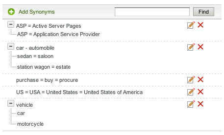

# 辞書について{#about-dictionaries}

辞書を使用して、辞書のコレクションと、それに関連する同義語およびハイフンを管理できます。

## 辞書の使用 {#concept_B8028B71EC8144669614C64578EDB034}

同義語とは、パンツ、ジーンズ、ズボン、スラックスなど、同じ意味または類似した意味を持つ単語、または購入、購入、獲得、注文を意味する単語です。

同義語とは単方向の同義語で、同義語が不適切な場合の解決策を提供します。 例えば、アパレル小売サイトのトップ検索用語は「パンツ」です。 ただし、ジーンズは検索結果に表示されません。 この場合、ジーンズをパンツに関連付けるためにハイフンを使用できますが、ジーンズの検索ではジーンズのみを返すことを許可します。 廃止された製品や競合用語に一致するものを提供するには、下位語を使用します。 この方法を使用すると、他の検索結果に対する影響を最小限に抑えることができます。 例えば、「S2000」製品が廃止され、「S3000」がその後継製品である場合、「S3000」の検索結果に誤った「S2000」結果が含まれないように、「S3000」の代わりにハイフンを使用します。

同義語と低音語は、Webページに存在しない完全一致以外の用語を入力した場合に、関連する検索結果を見つけるのに役立ちます。 例えば、「pants」という単語がWebサイト全体で使用されている場合、「pants」と「ズボン」を連結するシノニムを作成できます。 また、顧客が「ズボン」を検索すると、ズボンに関連した検索結果が返されます。

同義語と低音語は、ドメインディクショナリとしてグループ化されます。 これらは、特定のテーマや目的で作成する特殊な辞書です。

辞書メニューページには、アカウントで現在定義されているすべてのドメイン辞書が表示されます。 このメインページから、ドメインディクショナリの名前の変更、編集、削除または有効化と無効化を行うことができます。

## シノニムとハイフン表記の理解 {#section_B459CCB850974F4FB16A14E489BBBEC0}

次の図は、同義語とハイフンの両方の関係を持つ用語のグループの例です。

6つのメインのシノニム関係が明示的に定義されます。 各キーワードは等号(=)で区切られます。

* 「車」は自動車の同義語です。
* セダンはサロンの同義語。
* 「駅馬車」とは、地所の同義語。
* 「ASP」は、Active Server PagesとApplication Service Providerの同義語です。
* 「購入」、「購入」、「調達」は、お互いの同義語です。
* 「US」、「USA」、「United States of America」は、お互いの同義語です。

単一の単語を含む行は、単純な同義語です。 展開可能なツリーを持つ行は、ハイフンの関係を形成します。 この例では、2番目のツリーで、セダン、サロン、ステーションワゴンおよびステートを、車と自動車の低音語として定義しています。 逆に、車と自動車は、木の残りの部分ではハイパーニームだ。

3番目のツリーは、車とバイクを車両の低音語と定義する。

上記の「US」シノニムの例に示すように、各シノニムに複数の頭字語や複数語の拡張を含めることができます。 単語や頭字語に複数の意味がある場合は、上の例の「ASP」のように、各意味の同義語を作成します。 複数の同義語を追加することで、例えば「Application Service Provider」の検索で「Active Server Pages」の検索結果が返されないようにします。

下位語は、他の下位語と共に拡張されません。 下位語は、同義語を含む1レベル以上の拡張を行います。 例えば、「vehicle」という検索では「car」と「automobile」の結果が返されますが、「sedan」と「station wagon」の結果は返されません。

## 辞書全体でのキーワードの検索について {#section_28E7F80CE68D4481BBF4F51EED237C67}

追加するすべての辞書で、下位語や同義語を検索できます。 この機能は、複数の辞書に存在する特定のキーワードを編集または削除する場合に便利です。 一致する結果を持つすべての辞書は、一致する単語セットと共に表示されます。 クエリが1000セット（ツリー）を超える場合、最初の1000のみが表示されます。

辞書間での [検索を参照してください](../c-about-linguistics-menu/c-about-dictionaries.md#task_8D2BACC6F9B4487FA82367CBEDEE306F)。

詳しくは、 [辞書の編集を参照してくださ](../c-about-linguistics-menu/c-about-dictionaries.md#task_7B349B2D385048D7A06E754FAB75316A)い。

## 辞書をステミング辞書として設定する方法について {#section_B859E2E957674F558AC6F8D05A0ED190}

語幹検索は、複数の語尾を持つ単語のルートを検索する機能で、次の3つのモードのいずれかで動作します。ドメインディクショナリ、デフォルトの代替単語フォーム、なし。

単語と言 [語についてを参照してください](../c-about-linguistics-menu/c-about-words-and-language.md#concept_CEB4B9576F3C4E2EB87B352EEC738D79)。

次の情報は、アカウントがに設定されている **[!UICONTROL Alternative Word Forms]** ことを前提とし **[!UICONTROL Domain Dictionaries]**&#x200B;ており、特定のドメインディクショナリをステムのソースとして設定できます。

任意のドメインディクショナリを「ステミングディクショナリ」に変換できます。 同義語や低音語は、引き続き期待どおりに拡張されますが、副次的な影響もあります。 他の辞書やそれ自体に共通する用語と共に、その単語のグループと同義語や低音語を結合します。 これは、単語の拡張の別のレベルと考えることができます。

語幹付けを行わない場合、同義語および低音語は、冗長で完全である必要があり、各関連語がメンバーとして表示されます。

次に、同義語とステミングなしの例を示します。

* 同義語：ジョグ=実行中
* 「jog」に対するクエリーは、「running」と「jog」という語を含むドキュメントを生成します。
* 「実行中」のクエリーは、「ジョグ」と同じドキュメントを生成します。
* 「jog」と「running」がないが、「runs」や「run」などの他の単語フォームが含まれているWebページがクエリ結果に表示されません。

この例では、クエリー語は、特定の同義語またはハイフンのメンバーでない限り、展開されません。

同義語とステミングの例を次に示します。

* 同義語：ジョグ=実行中
* ステミング辞書のシノニムエントリ：running = runs = run
* 「jog」または「running」に対するクエリは、「runs」、「running」、「run」および「jog」という語を含むすべてのWebページを返します。
* 「runs」と「run」に対するクエリーは、同じ（または類似した）結果を返します。

この例では、語幹辞書の同義語は、同等語のグループを、少なくとも1つの用語が共通する他の辞書の同義語またはハイフンと結合できます。

辞書の指定数が多すぎると、パフォーマンスが低下する可能性があります。 ドメインディクショナリをストリーミングディクショナリとして慎重に指定する必要があります。 また、検索時に予期しない単語の拡張が発生し、単語の拡張のデバッグと追跡のプロセスが複雑になる場合もあります。

詳しくは、 [辞書をステミング辞書として設定するを参照してくださ](../c-about-linguistics-menu/c-about-dictionaries.md#task_541E8453A12F4A8E89CF6F595469F074)い。

## Adding a new dictionary {#task_F31AC6723E894C4F91D12AB2A4CEE9FB}

同義語と低音語の新しい辞書を追加して、顧客が関連する検索結果を見つけやすくすることができます。 この機能は、顧客がWebページに存在しない可能性のある、完全に一致しない用語を入力する場合に特に便利です。

「新しいビジネ [スルールの追加」も参照してくださ](../c-about-rules-menu/c-about-business-rules.md#task_BD3B31ED48BB4B1B8F1DCD3BFA2528E7)い。

**新しい辞書を追加するには**

1. 製品メニューで、/をクリッ **[!UICONTROL Linguistics]** クしま **[!UICONTROL Dictionaries]**&#x200B;す。
1. ページ上で、 **[!UICONTROL Dictionary Menu]** をクリックしま **[!UICONTROL Add New Dictionary]**&#x200B;す。
1. ページ **[!UICONTROL Dictionary]** のフィールド **[!UICONTROL Name]** に、新しい辞書の名前を入力します。
1. クリック **[!UICONTROL Add Synonyms]**.
1. ダイアログ **[!UICONTROL Add Terms]** ボックスで、次のいずれかの操作を行います。

   * 同義語を追加するには、メインテキストフィールドに複数の語句を入力し、各語句を等号(=)で区切ります。 例えば、pants = bont = slacksのように指定します。
   * ハイフンを追加するには、メインテキストフィールドにhypernymキーワードを入力します。 をク **[!UICONTROL Add Hyponym]**&#x200B;リックし、入力したハイパーニームに関連するハイフンを入力します。 例えば、「sedan」、「saloon」、「station wagon」、「seate」は、以下のように「car」や「automobile」（両方のハイパーニム）というハイフンで表すことができます。

      

      「sedan」や「saloon」などの同義語を入力することもできます。

1. クリック **[!UICONTROL Save]**.
1. 次のいずれかを実行します。

   * 手順4 ～ 6を繰り返して、同義語と低音語を追加します。
   * 次の手順に進みます。

1. 変更の結果をプレビューするには、をクリックして、ステージ **[!UICONTROL regenerate your staged site index]** ングされたWebサイトインデックスを再構築します。

   ライブま [たはステージングされたWebサイトの完全なインデックスの実行を参照してください。](../c-about-index-menu/c-about-full-index.md#task_F7FE04D8A1654A7787FCCA31B45EB42D).

   ライブま [たはステージングされたWebサイトの増分インデックスの実行を参照してください。](../c-about-index-menu/c-about-incremental-index.md#task_9BFB6157F3884B2FAECB7E0E9CA318CB).
1. （オプション）製品メニューで、/をク **[!UICONTROL Linguistics]** リック **[!UICONTROL Dictionaries]**&#x200B;し、次のいずれかの操作を行います。

   * 変更を **[!UICONTROL History]** 元に戻すには、をクリックします。

      詳しくは、「 [履歴」オプションの使用を参照してくださ](../t-using-the-history-option.md#task_70DD3F87A67242BBBD2CB27156F43002)い。

   * クリック **[!UICONTROL Live]**.

      ライブ設 [定の表示を参照してください](../c-about-staging.md#task_401A0EBDB5DB4D4CA933CBA7BECDC10F)。

   * クリック **[!UICONTROL Push Live]**.

      詳しくは、ス [テージ設定をライブにプッシュするを参照してくださ](../c-about-staging.md#task_44306783B4C0408AAA58B471DAF2D9A4)い。

## 辞書の有効化または無効化 {#task_EC282EA0846942F6913918EA8218220B}

各単語の関係は、Webサイトのインデックスを作成する際に生成されます。 次回のインデックス作成操作の前に、追加したディクショナリのオン/オフを切り替えることができます。

**辞書を有効または無効にするには**

1. 製品メニューで、/をクリッ **[!UICONTROL Linguistics]** クしま **[!UICONTROL Dictionaries]**&#x200B;す。
1. ページの **[!UICONTROL Dictionary Menu]** 表の列の下で、 **[!UICONTROL Enabled]** 次のいずれかの操作を行います。

   * 有効にし、インデックスを作成する辞書のチェックボックスをオンにします。
   * インデックスが作成されていない辞書のチェックボックスをオフにします。

1. クリック **[!UICONTROL Save Changes]**.
1. 変更の結果をプレビューするには、をクリックして、ステージ **[!UICONTROL regenerate your staged site index]** ングされたWebサイトインデックスを再構築します。

   ライブま [たはステージングされたWebサイトの完全なインデックスの実行を参照してください。](../c-about-index-menu/c-about-full-index.md#task_F7FE04D8A1654A7787FCCA31B45EB42D).

   ライブま [たはステージングされたWebサイトの増分インデックスの実行を参照してください。](../c-about-index-menu/c-about-incremental-index.md#task_9BFB6157F3884B2FAECB7E0E9CA318CB).
1. （オプション）製品メニューで、/をク **[!UICONTROL Linguistics]** リック **[!UICONTROL Dictionaries]**&#x200B;し、次のいずれかの操作を行います。

   * 変更を **[!UICONTROL History]** 元に戻すには、をクリックします。

      詳しくは、「 [履歴」オプションの使用を参照してくださ](../t-using-the-history-option.md#task_70DD3F87A67242BBBD2CB27156F43002)い。

   * クリック **[!UICONTROL Live]**.

      ライブ設 [定の表示を参照してください](../c-about-staging.md#task_401A0EBDB5DB4D4CA933CBA7BECDC10F)。

   * クリック **[!UICONTROL Push Live]**.

      詳しくは、ス [テージ設定をライブにプッシュするを参照してくださ](../c-about-staging.md#task_44306783B4C0408AAA58B471DAF2D9A4)い。

## 辞書の編集 {#task_7B349B2D385048D7A06E754FAB75316A}

特定の辞書を構成するシノニムおよびハイフングループを編集または削除できます。

<!-- 

t_editing_a_dictionary.xml

 -->

また、を使用して、す **[!UICONTROL Find]** べての辞書で編集または削除する特定の同義語やハイフンを検索することもできます。

**辞書を編集するには**

1. 製品メニューで、/をクリッ **[!UICONTROL Linguistics]** クしま **[!UICONTROL Dictionaries]**&#x200B;す。
1. 次のいずれかを実行します。

   * ページの [!DNL Dictionary Menu] 表で、キーワードを編集または削除する単一の辞書のハイパーリンク名をクリックします。
   * ページ [!DNL Dictionary Menu] のテキストフ **[!UICONTROL Find]** ィールドに、すべての辞書で検索する用語を入力し、をクリックします **[!UICONTROL Find]**。

      ページで、 [!DNL Find in Dictionaries] 付属のドロップダウンリストを使用して、必要な洗練オプションを設定します。

      <table> 
      <thead> 
        <tr> 
        <th colname="col1" class="entry"> 
オプション 
 </th> 
        <th colname="col2" class="entry"> 
説明 
 </th> 
        </tr> 
      </thead>
      <tbody> 
        <tr> 
        <td colname="col1"> 
検索 
 </td> 
        <td colname="col2"> 
すべての辞書で検索する語句を入力できます。 
 </td> 
        </tr> 
        <tr> 
        <td colname="col1"> 
一致ドロップダウンリスト 
 </td> 
        <td colname="col2"> 
次の4種類の一致から選択できます。 
        <ul id="ul_D656F159677946938050115F610EEF4B"> 
        <li id="li_2D6B302E021A4CE7A47F028812633EDC">  完全一致  
クエリーは、ハイフンまたはシノニムと完全に一致する必要があります。 
 </li> 
        <li id="li_30AD5976E43041E98190F4757E821092">  テキストを含む  
クエリには、サブ文字列の一致のみが必要です。ハイフンまたは同義語内の一致。 
 </li> 
        <li id="li_9BF911EFB54345BB82679BDE51DDF8AF">  次で始まる  
クエリーは、各ハイフンとシノニムの先頭に対してのみ一致します。 
 </li> 
        <li id="li_CB791C7F5B5A4496B329ED505E7D97BC">  単語の一致  
クエリーは、シノニムまたはハイフンから各単語と比較されますが、単語は完全に一致する必要があります。 
 </li> 
        </ul> 
 </td> 
        </tr> 
        <tr> 
        <td colname="col1"> 
「有効/無効の辞書」ドロップダウンリスト 
 </td> 
        <td colname="col2"> 
次のオプションから選択できます。 
        <ul id="ul_EBBD3F3A2D854952A35CBDDBECB40958"> 
        <li id="li_7F5654C284BE485EAC9B000A663C6C60">  有効/無効の辞書  
有効な辞書と無効な辞書の両方で、指定した語句を検索します。 
 </li> 
        <li id="li_4A83EECF38044287A923EC0AAF639079">  有効な辞書のみ  
有効な辞書のみを検索すると、現在のインデックスのデバッグに役立ちます。 
 </li> 
        </ul> 
 
詳しくは、辞 <a href="../c-about-linguistics-menu/c-about-dictionaries.md#task_EC282EA0846942F6913918EA8218220B" type="task" format="dita" scope="local"> 書の有効化と無効化を参照してくだ </a>さい。 
 </td> 
        </tr> 
        <tr> 
        <td colname="col1"> 
ステージ/ライブドロップダウンリスト 
 </td> 
        <td colname="col2"> 
次のオプションから選択できます。 
        <ul id="ul_BD0733A30E6B470E942B21F499A4373B"> 
        <li id="li_F9A8C39C22EA4FBF86536F5924ED973C">  ステージ/ライブ辞書  
ステージング済みおよびライブの辞書全体で指定したキーワードを検索します。 ただし、辞書が存在する場合は、ステージングされたバージョンのみが検索されます。 ステージバージョンが存在しない場合は、ライブバージョンのディクショナリを検索します。 
 </li> 
        <li id="li_DB0944DB18564269AA10676BDFDB0460">  ライブ辞書  
ライブ辞書の中で指定した語句のみを検索します。 
 </li> 
        </ul> 
 </td> 
        </tr> 
      </tbody> 
      </table>

1. 表で、次のいずれかの操作を行います。

   * 更新  するキーワードに関連付けられているをクリックします。 ダイアログ **[!UICONTROL Edit Terms]** ボックスで、目的のキーワードを変更します。 終了したら、をクリックしま **[!UICONTROL Save]**&#x200B;す。

   * 削除  するキーワードに関連付けられているをクリックします。 ダイアログボッ **[!UICONTROL Delete Terms]** クスで、をクリックしま **[!UICONTROL Delete]**&#x200B;す。 必ず正しいキーワードを削除してください。削除の確認ダイアログボックスはありません。

1. 変更の結果をプレビューするには、をクリックして、ステージ **[!UICONTROL regenerate your staged site index]** ングされたWebサイトインデックスを再構築します。

   ライブま [たはステージングされたWebサイトの完全なインデックスの実行を参照してください。](../c-about-index-menu/c-about-full-index.md#task_F7FE04D8A1654A7787FCCA31B45EB42D).

   ライブま [たはステージングされたWebサイトの増分インデックスの実行を参照してください。](../c-about-index-menu/c-about-incremental-index.md#task_9BFB6157F3884B2FAECB7E0E9CA318CB).
1. （オプション）製品メニューで、/をク **[!UICONTROL Linguistics]** リック **[!UICONTROL Dictionaries]**&#x200B;し、次のいずれかの操作を行います。

   * 変更を **[!UICONTROL History]** 元に戻すには、をクリックします。

      詳しくは、「 [履歴」オプションの使用を参照してくださ](../t-using-the-history-option.md#task_70DD3F87A67242BBBD2CB27156F43002)い。

   * クリック **[!UICONTROL Live]**.

      ライブ設 [定の表示を参照してください](../c-about-staging.md#task_401A0EBDB5DB4D4CA933CBA7BECDC10F)。

   * クリック **[!UICONTROL Push Live]**.

      詳しくは、ス [テージ設定をライブにプッシュするを参照してくださ](../c-about-staging.md#task_44306783B4C0408AAA58B471DAF2D9A4)い。

## 辞書の名前の変更 {#task_7F1F372B337B4853BFA2A60AD267B092}

追加した辞書の名前を変更できます。

<!-- 

t_renaming_a_dictionary.xml

 -->

このオプションを **[!UICONTROL Alternate Word Forms]** inに設定し **[!UICONTROL Domain Dictionaries]** た場合、で **[!UICONTROL Words & Language]**&#x200B;はなくこのオ **[!UICONTROL Configure]** プションが使用されま **[!UICONTROL Rename]**&#x200B;す。

単語と言 [語についてを参照してください](../c-about-linguistics-menu/c-about-words-and-language.md#concept_CEB4B9576F3C4E2EB87B352EEC738D79)。

**辞書の名前を変更するには**

1. 製品メニューで、/をクリッ **[!UICONTROL Linguistics]** クしま **[!UICONTROL Dictionaries]**&#x200B;す。
1. ページの **[!UICONTROL Dictionary Menu]** 表の列の下で、 **[!UICONTROL Actions]** 次のいずれかの操作を行います。

   * 名前を **[!UICONTROL Rename]** 変更する関連する辞書をクリックします。

      ダイアログボッ **[!UICONTROL Rename Dictionary]** クスで選択します。 フィー **[!UICONTROL Name]** ルドに、辞書の新しい名前を入力します。

      クリック **[!UICONTROL Rename File]**.

   * 名前を **[!UICONTROL Configure]** 変更する関連する辞書をクリックします。

      ダイアログボッ **[!UICONTROL Configure Dictionary]** クスで選択します。 フィー **[!UICONTROL Name]** ルドに、辞書の新しい名前を入力します。

      クリック **[!UICONTROL Save Configuration]**.

1. （オプション）次のいずれかの操作を行います。

   * 変更を **[!UICONTROL History]** 元に戻すには、をクリックします。

      詳しくは、「 [履歴」オプションの使用を参照してくださ](../t-using-the-history-option.md#task_70DD3F87A67242BBBD2CB27156F43002)い。

   * クリック **[!UICONTROL Live]**.

      ライブ設 [定の表示を参照してください](../c-about-staging.md#task_401A0EBDB5DB4D4CA933CBA7BECDC10F)。

   * クリック **[!UICONTROL Push Live]**.

      詳しくは、ス [テージ設定をライブにプッシュするを参照してくださ](../c-about-staging.md#task_44306783B4C0408AAA58B471DAF2D9A4)い。

## 辞書をステミング辞書として設定する {#task_541E8453A12F4A8E89CF6F595469F074}

辞書を高度なステミングモードに設定して、検索で語幹化を利用できます。

<!-- 

t_configuring_a_dictionary_as_a_stemming_dictionary.xml

 -->

このようなモードは、顧客が検索している内容の変種に一致するWebページを返します。

辞書につ [いてを参照](../c-about-linguistics-menu/c-about-dictionaries.md#concept_B8028B71EC8144669614C64578EDB034)。

単語と言 [語についてを参照してください](../c-about-linguistics-menu/c-about-words-and-language.md#concept_CEB4B9576F3C4E2EB87B352EEC738D79)。

**辞書をステミング辞書として設定するには**

1. 製品メニューで、/をクリッ **[!UICONTROL Linguistics]** クしま **[!UICONTROL Words & Language]**&#x200B;す。
1. ページ [!DNL Words & Languages] のドロップダウンリ **[!UICONTROL Alternate Words Forms]** ストで、を選択します **[!UICONTROL Domain Dictionaries]**。

   ステミングディクショナリとして設定されたドメインディクショナリ（後述の手順7を参照）は、代替単語フォームのソースとして使用されます。

1. クリック **[!UICONTROL Save Changes]**.
1. 製品メニューで、/をクリッ **[!UICONTROL Linguistics]** クしま **[!UICONTROL Dictionaries]**&#x200B;す。
1. ページ [!DNL Dictionaries Menu] の表の列の **[!UICONTROL Actions]** 下で、ステミング辞書と **[!UICONTROL Configure]** して設定する関連する辞書をクリックします。
1. ダイアログ **[!UICONTROL Configure Dictionary]** ボックスのドロップダ **[!UICONTROL Advanced Stemming Mode]** ウンリストで、を選択しま **[!UICONTROL Yes]**&#x200B;す。
1. クリック **[!UICONTROL Save Configuration]**.
1. をクリックし **[!UICONTROL regenerate your staged site index]** て、ステージングされたWebサイトのインデックスを再構築します。

   ライブま [たはステージングされたWebサイトの完全なインデックスの実行を参照してください。](../c-about-index-menu/c-about-full-index.md#task_F7FE04D8A1654A7787FCCA31B45EB42D).

   ライブま [たはステージングされたWebサイトの増分インデックスの実行を参照してください。](../c-about-index-menu/c-about-incremental-index.md#task_9BFB6157F3884B2FAECB7E0E9CA318CB).
1. （オプション）製品メニューで、/をク **[!UICONTROL Linguistics]** リック **[!UICONTROL Dictionaries]**&#x200B;し、次のいずれかの操作を行います。

   * 変更を **[!UICONTROL History]** 元に戻すには、をクリックします。

      詳しくは、「 [履歴」オプションの使用を参照してくださ](../t-using-the-history-option.md#task_70DD3F87A67242BBBD2CB27156F43002)い。

   * クリック **[!UICONTROL Live]**.

      ライブ設 [定の表示を参照してください](../c-about-staging.md#task_401A0EBDB5DB4D4CA933CBA7BECDC10F)。

   * クリック **[!UICONTROL Push Live]**.

      詳しくは、ス [テージ設定をライブにプッシュするを参照してくださ](../c-about-staging.md#task_44306783B4C0408AAA58B471DAF2D9A4)い。

## 辞書間の検索 {#task_8D2BACC6F9B4487FA82367CBEDEE306F}

サイト検索/マーチャンダイジングに追加されたすべての辞書で、低音語や同義語を検索できます。

<!-- 

t_searching_across_dictionaries.xml

 -->

この機能は、複数の辞書に存在する特定のキーワードを編集または削除する場合に便利です。 一致する結果を持つすべての辞書は、一致する単語セットと共に表示されます。 クエリが1000セット（ツリー）を超える場合、最初の1000のみが表示されます。

詳しくは、 [辞書の編集を参照してくださ](../c-about-linguistics-menu/c-about-dictionaries.md#task_7B349B2D385048D7A06E754FAB75316A)い。

**辞書をまたいで検索するには**

1. 製品メニューで、/をクリッ **[!UICONTROL Linguistics]** クしま **[!UICONTROL Dictionaries]**&#x200B;す。
1. ページ [!DNL Dictionary Menu] のテキストフ **[!UICONTROL Find]** ィールドに、すべての辞書で検索する用語を入力し、をクリックします **[!UICONTROL Find]**。
1. ページで、 [!DNL Find in Dictionaries] 付属のドロップダウンリストを使用して、必要な調整オプションを設定します。

   詳しくは、 [辞書の編集を参照してくださ](../c-about-linguistics-menu/c-about-dictionaries.md#task_7B349B2D385048D7A06E754FAB75316A)い。
1. （オプション）ドロッ **[!UICONTROL Show]** プダウンを使用して、1ページに表示する結果の最大数を指定します。

## 辞書の削除 {#task_DBAAEE624BC14D2590444B0B7869ECCA}

不要になった辞書や使用しなくなった辞書は削除できます。

<!-- 

t_deleting_a_dictionary.xml

 -->

ライブの辞書を削除すると、削除対象としてステージングされます。 ステージングされた辞書を削除すると、その辞書は直ちに削除されます。

必要な時間が長い辞書を削除していることを確認します。削除を元に戻す履歴機能はありません。

**辞書を削除するには**

1. 製品メニューで、/をクリッ **[!UICONTROL Linguistics]** クしま **[!UICONTROL Dictionaries]**&#x200B;す。
1. ページ [!DNL Dictionary Menu] の表の列の下 **[!UICONTROL Actions]** で、削除する関連 **[!UICONTROL Delete]** 辞書のをクリックします。
1. ダイアログボッ **[!UICONTROL Delete Dictionary]** クスで選択します。 click **[!UICONTROL Yes]** to confirm the deletion.
1. （オプション）ライブ辞書を削除した場合は、次のいずれかの操作を行います。

   * クリック **[!UICONTROL Live]**.

      ライブ設 [定の表示を参照してください](../c-about-staging.md#task_401A0EBDB5DB4D4CA933CBA7BECDC10F)。

   * クリック **[!UICONTROL Push Live]**.

      詳しくは、ス [テージ設定をライブにプッシュするを参照してくださ](../c-about-staging.md#task_44306783B4C0408AAA58B471DAF2D9A4)い。

