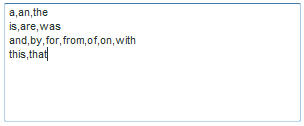

# 除外する単語について{#about-excluded-words}

「除外された単語」を使用すると、検索結果から除外する頻度の高い語句や、「a」や「the」などの共通語を指定できます。

## 除外単語の使用 {#concept_9DB67BD2F0DC43AC88741003D9F39812}

See also [About Searches](../c-about-settings-menu/c-about-searching-menu.md#concept_207105CF26B1448F8A3D223787C56AB8).

「除外された単語」を使用しないと、これらの単語を含む検索で、無関係な結果が多数見つかる場合があります。 単語やフレーズを除外すると、指定した除外された用語のみに一致する検索結果は表示されません。 検索クエリに除外された単語が含まれる場合は、除外されていない単語のみがドキュメントの検索に使用されます。

除外された検索語は、検索結果でハイライト表示されません。 ただし、各結果の関連度スコアは、除外された単語の影響を受けます。 つまり、除外された単語はドキュメントを検索する際に無視されますが、検索結果ページでドキュメントをランク付けする際には引き続き使用されます。 顧客が「除外単語」設定（またはこれらの設定の変更）の効果を利用できるようにする前に、サイトインデックスを必ず再生成してください。

検索結果から除外する単語を入力する場合は、語句をコンマで区切ります。 1行に1つ以上の除外する単語を入力できます。 次の例は、除外された単語を別々の行でコンマで割ったものです。

上記の除外単語の例を使用して、顧客が「米国」を検索した場合、「the」と「of」という単語は検索から除外されます。 代わりに、「united」、「states」および「america」という語を含むすべてのページが検索されます。 「of」または「the」という語のみを含むページは表示されません。

一部のサイトでは、ほとんどのページまたはすべてのページに特定のフレーズが含まれています。 例えば、ニューヨーク市の観光関連のWebサイトでは、各ページのタイトルに「ニューヨーク」という語を含めることができます。 除外リストにこのフレーズなどを追加することを検討します。

フレーズを除外しても、それを構成する個々の単語は検索用語として引き続き使用されます。 訪問者が除外されたフレーズと完全に一致する語句を検索した場合にのみ、その語句が検索結果から除外されます。 上記の例を使用して、顧客が「ニューヨークバレエ」を検索した場合、「the」という語と「new york」という語は除外されます。「バレエ」という単語を含むページのみが検索結果として返されます。 一方、「new buildings」や「duke of york」を検索すると、それぞれ「new」や「york」という語を含むページが検索されます。

## 除外する単語の設定 {#task_60BF6BB7A66C48479D2BBB32C0F38CDE}

頻繁に使用するフレーズや共通語を検索結果から除外できます。

1行に1つ以上の単語を入力できます。 次の例のように、各単語はコンマで区切ります。

顧客の検索内のすべての単語が除外された場合に検索結果を表示するように選択できます。 例えば、「the」という単語を除外し、顧客が「the」のみを検索することを選択した場合、検索結果には「the」という単語を含むページが表示されます。 この結果は、「the」という単語が除外されても当てはまります。 このオプションを選択しないと、顧客は検索結果を取得しません。 この設定は、検索に除外されない単語が1つ以上含まれている場合は無効です。

**除外する単語を設定するには**

1. 製品メニューで、/をクリッ **[!UICONTROL Linguistics]** クしま **[!UICONTROL Excluded Words]**&#x200B;す。
1. ページ [!DNL Excluded Words] のテキストフ **[!UICONTROL Words and Phrases]** ィールドに、検索結果から除外する単語を入力します。
1. （オプション）をクリックしま **[!UICONTROL Show results when all words in the query are excluded words]**&#x200B;す。

   顧客の検索内のすべての単語が除外される場合、すべての単語が一緒に使用されて検索が実行されます。
1. クリック **[!UICONTROL Save Changes]**.
1. 変更の結果をプレビューするには、をクリックして、ステージ **[!UICONTROL regenerate your staged site index]** ングされたWebサイトインデックスを再構築します。

   ライブま [たはステージングされたWebサイトの完全なインデックスの実行を参照してください。](../c-about-index-menu/c-about-full-index.md#task_F7FE04D8A1654A7787FCCA31B45EB42D).

   ライブま [たはステージングされたWebサイトの増分インデックスの実行を参照してください。](../c-about-index-menu/c-about-incremental-index.md#task_9BFB6157F3884B2FAECB7E0E9CA318CB).
1. （オプション）製品メニューで、/をク **[!UICONTROL Linguistics]** リック **[!UICONTROL Excluded Words]**&#x200B;し、次のいずれかの操作を行います。

   * 変更を **[!UICONTROL History]** 元に戻すには、をクリックします。

      詳しくは、「 [履歴」オプションの使用を参照してくださ](../t-using-the-history-option.md#task_70DD3F87A67242BBBD2CB27156F43002)い。

   * クリック **[!UICONTROL Live]**.

      ライブ設 [定の表示を参照してください](../c-about-staging.md#task_401A0EBDB5DB4D4CA933CBA7BECDC10F)。

   * クリック **[!UICONTROL Push Live]**.

      詳しくは、ス [テージ設定をライブにプッシュするを参照してくださ](../c-about-staging.md#task_44306783B4C0408AAA58B471DAF2D9A4)い。

