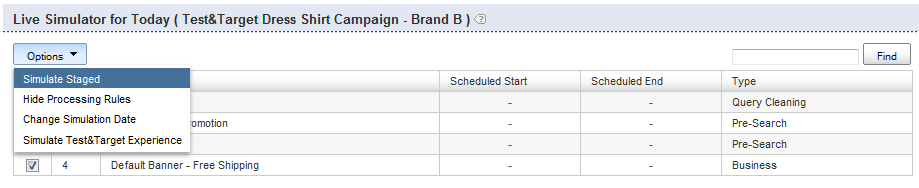

# ビジネス・ルールについて{#about-business-rules}

ビジネスルールを使用して、検索をマーチャンダイジングできます。

## ビジネス・ルールの使用 {#concept_2A93D76216754D3D8412CDEA00BD26BD}

例えば、バナーを表示するタイミングや、表示する結果や表示順を設定できます。 また、ファセット内の項目の位置や、特定の検索に使用するテンプレートを設定することもできます。 ルールは、定義された順に実行されます。ルールの順序番号が高いほど、プロセスで後から実行され、以前のルールが切り捨てられます。 ルールをドラッグ&amp;ドロップして順序を変更するか、「ルールの順序」テキストボックスに新しい番号を入力して順序を変更できます。

各ビジネスルールは、トリガーとアクションで構成されます。

トリガーは、ルールをいつ実行するかを定義します。 例えば、クエリ用語が「mens」の場合や、結果がほとんどがhatsの場合などです。 トリガーは、すべての条件、または全体のトリガーを真にするための条件のいずれかを満たす必要がある複数の条件で構成されます。 トリガー演算子を変更することで、優先順位を指定できます。

アクションは、トリガー条件が満たされた場合の動作を定義します。 例えば、特定の結果を位置1に表示または移動するようにバナーを設定します。 ルールの表には、ルールに関する概要情報が表示されます。 ルール名をクリックすると、そのルール名が開き、追加情報が表示されます。

ルールの表には、すべてのビジネスルールのリストが表示されます。 デフォルトでは、追加された最近10個のルールが降順で表示されます。 テーブル内の列ヘッダーをクリックして、ルールを昇順または降順で並べ替えることができます。

ビジネスルールには、次の3つの状態のいずれかを含めることができます。承認済、休止または仕掛品（作業中）

<table> 
 <thead> 
  <tr> 
   <th colname="col1" class="entry"> 
ビジネスルールの状態 
 </th> 
   <th colname="col2" class="entry"> 
説明 
 </th> 
  </tr> 
 </thead>
 <tbody> 
  <tr> 
   <td colname="col1"> 
承認済み 
 </td> 
   <td colname="col2"> 
承認済みのビジネスルールは、実稼働環境およびステージ環境で実行されます。 ビジネスルールは、アドバンスルールビルダーで承認します。 
 </td> 
  </tr> 
  <tr> 
   <td colname="col1"> 
停止中 
 </td> 
   <td colname="col2"> 
休止されたビジネスルールは、ステージングされた環境や実稼働環境では実行されません。 
 </td> 
  </tr> 
  <tr> 
   <td colname="col1"> 
仕掛品 
 </td> 
   <td colname="col2"> 
WIP(Work In Progress)は、承認も休止もされていないビジネス・ルールです。 つまり、まだ作業を続けている場合や、承認する前にテストを行う場合があります。 WIP状態のビジネス・ルールは、ステージング環境でのみ実行されます。 
 </td> 
  </tr> 
 </tbody> 
</table>

ビジネスルールを承認し、ライブ環境で実行するようにビジネスルールをプッシュします。 現在、すべてのルールをライブにプッ *シュで* きます。 ただし、ルールのステータスを変更して、実稼働環境で実行するルールと実行しないルールを制御できます。

デフォルトでは、関連するトリガーが満たされるたびにルールが実行されます。 ただし、オプションで、特定の日時範囲に対してルールを実行するようにスケジュールすることもできます。

また、デフォルトでは、すべてのストアに対して関連付けトリガーが満たされるたびにルールが実行されます。 ルールを特定のストアにのみ適用する場合は、ストアパネルを使用して、ルールを適用する1つ以上のストアを選択できます。

## 新しいビジネスルールの追加 {#task_BD3B31ED48BB4B1B8F1DCD3BFA2528E7}

またはを使用して、 [!DNL Visual Rule Builder] 顧客の検 [!DNL Advanced Rule Builder] 索エクスペリエンスをカスタマイズするビジネスルールを追加できます。

**新しいビジネスルールを追加するには**

次の手順は、Visual Rule Builderを使用していることを前提としています。

1. 次のいずれかを実行します。

   * 製品メニューで、/をクリッ **[!UICONTROL Rules]** クしま **[!UICONTROL Business Rules]**&#x200B;す。 ページ上で、 [!DNL Business Rules] をクリックしま **[!UICONTROL Add New Rule]**&#x200B;す。

   * 製品メニューで、をクリックしま **[!UICONTROL Simulator]**&#x200B;す。 ページ **[!UICONTROL Simulator for Today]** で、ドロッ **[!UICONTROL Add New Rule]** プダウンメニューの右 **[!UICONTROL Options]** 側をクリックします。

      このオプシ **[!UICONTROL Add New Rule]** ョンがページに表示されない場合は、ドロップダウンメ **[!UICONTROL Options]** ニューでをクリックしま **[!UICONTROL Simulate Staged]**&#x200B;す。

      

1. テキストフ **[!UICONTROL Name]** ィールドに、ビジネスルールの新しい名前を入力します。

   まだクリックしな **[!UICONTROL Save Rule]** いでください。
1. （オプション）多数のビジネスルールを管理する場合は、ビジネスルールに特定のラベルを付けることができます。 フィールド **[!UICONTROL Tags]** に、1つ以上のタグラベル、カンマ、タブまたはEnterを区切り文字として入力します。

   ページで、 [!DNL Business Rules] この機能を使用し **[!UICONTROL Filter by tag]** て、特定のラベルに一致するルールをフィルタリングします。 1.ページ [!DNL Business Rule Builder] で、使用するトリガーとアクションを設定します。

   **トリガーオプション**

   トリガーとは、ビジネスルールを実行するために満たす必要がある条件です。 ビジネスルールに複数のトリガーがある場合、次の3つの方法のいずれかを使用して、トリガーの応答方法を設定できます。

   * 次の例のように、すべてのトリガーがtrue（デフォルト設定）である必要がある応答です。

      `if a AND b AND c then ...`

   * 次の例のように、いずれかのトリガーが真である必要がある応答です。

      `if a OR b OR c then ...`

   * トリガーのカスタムの組み合わせが指定された応答。 つまり、個々のトリガーまたは「条件」を演算子や演算子と組み `AND` 合わせることがで `OR` きます。

      また、次の例のように、左括弧と右括弧の組み合わせを追加して、評価の優先順位を変更することもできます。

      `if (a OR b) AND c then ...`

      >[!NOTE]
      >
      >演算子をカスタム・ビジ `AND` ネス・ル `OR` ール・セットの演算子と組み合わせる場合は、トリガーが正しい順序で評価されるように、括弧を適切に指定する必要があります。

      トリガーの組み合わせをカスタマイズできるこの特徴は、デフォルトでは有効になっていません。 お使いの機能を有効にするには、テクニカルサポートにお問い合わせください。
   <table> 
      <thead> 
      <tr> 
      <th colname="col1" class="entry"> 
トリガーオプション 
 </th> 
      <th colname="col2" class="entry"> 
説明 
 </th> 
      </tr> 
    </thead>
    <tbody> 
      <tr> 
      <td colname="col1"> 
キーワードの一致 
 </td> 
      <td colname="col2"> 
トリガーは、検索語句が特定の大文字と小文字を区別するキーワードと一致する場合にtrueになります。 このトリガーは、言語辞書で定義されている、キーワードとそのすべての同義語の両方に当てはまります。 
 </td> 
      </tr> 
      <tr> 
      <td colname="col1"> 
 クエリの一致 
 </td> 
      <td colname="col2"> 
 すべての検索パラメータが一致する場合、トリガはtrueです。 
 </td> 
      </tr> 
      <tr> 
      <td colname="col1"> 
 結果グループが優先 
 </td> 
      <td colname="col2"> 
 トリガーは、指定した検索で定義された結果のグループが結果セットを支配する場合にtrueになります。 
 
デフォルトでは、優先度は50%に設定されています。 この設定は、設定できるマーチャンダイジングの環境設定です。 
 
 
        <!--See <xref href="t_Configuring_Merchandising_preferences.xml#task_7AC7B9F5D9F44E10AB5BC0B8CB31C37A" type="task" format="dita" scope="local">Configuring Merchandising preferences</xref>. --> 
 
このトリガーをtrueにするには、グループ全体が結果セット内に存在する必要があります。 結果のグループは動的です。 インデックス操作の後、元の検索条件に一致する結果に応じて変化する可能性があります。 
 </td> 
      </tr> 
      <tr> 
      <td colname="col1"> 
結果グループが存在する 
 </td> 
      <td colname="col2"> 
 トリガーは、指定した検索で定義された結果のグループが結果セットに存在する場合にtrueになります。 このトリガーを満たすには、グループ全体が結果セット内に存在する必要があります（結果は任意のページに表示されます）。 結果のグループは動的で、インデックス操作の後で元の検索条件に一致する結果に応じて変化する場合があります。 
 </td> 
      </tr> 
      <tr> 
      <td colname="col1"> 
 結果が存在する 
 </td> 
      <td colname="col2"> 
 トリガーは、結果セット内に個々の結果が見つかった場合にtrueになります。 結果は結果セットの任意の場所に含めることができ、ユーザーが現在表示しているページ上に置く必要はありません。 
 </td> 
      </tr> 
    </tbody> 
    </table>

   **アクションオプション**

   ビジネスルールのトリガーが満たされると、そのルールに関連付けられたアクションが実行されます。 Visual Rule Builderでは次のアクションを作成できますが、Advanced Rule Builderを使用して追加のタイプのアクションを作成できます。

   次の表に示す「ファセット項目を削除」、「ファセット項目を表示」、「ファセットを表示」、「ファセットを削除」、「ファセット項目をプッシュ」の各アクションには、ファセットが必要です。 ファセットを選択するためのインターフェイスは、アカウントの設定方法によって異なります。 例えば、通常のアカウントでは、ファセットの選択にドロップダウンリストを使用します。 ただし、アカウントにスロットファセットがある場合は、「オートコンプリート」テキストボックスが表示され、任意のファセットの名前を入力できます。 オートコンプリートは、ファセット名を入力すると、ドロップダウンリストのファセットを提案します。 提案には、現在定義されているファセットが含まれます。 アカウントにスロットマップがある場合は、スロットファセットも提示されます。

   <table> 
    <thead> 
      <tr> 
      <th colname="col1" class="entry"> 
アクションオプション 
 </th> 
      <th colname="col2" class="entry"> 
説明 
 </th> 
      </tr> 
    </thead>
    <tbody> 
      <tr> 
      <td colname="col1"> 
プッシュグループ 
 </td> 
      <td colname="col2"> 
 指定した検索条件で定義された検索結果のグループを特定の位置にプッシュします。 
 
検索結果のグループをプッシュしても、グループは暗黙的に追加されません。 
 </td> 
      </tr> 
      <tr> 
      <td colname="col1"> 
グループの追加 
 </td> 
      <td colname="col2"> 
 指定した検索条件で定義された検索結果のグループを追加します。 
 </td> 
      </tr> 
      <tr> 
      <td colname="col1"> 
グループの削除 
 </td> 
      <td colname="col2"> 
 指定した検索条件で定義された検索結果のグループを削除します。 
 </td> 
      </tr> 
      <tr> 
      <td colname="col1"> 
プッシュ（1つ） 
 </td> 
      <td colname="col2"> 
 個々の検索結果を選択した位置にプッシュします。 
 </td> 
      </tr> 
      <tr> 
      <td colname="col1"> 
1つ追加 
 </td> 
      <td colname="col2"> 
 選択した位置に個々の検索結果を追加します。 
 </td> 
      </tr> 
      <tr> 
      <td colname="col1"> 
1つ削除 
 </td> 
      <td colname="col2"> 
 検索結果セットから個々の検索結果を削除します。 
 </td> 
      </tr> 
      <tr> 
      <td colname="col1"> 
すべての結果を削除 
 </td> 
      <td colname="col2"> 
検索結果セットからすべての結果を削除します。 
 
 
        <!-- Bug #3331637 The option is meant to be used in conjunction with other rule actions in order to create "canned landing pages" where we want to create a page's content solely by rule actions, and need to completely discard the "natural" results of the search. Given that the other options don't have any kind of "here's how/why you might use this", I don't see much point in breaking that precedent here.--> 
 </td> 
      </tr> 
      <tr> 
      <td colname="col1"> 
別のバナーを選択 
 </td> 
      <td colname="col2"> 
 選択したバナー領域のバナーを変更します。 
 
このオプションは、Webページ表示領域でバナーを右クリックしたときに使用できます。 
 </td> 
      </tr> 
      <tr> 
      <td colname="col1"> 
バナーコマンドの追加 
 </td> 
      <td colname="col2"> 
Adobe Dynamic Media Classicテンプレートにのみ適用されます。 
 
バナーテンプレートで使用されるデフォルトのパラメーターを変更できます。 
 
Adobe Dynamic Media Classicを使用したバナーの追 <a scope="local" href="../c-about-design-menu/c-about-banners.md#task_AD1E0C00A9E04B1FA819EB93288786B3" type="reference" format="dita"> 加のオプションの表を参照してくださ </a>い。 
 
Adobe Dynamic Media Classicを使 <a href="../c-about-design-menu/c-about-banners.md#task_C3E782477FBF428ABEA220751781ACA9" type="task" format="dita" scope="local"> 用したバナーの編集も参照してくださ </a>い。 
 </td> 
      </tr> 
      <tr> 
      <td colname="col1"> 
バナーの削除 
 </td> 
      <td colname="col2"> 
 選択したバナー領域からバナーを削除します。バナーを設定する別のルールがこのルールを上書きしない限り、バナーは表示されません。 
 
このオプションは、Webページ表示領域でバナーを右クリックしたときに使用できます。 
 </td> 
      </tr> 
      <tr> 
      <td colname="col1"> 
ファセット項目をプッシュ 
 </td> 
      <td colname="col2"> 
 ファセット内の項目を選択した位置にプッシュします。 
 </td> 
      </tr> 
      <tr> 
      <td colname="col1"> 
ゾーンの削除 
 </td> 
      <td colname="col2"> 
 検索結果ページからゾーンを削除します。 
 
以下の「ファセットを削除」アクションも参照してください。 
 </td> 
      </tr> 
      <tr> 
      <td colname="col1"> 
領域の表示 
 </td> 
      <td colname="col2"> 
 検索結果ページにゾーンを表示します。 
 
以下の「ファセットを表示」アクションも参照してください。 
 </td> 
      </tr> 
      <tr> 
      <td colname="col1"> 
ファセット項目の削除 
 </td> 
      <td colname="col2"> 
 ファセット項目をファセットから削除します。 
 </td> 
      </tr> 
      <tr> 
      <td colname="col1"> 
ファセット項目を表示アクションが 
 </td> 
      <td colname="col2"> 
 特定のファセット項目を表示します。 
 </td> 
      </tr> 
      <tr> 
      <td colname="col1"> 
ファセットを表示 
 </td> 
      <td colname="col2"> 
 特定のファセットを表示します。 この操作は、「ゾーンを表示」アクションよりも優先されます。 
 </td> 
      </tr> 
      <tr> 
      <td colname="col1"> 
ファセットの削除 
 </td> 
      <td colname="col2"> 
 特定のファセットを削除します。 この操作は、「Remove Zone」操作よりも優先されます。 
 </td> 
      </tr> 
    </tbody> 
    </table>

   アクティブな（展開された）ルールビルダーパネルに応じて、次の操作を実行して、トリガーとアクションを設定することもできます。

   * パネルが展 **[!UICONTROL Triggers]** 開されたら — ビジネスルールビルダページのプレゼンテーションテンプレート領域で、検索結果または検索ファセットを右クリックし、をクリックしま **[!UICONTROL Add "result present" trigger]**&#x200B;す。

      トリガーパネルで、トリガーの左側の「X」をクリックして、トリガーのリストから削除します。

   * パネルが展 **[!UICONTROL Actions]** 開されたら — ビジネスルールビルダページのプレゼンテーションテンプレート領域で、検索結果を右クリックします。 、、、ま **[!UICONTROL Add Result]**&#x200B;たは( **[!UICONTROL Remove Result]**&#x200B;は数 **[!UICONTROL Push to bottom]**&#x200B;字) **[!UICONTROL Push to #`<n>`]** をク `<n>` リックします。

1. （オプション）任意のビジネスルールビルダーパネル(、 [!DNL Triggers]、ま [!DNL Actions]たは [!DNL Schedule])で、次のいずれかの操作を行います。

   * [ビジネスルールビルダ]ページ領域のプレゼンテーションテンプレート領域で、バナーを右クリックし、をクリックしま **[!UICONTROL Select different banner]**&#x200B;す。 ページで、バ **[!UICONTROL Pick Banner]** ナーサムネールの **[!UICONTROL Pick this banner]** 下のをクリックして、プレゼンテーションテンプレートに追加します。 プレゼンテーションテンプレート上の元のバナーのサイズと領域に一致するバナーのみを選択できます。

      バナーの追加アクションがパネルに追加さ [!DNL Actions] れます。

   * ページのプレゼンテーションテンプレ [!DNL Business Rule Builder] ート領域で、パラメーターを変更するAdobe Dynamic Media Classicテンプレートバナーを右クリックし、をクリックしま **[!UICONTROL Add banner commands]**&#x200B;す。 ダイアログボ [!DNL Change Parameters] ックスで、必要なパラメータオプションを設定します。

      Adobe Dynamic Media Classicを使用したバナーの追 [加のオプションの表を参照してください](../c-about-design-menu/c-about-banners.md#task_AD1E0C00A9E04B1FA819EB93288786B3)。

      クリック **[!UICONTROL Save]**.

      パラメータの変更がパネルに追加さ [!DNL Actions] れます。

      Adobe Dynamic Media Classicを使 [用したバナーの編集も参照してください](../c-about-design-menu/c-about-banners.md#task_C3E782477FBF428ABEA220751781ACA9)。

   * [ビジネスルールビルダ]ページのプレゼンテーションテンプレート領域で、ページから削除するバナーを右クリックし、をクリックしま **[!UICONTROL Remove banner]**&#x200B;す。 バナーの削除アクションがアクションパネルに追加されます。

1. （オプション）パネル **[!UICONTROL Schedule]** で、次のいずれかの操作を行います。

   * をクリッ **[!UICONTROL Run Indefinitely]** クすると、関連するトリガーが満たされた場合にルールが実行されます。 このオプションはデフォルトです。
   * をク **[!UICONTROL Fixed Schedule]**&#x200B;リックし、関連するトリガーに適合した場合にルールを実行する開始日時と終了日時を指定します。

1. クリック **[!UICONTROL Save Rule]**.
1. （オプション）ページ [!DNL Business Rules] で、次のいずれかの操作を行います。

   * 変更を **[!UICONTROL History]** 元に戻すには、をクリックします。

      詳しくは、「 [履歴」オプションの使用を参照してくださ](../t-using-the-history-option.md#task_70DD3F87A67242BBBD2CB27156F43002)い。

   * クリック **[!UICONTROL Live]**.

      ライブ設 [定の表示を参照してください](../c-about-staging.md#task_401A0EBDB5DB4D4CA933CBA7BECDC10F)。

   * クリック **[!UICONTROL Push Live]**.

      詳しくは、ス [テージ設定をライブにプッシュするを参照してくださ](../c-about-staging.md#task_44306783B4C0408AAA58B471DAF2D9A4)い。

## ビジネスルールの編集 {#task_375CFA75D1D94D9E92A35DE1228E5087}

Visual Rule BuilderまたはAdvanced Rule Builderを使用して、追加したビジネスルールを編集できます。

**新しいビジネスルールを編集するには**

1. 製品メニューで、/をクリッ **[!UICONTROL Rules]** クしま **[!UICONTROL Business Rules]**&#x200B;す。
1. ページで、 [!DNL Business Rules] 次のいずれかの操作を行います。

   * 列の下 [!DNL Name] で、変更するビジネスルールの名前をクリックします。

      ビジネスルールは、> >で指定したデフォルトのインターフェイスで **[!UICONTROL Settings]** 開か **[!UICONTROL My Profile]** れま **[!UICONTROL My Preferences]**&#x200B;す。

   * ドロップダウンリストで、編集するビジネスルール名の横にあるまたはをクリックし **[!UICONTROL Edit in advanced mode]** ます **[!UICONTROL Edit in visual mode]**。

1. テキストフ [!DNL Name] ィールドに、ビジネスルールの新しい名前を入力します。

   まだクリックしな **[!UICONTROL Save Rule]** いでください。 1.ページ [!DNL Business Rule Builder] で、使用するトリガーとアクションを設定します。

   「新しいビジネスルールの追加」のオ [プションの表を参照してください](../c-about-rules-menu/c-about-business-rules.md#task_BD3B31ED48BB4B1B8F1DCD3BFA2528E7)。
1. （オプション）任意のパネ **[!UICONTROL Business Rule Builder]** ル(、、ま [!DNL Triggers]たは、 [!DNL Actions]次のい [!DNL Schedule]ずれかの操作を行います。

   * ページのプレゼンテーションテンプレ [!DNL Business Rule Builder] ート領域で、バナーを右クリックし、をクリックしま **[!UICONTROL Select different banner]**&#x200B;す。 で、バナーサ [!DNL Pick Banner page]ムネールの下 **[!UICONTROL Pick this banner]** のをクリックして、プレゼンテーションテンプレートに追加します。 プレゼンテーションテンプレート上の元のバナーのサイズと領域に一致するバナーのみを選択できます。

      バナーの追加アクションがパネルに追加さ [!DNL Actions] れます。

   * ページのプレゼンテーションテンプレ [!DNL Business Rule Builder] ート領域で、パラメーターを変更するAdobe Dynamic Media Classicテンプレートバナーを右クリックし、をクリックしま **[!UICONTROL Add banner commands]**&#x200B;す。 ダイアログボ [!DNL Change Parameters] ックスで、必要なパラメータオプションを設定します。

      Adobe Dynamic Media Classicを使用したバナーの追 [加のオプションの表を参照してください](../c-about-design-menu/c-about-banners.md#task_AD1E0C00A9E04B1FA819EB93288786B3)。

      クリック **[!UICONTROL Save]**.

      パラメータの変更がパネルに追加さ [!DNL Actions] れます。

      Adobe Dynamic Media Classicを使 [用したバナーの編集も参照してください](../c-about-design-menu/c-about-banners.md#task_C3E782477FBF428ABEA220751781ACA9)。

   * ページのプレゼンテーションテン [!DNL Business Rule Builder] プレート領域で、ページから削除するバナーを右クリックし、をクリックしま **[!UICONTROL Remove banner]**&#x200B;す。 バナーの削除アクションがパネルに追加さ [!DNL Actions] れます。

1. （オプション）パネル [!DNL Schedule] で、次のいずれかの操作を行います。

   * をクリッ **[!UICONTROL Run Indefinitely]** クすると、関連するトリガーが満たされた場合にルールが実行されます。 このオプションはデフォルトです。
   * をク **[!UICONTROL Fixed Schedule]**&#x200B;リックし、関連するトリガーが満たされた場合にルールを実行する開始日時と終了日時を指定します。

1. クリック **[!UICONTROL Save Rule]**.

   ペー [!DNL Business Rule Builder] ジが閉じ、ページに戻り **[!UICONTROL Business Rule]** ます。 ルールが表に表示されます。 編集日でルー **[!UICONTROL Modified]** ルを並べ替えるには、列見出しをクリックします。 1.（オプション）次のいずれかの操作を行います。

   * 変更を **[!UICONTROL History]** 元に戻すには、をクリックします。

      詳しくは、「 [履歴」オプションの使用を参照してくださ](../t-using-the-history-option.md#task_70DD3F87A67242BBBD2CB27156F43002)い。

   * クリック **[!UICONTROL Live]**.

      ライブ設 [定の表示を参照してください](../c-about-staging.md#task_401A0EBDB5DB4D4CA933CBA7BECDC10F)。

   * クリック **[!UICONTROL Push Live]**.

      詳しくは、ス [テージ設定をライブにプッシュするを参照してくださ](../c-about-staging.md#task_44306783B4C0408AAA58B471DAF2D9A4)い。

## ビジネスルールのコピー {#task_89F1879C71A54EE9B7454439302C03EC}

既存のビジネスルールをコピーして、作成する新しいビジネスルールの基本として使用できます。

**ビジネス・ルールをコピーするには**

1. 製品メニューで、/をクリッ **[!UICONTROL Rules]** クしま **[!UICONTROL Business Rules]**&#x200B;す。
1. ページ **[!UICONTROL Business Rules]** の、コピーするビジネスルール名の横のドロップダウンリストで、をクリックしま **[!UICONTROL Copy rule]**&#x200B;す。
1. コピーしたビジネスルールを通常どおり編集します。

   See [Editing a business rule](../c-about-rules-menu/c-about-business-rules.md#task_375CFA75D1D94D9E92A35DE1228E5087).

## ビジネスルールの承認 {#task_BD569D18BF664272B8692294C162E2C1}

ステータスが「仕掛品」(Work In Progress)または「休止」のビジネス・ルールをアクティブ化できます。

**ビジネスルールを承認するには**

1. 製品メニューで、/をクリッ **[!UICONTROL Rule]** クしま **[!UICONTROL Business Rules]**&#x200B;す。
1. ページ [!DNL Business Rules] で、ビジネスルールテーブルの列の [!DNL Status] ステータス列ヘッダーを使用して、またはのステータスを持つルールを並べ替 **[!UICONTROL WIP]** えます **[!UICONTROL suspended]**。

   表の左側のチェックボックス列のヘッダーを使用して、現在ページに表示されているすべてのルールを確認したり、ステータスがまたはのルールのみを確認したり **[!UICONTROL WIP]** しま **[!UICONTROL suspended]**&#x200B;す。 1.ページの上部近くにあるメニューバーで、をクリックしま **[!UICONTROL Approve]**&#x200B;す。
1. ダイアログボッ **[!UICONTROL Confirm Action]** クスで、をクリックしま **[!UICONTROL OK]**&#x200B;す。
1. （オプション）次のいずれかの操作を行います。

   * 変更を **[!UICONTROL History]** 元に戻すには、をクリックします。

      詳しくは、「 [履歴」オプションの使用を参照してくださ](../t-using-the-history-option.md#task_70DD3F87A67242BBBD2CB27156F43002)い。

   * クリック **[!UICONTROL Live]**.

      ライブ設 [定の表示を参照してください](../c-about-staging.md#task_401A0EBDB5DB4D4CA933CBA7BECDC10F)。

   * クリック **[!UICONTROL Push Live]**.

      詳しくは、ス [テージ設定をライブにプッシュするを参照してくださ](../c-about-staging.md#task_44306783B4C0408AAA58B471DAF2D9A4)い。

## ビジネスルールの中断 {#task_364E1FFB905141C08E306C8F1794A20E}

「仕掛品」(Work In Progress)または「承認済」のステータスを持つビジネス・ルールを休止できます。

ルールを一時停止すると、一時的に非アクティブにし、別の時間そのルールに対する作業を保留していることをユーザーインターフェイスで示します。 ただし、中断されたルールは引き続き編集できます。

**ビジネスルールを停止するには**

1. 製品メニューで、/をクリッ **[!UICONTROL Rule]** クしま **[!UICONTROL Business Rules]**&#x200B;す。
1. ページ [!DNL Business Rules] で、ビジネスルールテーブルの「ステータス」列のステータスを使用し、テーブルの最も左側の列で、ステータスが「または」のルールを確認 **[!UICONTROL WIP]**&#x200B;します **[!UICONTROL approved]**。
1. ページの上部近くにあるメニューバーで、をクリックしま **[!UICONTROL Suspend]**&#x200B;す。
1. ダイアログボッ **[!UICONTROL Confirm Action]** クスで、をクリックしま **[!UICONTROL OK]**&#x200B;す。
1. （オプション）次のいずれかの操作を行います。

   * 変更を **[!UICONTROL History]** 元に戻すには、をクリックします。

      詳しくは、「 [履歴」オプションの使用を参照してくださ](../t-using-the-history-option.md#task_70DD3F87A67242BBBD2CB27156F43002)い。

   * クリック **[!UICONTROL Live]**.

      ライブ設 [定の表示を参照してください](../c-about-staging.md#task_401A0EBDB5DB4D4CA933CBA7BECDC10F)。

   * クリック **[!UICONTROL Push Live]**.

      詳しくは、ス [テージ設定をライブにプッシュするを参照してくださ](../c-about-staging.md#task_44306783B4C0408AAA58B471DAF2D9A4)い。

## ビジネスルールの再開 {#task_E67D678C765B436EA2A3D6ADD7A49ABA}

ビジネスルールを再開して、中断されたルールを再アクティブ化できます。 ビジネス・ルールを再開すると、ステータスは「WIP」(Work In Progress)に設定されます。

**ビジネスルールを再開するには**

1. 製品メニューで、/をクリッ **[!UICONTROL Rule]** クしま **[!UICONTROL Business Rules]**&#x200B;す。
1. ページ [!DNL Business Rules] で、ビジネスルールテーブルの「ステータス」列のステータスを使用し、テーブルの最も左側の列で、ステータスが「」のルールを確認します **[!UICONTROL suspended]**。
1. ページの上部近くにあるメニューバーで、をクリックしま **[!UICONTROL Resume]**&#x200B;す。
1. ダイアログボッ [!DNL Confirm Action] クスで、をクリックしま **[!UICONTROL OK]**&#x200B;す。
1. （オプション）次のいずれかの操作を行います。

   * 変更を **[!UICONTROL History]** 元に戻すには、をクリックします。

      詳しくは、「 [履歴」オプションの使用を参照してくださ](../t-using-the-history-option.md#task_70DD3F87A67242BBBD2CB27156F43002)い。

   * クリック **[!UICONTROL Live]**.

      ライブ設 [定の表示を参照してください](../c-about-staging.md#task_401A0EBDB5DB4D4CA933CBA7BECDC10F)。

   * クリック **[!UICONTROL Push Live]**.

      詳しくは、ス [テージ設定をライブにプッシュするを参照してくださ](../c-about-staging.md#task_44306783B4C0408AAA58B471DAF2D9A4)い。

## ビジネスルールの実行順序の変更 {#task_FE3B1C17307F49B49050C2EC5A063991}

ビジネスルールの順序を変更して、プレゼンテーションテンプレートで実行する順序を変更できます。

ビジネスルールは、定義された順に実行されます。ルールの順序番号が高いほど、プロセスで後から実行され、以前のルールが切り捨てられます。 ルールの順序を変更するには、ページ上のテーブルの「順序」列に新しい番号を入力 [!DNL Business Rules] します。 ルールのドラッグ&amp;ドロップを使用して、ルールの実行順序を変更することもできます。

**ビジネスルールの実行順序を変更するには**

1. 製品メニューで、/をクリッ **[!UICONTROL Rule]** クしま **[!UICONTROL Business Rules]**&#x200B;す。
1. ページの [!DNL Business Rules] 表で、次のいずれかの操作を行います。

   * Click the **[!UICONTROL Order]** column header to sort the rules in ascending or descending order.
   * ビジネス **[!UICONTROL Order]** ルール名の左側にあるテキストフィールドの列に、ルールを実行する順序番号を入力します。
   * ルールを実行する位置にテーブル行をドラッグ&amp;ドロップします。 すべての注文番号が更新され、ルールが実行される新しい順序が反映されます。

1. クリック **[!UICONTROL Save Changes]**.

   これで、ビジネスルールは指定した順に実行されます。 リダイレクトビジネスルールが指定されている場合は例外です。 リダイレクトビジネスルールがトリガーまたはヒットされた場合、およびその時点で、ビジネスルールの処理が停止し、リダイレクトが許可されます。
1. （オプション）次のいずれかの操作を行います。

   * 変更を **[!UICONTROL History]** 元に戻すには、をクリックします。

      詳しくは、「 [履歴」オプションの使用を参照してくださ](../t-using-the-history-option.md#task_70DD3F87A67242BBBD2CB27156F43002)い。

   * クリック **[!UICONTROL Live]**.

      ライブ設 [定の表示を参照してください](../c-about-staging.md#task_401A0EBDB5DB4D4CA933CBA7BECDC10F)。

   * クリック **[!UICONTROL Push Live]**.

      詳しくは、ス [テージ設定をライブにプッシュするを参照してくださ](../c-about-staging.md#task_44306783B4C0408AAA58B471DAF2D9A4)い。

## ビジネスルールの削除 {#task_AE37B42412044541BCC6D46CF8793DFF}

「バルク・アクション」ドロップダウン・メニューを使用して、ステータスが「WIP」、「休止」または「承認済」のビジネス・ルールを削除できます。

**ビジネス・ルールを削除するには**

1. 製品メニューで、/をクリッ **[!UICONTROL Rules]** クしま **[!UICONTROL Business Rules]**&#x200B;す。
1. ページで、 [!DNL Business Rules] 次のいずれかの操作を行います。

   * ページに現在表示されているすべてのルールを確認するには、チェックボックスの列見出しを使用します。
   * 表の「ステータス」列のステータスに基づいて、削除するビジネスルールのみをチェックします。

1. ドロップダウ [!DNL Bulk Actions] ンリストで、をクリックしま **[!UICONTROL Delete]**&#x200B;す。
1. ダイアログボッ [!DNL Confirm Action] クスで、をクリックしま **[!UICONTROL OK]**&#x200B;す。
1. （オプション）次のいずれかの操作を行います。

   * 変更を **[!UICONTROL History]** 元に戻すには、をクリックします。

      詳しくは、「 [履歴」オプションの使用を参照してくださ](../t-using-the-history-option.md#task_70DD3F87A67242BBBD2CB27156F43002)い。

   * クリック **[!UICONTROL Live]**.

      ライブ設 [定の表示を参照してください](../c-about-staging.md#task_401A0EBDB5DB4D4CA933CBA7BECDC10F)。

   * クリック **[!UICONTROL Push Live]**.

      詳しくは、ス [テージ設定をライブにプッシュするを参照してくださ](../c-about-staging.md#task_44306783B4C0408AAA58B471DAF2D9A4)い。
