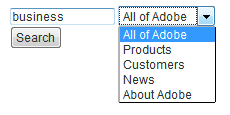
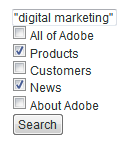
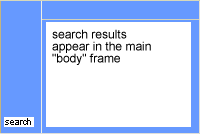
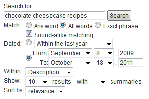

# Search forms{#search-forms}

## 検索フォームでのコレクションの使用{#reference_5A079AEEEFB84457892EF0870D0605C3}

コレクションを使用すると、Webサイトの特定の領域をユーザーが検索できます。 コンボボックスを実装するか、チェックボックスのリストを実装するかに応じて、ユーザーが1つのコレクションまたは複数のリストを検索できるようにします。

[コレクション](../c-about-settings-menu/c-about-searching-menu.md#concept_62E42ACE53D54EEE9273433B86259127)についても参照してください。

次の例は、4つの異なるコレクション名と、それらが対象とするWebサイトの関連領域を示しています。

<table> 
 <thead> 
  <tr> 
   <th colname="col1" class="entry"> <p>コレクション名 </p> </th> 
   <th colname="col2" class="entry"> <p> </p> </th> 
  </tr> 
 </thead>
 <tbody> 
  <tr> 
   <td colname="col1"> <p>製品 </p> </td> 
   <td colname="col2"> <p> 
     <ul id="ul_7AE70789C0914EBFBCCC7695C6F53B9E"> 
      <li id="li_72525BAA34E2442D86152F2FD8CA83D5"> https://www.mycompany.com/products.htm </li> 
      <li id="li_5CA4152239124BDBB251E6C94B15D45B"> https://www.mycompany.com/publish/ </li> 
      <li id="li_6E266736B3494696A3AFD841C4AFEC57"> https://www.mycompany.com/search/ </li> 
     </ul> </p> </td> 
  </tr> 
  <tr> 
   <td colname="col1"> <p>顧客 </p> </td> 
   <td colname="col2"> <p>https://www.mycompany.com/customers/ </p> </td> 
  </tr> 
  <tr> 
   <td colname="col1"> <p>News </p> </td> 
   <td colname="col2"> <p>https://www.mycompany.com/news/ </p> </td> 
  </tr> 
  <tr> 
   <td colname="col1"> <p>Adobeについて </p> </td> 
   <td colname="col2"> <p>https://www.mycompany.com/company/ </p> </td> 
  </tr> 
 </tbody> 
</table>

ドロップダウン検索フォームのインターフェイスを使用すると、次のようなコレクションを1つ選択できます。



ドロップダウン検索フォームは、次のHTMLコードと共に生成されます。

```
<select name="sp_k"> 
<option value="">All of Adobe</option> 
<option value="Products">Products</option> 
<option value="Customers">Customers</option> 
<option value="News">News</option> 
<option value="About Adobe">About Adobe</option> 
</select>
```

または、検索フォームでチェックボックスのグループを使用して、訪問者が複数のコレクションを選択できるようにすることもできます。



チェックボックス検索フォームは、次のHTMLコードと共に生成されます。

```
<input type="checkbox" name="sp_k" value="">All of Adobe<br> 
<input type="checkbox" name="sp_k" value="Products">Products<br> 
<input type="checkbox" name="sp_k" value="Customers">Customers<br> 
<input type="checkbox" name="sp_k" value="News">News<br> 
<input type="checkbox" name="sp_k" value="About Adobe">About Adobe<br>
```

## 検索結果{#section_BBDD5B44E2B349BC88D937F44583D350}

検索テンプレートタグ`<search-input-collections>`は、検索結果にコレクションリストボックスHTMLを生成し、検索で指定されたコレクションを自動的に選択します。 代わりにチェックボックスを生成する場合は、次のように`<input>`タグの代わりに`<search-input>`タグを使用します。

```
<search-input type="checkbox" name="sp_k" value="">All of Adobe<br> 
<search-input type="checkbox" name="sp_k" value="Products">Products<br> 
<search-input type="checkbox" name="sp_k" value="Customers">Customers<br> 
<search-input type="checkbox" name="sp_k" value="News">News<br> 
<search-input type="checkbox" name="sp_k" value="About Adobe">About Adobe<br>
```

`<search-input>`タグは`<input>`タグを出力し、コレクションが検索で指定されている場合は`checked`属性を含めます。

## フォーム{#reference_82CDDDA1E37042E4849EBF7EA05407C5}でのフレームの使用

サイト検索/マーチャンダイジングと連携するようにフレームセットを設定できます。

HTMLフレームとHTMLフレームセット要素について詳しくは、次のURLを参照してください。

[https://www.w3schools.com/html/html_frames.asp](https://www.w3schools.com/html/html_frames.asp)

サイトでフレームが使用されている場合は、検索結果リンクのターゲットフレームを指定できます。 デフォルトのターゲットは_selfで、現在のフレームまたはブラウザーウィンドウにリンクが開きます。 代わりに、サイト固有またはブラウザー予約のターゲットを指定できます。

* _top (browser-reserved)結果は、現在のブラウザーウィンドウで開き、現在のフレームをすべて置き換えます。
* _blank(browser-reserved)結果が新しいブラウザウィンドウで開きます。
* _parent(browser-reserved)結果は、現在のフレームの親フレームで開きます。
* frame2（サイト固有）の場合、「frame2」という名前のフレームで開きます。 任意のフレームの名前を値として指定できます（メインやコンテンツなど）。

サイトでフレームが使用されていない場合は、通常、デフォルトのターゲット名を変更しないでください。

Webサイト用の検索結果のカスタムテンプレートを作成する場合、`<search-link>`タグの`target`属性を使用して、指定した設定を上書きできます。

フレームセットを設定する手順は次のとおりです。

<table> 
 <thead> 
  <tr> 
   <th colname="col1" class="entry"> <p>処理手順 </p> </th> 
   <th colname="col02" class="entry"> <p>プロセスの説明 </p> </th> 
   <th colname="col2" class="entry"> <p>リンク </p> </th> 
  </tr> 
 </thead>
 <tbody> 
  <tr> 
   <td colname="col1"> <p>1 </p> </td> 
   <td colname="col02"> <p>Web追加ページの目的のフレームにフォームを移動します。 </p> </td> 
   <td colname="col2"> <p> <a href="#section_BAA8A502BB2243F8B5FF9783CDF2BFFD" type="section" format="dita" scope="local"> 検索フォームコードを  </a> </p> </td> 
  </tr> 
  <tr> 
   <td colname="col1"> <p>2 </p> </td> 
   <td colname="col02"> <p>検索結果ページのターゲットフレームを設定 </p> </td> 
   <td colname="col2"> <p> <a scope="local" href="#section_532CACB90888467093D95EACB64FDFA1" type="section" format="dita"> 検索結果ページのターゲットフレームの設定  </a> </p> </td> 
  </tr> 
  <tr> 
   <td colname="col1"> <p>3 </p> </td> 
   <td colname="col02"> <p>検索結果ページから作成されたリンクのターゲットを設定します。 </p> </td> 
   <td colname="col2"> <p> <a scope="local" href="#section_523248C5AC424D878321C21A23A5CD66" type="section" format="dita"> 検索結果から作成されたリンクのターゲットを設定しています…  </a> </p> </td> 
  </tr> 
  <tr> 
   <td colname="col1"> <p>4 </p> </td> 
   <td colname="col02"> <p>ナビゲーションフレームのページを編集して、インデックスが作成されないようにします。 </p> </td> 
   <td colname="col2"> <p> <a scope="local" href="#section_C62E5F0EE1294D5EBD97E123E54433FC" type="section" format="dita"> ナビゲーションフレームページを編集して禁止しています…  </a> </p> </td> 
  </tr> 
  <tr> 
   <td colname="col1"> <p>5 </p> </td> 
   <td colname="col02"> <p>検索フォームをテストします。 </p> </td> 
   <td colname="col2"> <p> <a scope="local" href="#section_43D8D4A7BF524DC480DFE5442F6A2E3C" type="section" format="dita"> 検索フォームのテスト  </a> </p> </td> 
  </tr> 
 </tbody> 
</table>

## Webページのフレームへの検索フォームコードの追加{#section_BAA8A502BB2243F8B5FF9783CDF2BFFD}

1. 製品メニューで、**[!UICONTROL Design]**/**[!UICONTROL Auto-Complete]**/**[!UICONTROL Form Source]**&#x200B;をクリックします。

   HTML検索フォームのコードは次のようになります。

   ```
   <!-- Adobe Target HTML for [your customer name] --> 
   <form method="get" action="https://search.atomz.com/search/"> 
   <input size=15 name="sp_q"><br> 
   <input type=submit value="Search"> 
   <input type=hidden name="sp_a" value="[your account number]"> 
   </form>
   ```

1. [!DNL Standard Form Source]ページで、テキストフィールドに表示されるHTML検索フォームコードを選択してコピーします。
1. 検索フォームコードを、フレームセット内の目的のフレームに貼り付けます。

   次の例では、検索フォームコードをナビゲーションフレーム（画面の左側の狭い縦長のフレーム）に貼り付けます。

   

## 検索結果ページのターゲットフレームの設定{#section_532CACB90888467093D95EACB64FDFA1}

上記のように、検索フォームコードを縦置きのナビゲーションフレームに配置すると、検索結果を大きいメインフレームに表示できます。 この例では、メインフレームを「body」と呼び出し、ターゲットフレームとして設定します。



1. 結果ページのターゲットフレームを指定するには、検索フォームコードの次の行を次のように変更して、ターゲットと値をフォームに追加します。

   `<form method="get" action="https://search.atomz.com/search/">`

   を次に示します。

   `<form target="body" method="get" action="https://search.atomz.com/search/">`

   フォームターゲットの値は引用符で囲んでください。

顧客がWebサイトの検索を実行すると、検索結果はWebページの「本文」フレームに表示されます。

## 検索結果ページ{#section_523248C5AC424D878321C21A23A5CD66}から作成されたリンクのターゲットの設定

テンプレートを直接編集して、出力先フレームを設定できます。

検索結果が「body」フレームに表示される場合は、「body」フレームでもリンクを開く必要があると考えられます。 これは同じフレームなので、ターゲット値`"_self"`（デフォルト設定）を変更する必要はありません。

結果リンクのリンク先フレームを設定することもできます。 実行できる操作の例を次に示します。

* 検索結果とリンクに対して異なるフレームを指定し、クリックした結果がそれぞれ別のフレームで開かれる間、検索結果がそれぞれのフレームでアクティブなままになるようにします。
* 検索結果が新しい空白のウィンドウに開くように指定すると、古いウィンドウは元の内容のままで、検索結果も保持されます。

ターゲット名には、HTMLで指定するフレームの名前を指定することも、次に示すHTMLデフォルトのいずれかを指定することもできます。

* `target="_blank"` リンクを新しい、空白の、名前のないウィンドウで開きます。

* `target="_self"` デフォルト. 検索結果が存在するのと同じウィンドウでリンクを開きます。 この場合、元の検索結果ウィンドウが表示されます。 グローバルに割り当てられたベースターゲットを上書きするには、このオプションを使用します。

* `target="_parent"` リンクページの親フレームセット内のリンクを開きます。ドキュメントに親がない場合、これはデフォルトで`"_self"`のように機能します。

* `target="_top"` 全ウィンドウでリンクを開きます。ドキュメントが既に一番上にある場合、デフォルトでは`"_self"`のように機能します。 このオプションは、任意に深いフレームのネストから抜け出す場合に使用します。

例えば、ターゲットの保存先フレーム`_blank`を設定するには、次の方法でテンプレートを編集します。

1. 製品メニューで、**[!UICONTROL Design]**/**[!UICONTROL Templates]**&#x200B;をクリックします。

1. [!DNL Staged Templates]ページの表で、対象となるテンプレートの名前をクリックします。
1. `<search-link>`タグを探します。 デフォルトの`<search-link>`タグは、次のようになります。

   `<search-link><search-title length=100></search-link>`

1. 追加`<search-link>`タグへのフレームターゲット。 上記の例では、`target="_blank"`と入力します。 ターゲット値は、アンダースコアと引用符で囲んで指定します。

   `<search-link>`タグは、次のように表示されます。

   `<search-link target="_blank"><search-title length=100></search-link>`

サイト訪問者が検索結果のリンクを選択すると、リンクされたページが新しい空白のウィンドウに開くようになりました。

## ナビゲーションフレームのページを編集して、インデックスが作成されないようにする{#section_C62E5F0EE1294D5EBD97E123E54433FC}

通常は、検索結果のインデックスが作成されるナビゲーションフレームを除外します。 この機能を実現するには、`noindex`メタタグをこれらのページに追加します。

1. ナビゲーションフレームのHTMLページソースを開きます。
1. HTML追加の`<head>`セクション内に次のmetaタグがあります。

   `<meta name="robots" content="noindex">`

   次に例を示します。

   ```
   <html> 
   <head> 
   <title>This page is a frameset that I do not want indexed</title> 
   <meta http-equiv="Content-Type" content="text/html; charset=iso-8859-1"> 
   <meta name="robots" content="noindex"> 
   </head>
   ```

## 検索フォーム{#section_43D8D4A7BF524DC480DFE5442F6A2E3C}のテスト

1. Webサイトに移動し、フォームに移動します。
1. 検索フィールドに検索語句を入力し、**[!UICONTROL Search]**&#x200B;をクリックします。

   次の点が当てはまります。

   * 検索結果ページが指定したターゲットフレームに表示されます。
   * 検索結果からのリンクは、指定したターゲットフレームに表示されます。
   * ナビゲーションフレームの結果は表示されません。

   検索フォームをテストした後にフレームに関する問題が発生した場合は、カスタマーサポートにお問い合わせください。

## アドバンス検索フォームの例{#reference_82E1051918744EBA88A01E9E6AE42C4A}

高度なフォームコードをデザインやコンテンツのニーズに合わせて編集したり、検索パラメータを追加または削除したりできます。

多くのお客様が検索機能を見つけたいと考えているので、ホームページはアドバンス検索フォームを挿入するのに適しています。 検索フォームやその他の役立つ情報を含むHTMLページを作成し、Webサイト全体を通じてそのページにリンクすることもできます。

セキュリティで保護されたコンテンツのインデックスを作成する場合は、セキュリティで保護された検索ウェブサーバから検索結果を提供できます。 検索フォームのアクション属性のURLを次に変更します。action=&quot;https://search.atomz.com/search/&quot;を使用してこれを行います。

>[!NOTE]
>
>一部のHTMLエディターでは、他のアプリケーションからHTMLコードを貼り付ける際に問題が発生します。 HTMLコードがWebページにテキストとして表示される場合は、検索コードをコピーしてWindowsのメモ帳やMacの単純テキストなどの単純なテキストエディターに貼り付け、単純なテキストエディターからHTMLエディターに再度コピーして貼り付けます。

検索パラメーターは、アドバンス検索フォームコードで、顧客が個々の検索をカスタマイズする際に使用できるラジオボタン、チェックボックスおよびリストボックスを作成するために使用します。 顧客は、表示する検索結果の数、日付範囲など、アドバンス検索フォームに表示するオプションを使用して、検索結果の全体と共にサマリを表示するかどうかを指定できます。

以下のアドバンス検索フォームの例を使用して、このトピックの残りの部分で、検索パラメーターを使用してフォームの各オプションを作成する方法を示します。



上記のサンプルのHTMLコードからアドバンス検索全体を表示できます。

「[HTMLコードのアドバンス検索](#reference_9AAD4A46B68D4D48865508982CB86DB9)」を参照してください。

「[オートコンプリートCSSの設定](../c-about-auto-complete.md#task_EECE35DEB6C94F4A8A5B42B4DED76D96)」を参照してください。

[検索フォームのHTMLコードを](../c-about-auto-complete.md#task_A3A01EA800F24C0AA33902387E0362C7).

<table> 
 <thead> 
  <tr> 
   <th colname="col2" class="entry"> <p>フォーム上の場所 </p> </th> 
   <th colname="col1" class="entry"> <p>パラメーター </p> </th> 
   <th colname="col3" class="entry"> <p>HTMLコード </p> </th> 
   <th colname="col4" class="entry"> <p>説明 </p> </th> 
  </tr> 
 </thead>
 <tbody> 
  <tr> 
   <td colname="col2"> <p>アドバンス検索フォームオプションを有効にする（非表示フィールド） </p> </td> 
   <td colname="col1"> <p> <span class="codeph"> sp_advanced  </span> </p> </td> 
   <td colname="col3"> <p> <span class="syntax html codeph"> &lt;input type="hidden" name="sp_advanced" value="1"&gt; </span> </p> </td> 
   <td colname="col4"> <p>アドバンス検索オプションを有効または無効にします。 例えば、高度なフォームを含む2ページ目へのリンクを含む標準検索フォームをホームページに配置できます。 この場合は、標準フォームのコピーを<span class="codeph"> &lt;search-if-not-advanced&gt;...の中に置きます。&lt;/search-if-not-advanced&gt; </span>テンプレートタグを使用します。 </p> <p>標準フォームから検索を実行した顧客は、検索結果が表示されたときに標準検索フォームを見ることができます。 アドバンス検索フォーム画面で、<span class="codeph"> &lt;input type=hidden name="sp_advanced" value=1&gt; </span>タグを他のアドバンスフォームオプションと共に含めます。 </p> <p>また、&lt;search-if-advanced&gt;... &lt;/search-if-advanced&gt;テンプレートタグ内に、アドバンス検索フォームのコピーを含めます。 アドバンス検索フォームから検索を実行した顧客は、検索結果が表示されるときにアドバンス検索フォームを表示します。 </p> </td> 
  </tr> 
  <tr> 
   <td colname="col2"> <p> いずれか、すべて、またはフレーズに一致 </p> </td> 
   <td colname="col1"> <p> <span class="codeph"> sp_p  </span> </p> <p> </p> </td> 
   <td colname="col3"> <p> <code class="syntax html"> &lt;!--&nbsp;Allow&nbsp;"any,"&nbsp;"all,"&nbsp;or&nbsp;"phrase"&nbsp;--&gt; 
      &lt;input&nbsp;type=radio&nbsp;name="sp_p"&nbsp;value="any"&gt;Any&nbsp;word 
      &lt;input&nbsp;type=radio&nbsp;name="sp_p"&nbsp;value="all"&nbsp;checked&gt;All&nbsp;words 
      &lt;input&nbsp;type=radio&nbsp;name="sp_p"&nbsp;value="phrase"&gt;Exact&nbsp;phrase </code> </p> </td> 
   <td colname="col4"> <p>ドキュメントが一致するには、「任意の単語」、「すべての単語」または「完全一致のフレーズ」を必ず含めるように指定できます。 <span class="codeph"> sp_p </span>パラメータを指定する場合、検索クエリで「+」、「 — 」、またはその両方を使用する必要はありません。 </p> <p> <span class="codeph"> sp_p </span>パラメーターを省略した場合、または「」または「any」に設定した場合、「+」および「 — 」指定子を使用できます。 <span class="codeph"> sp_p </span>パラメーターが"all"または"phrase"に設定されている場合、"+"および"-"は無視されます。 </p> <p>検索での「+」と「 — 」の使用についても詳しく説明しています。 </p> <p><a href="../c-about-settings-menu/c-about-searching-menu.md#concept_207105CF26B1448F8A3D223787C56AB8" type="concept" format="dita" scope="local">検索について</a>を参照してください。 </p> </td> 
  </tr> 
  <tr> 
   <td colname="col2"> <p> 音に似たマッチング </p> </td> 
   <td colname="col1"> <p> <span class="codeph"> sp_w  </span> </p> <p>および </p> <p> <span class="codeph"> sp_w_control  </span> </p> <p> </p> </td> 
   <td colname="col3"> <p> <code class="syntax html"> &lt;!--&nbsp;Checkbox&nbsp;enables&nbsp;sound-alike&nbsp;matching&nbsp;--&gt; 
      &lt;input&nbsp;type=hidden&nbsp;name="sp_w_control"&nbsp;value=1&gt; 
      &lt;input&nbsp;type=checkbox&nbsp;name="sp_w"&nbsp;value="alike"&gt;&nbsp;Sound-alike&nbsp;matching </code> </p> </td> 
   <td colname="col4"> <p>サウンドに類似した一致を有効または無効にできます。 サウンドの類似性を持つ一致により、スペルミスのある検索クエリは、ドキュメント内の「サウンドの類似性」を持つ単語と一致させることができます。 </p> <p><span class="codeph"> sp_w_control </span>パラメーターを1に、<span class="codeph"> sp_w </span>パラメーターを"alike"に設定すると、生成されるチェックボックスが選択され、デフォルトでサウンドの類似マッチングが有効になります。 </p> <p><span class="codeph"> sp_w </span>パラメータが""に設定されている場合、チェックボックスは選択されません。 </p> <p>最新のインデックス作成処理中に類似したサウンドの一致を有効にしなかった場合、サウンドに似た一致はできず、<span class="codeph"> sp_w </span>パラメータは無視されます。 サウンド類似の一致を有効にするには、製品メニューで<span class="uicontrol">言語</span> &gt; <span class="uicontrol">単語と言語</span> &gt; <span class="uicontrol">サウンド類似の一致</span>をクリックします。 </p> <p>また、次の方法で<span class="codeph"> sp_w </span>パラメーターと<span class="codeph"> sp_w_control </span>パラメーターを割り当てることもできます。 </p> <p> <code class="syntax html"> &lt;!--&nbsp;Checkbox&nbsp;disables&nbsp;sound-alike&nbsp;matching&nbsp;--&gt; 
      &lt;input&nbsp;type=hidden&nbsp;name="sp_w_control"&nbsp;value=0&gt; 
      &lt;input&nbsp;type=checkbox&nbsp;name="sp_w"&nbsp;value="exact"&gt; 
      No&nbsp;sound-alike&nbsp;matching </code> </p> <p>この場合、<span class="codeph"> sp_w_control </span>パラメーターが0に設定され、<span class="codeph"> sp_w </span>パラメーターが「exact」に設定されていると、サウンドの類似マッチングはデフォルトで無効になります。 <span class="codeph"> sp_w </span>パラメータが""に設定されている場合は、音と似たマッチングが有効になります。 </p> </td> 
  </tr> 
  <tr> 
   <td colname="col2"> <p>日付範囲の一致 </p> </td> 
   <td colname="col1"> <p> <span class="codeph"> sp_d  </span> </p> <p> </p> </td> 
   <td colname="col3"> <p> <code class="syntax html"> &lt;!--Specifies&nbsp;type&nbsp;of&nbsp;date&nbsp;range&nbsp;searching&nbsp;to&nbsp;perform.--&gt; 
      &lt;input&nbsp;type=radio&nbsp;name="sp_d"&nbsp;value="custom"&nbsp;checked&gt; 
      &lt;input&nbsp;type=radio&nbsp;name="sp_d"&nbsp;value="specific"&gt; </code> </p> </td> 
   <td colname="col4"> <p><span class="codeph"> sp_d </span>パラメータは、実行するカスタムデータ範囲の一致、または実行する特定の日付範囲の一致を指定します。 </p> <p>デフォルトのアドバンス検索フォームでは、このオプションは<span class="codeph"> sp_date_range </span>パラメータで生成された「カスタム」日付範囲のドロップダウンリストを持つラジオボタングループとして表示されます。 また、<span class="codeph"> sp_開始_日</span>、<span class="codeph"> sp_開始_月</span>、<span class="codeph"> sp_開始_年</span>、<span class="codeph"> sp_end_day </span>、<span class="codeph"> sp_end_month aで生成される「特定の」開始と終了日のグループも含みます。/&gt;、および<span class="codeph"> sp_end_year </span>パラメーター。</span> </p> <p>「カスタム」日付範囲は、検索する日付の名前付き範囲です。 例えば、「いつでも」、「今日」、「昨年以内」などです。 </p> <p>「特定の」日付範囲は、開始日と終了日で構成されます。 例えば、「2009年9月8日～ 2011年10月18日」のように指定します。 </p> </td> 
  </tr> 
  <tr> 
   <td colname="col2"> <p>日付範囲の一致：カスタム日付範囲 </p> </td> 
   <td colname="col1"> <p> <span class="codeph"> sp_date_range  </span> </p> <p> </p> </td> 
   <td colname="col3"> <p> <code class="syntax html"> &lt;!--Selection&nbsp;list&nbsp;for&nbsp;custom&nbsp;date&nbsp;range.--&gt; 
      &lt;select&nbsp;name="sp_date_range"&nbsp;size=1&gt; 
      &lt;option&nbsp;value=-1&nbsp;selected&gt;Anytime&lt;/option&gt; 
      &lt;option&nbsp;value=7&gt;Within&nbsp;the&nbsp;last&nbsp;week&lt;/option&gt; 
      &lt;option&nbsp;value=14&gt;Within&nbsp;the&nbsp;last&nbsp;2&nbsp;weeks&lt;/option&gt; 
      &lt;option&nbsp;value=30&gt;Within&nbsp;the&nbsp;last&nbsp;30&nbsp;days&lt;/option&gt; 
      &lt;option&nbsp;value=60&gt;Within&nbsp;the&nbsp;last&nbsp;60&nbsp;days&lt;/option&gt; 
      &lt;option&nbsp;value=90&gt;Within&nbsp;the&nbsp;last&nbsp;90&nbsp;days&lt;/option&gt; 
      &lt;option&nbsp;value=180&gt;Within&nbsp;the&nbsp;last&nbsp;180&nbsp;days&lt;/option&gt; 
      &lt;option&nbsp;value=365&gt;Within&nbsp;the&nbsp;last&nbsp;year&lt;/option&gt; 
      &lt;option&nbsp;value=730&gt;Within&nbsp;the&nbsp;last&nbsp;two&nbsp;years&lt;/option&gt; 
      &lt;/select&gt; </code> </p> </td> 
   <td colname="col4"> <p><span class="codeph"> sp_date_range </span>パラメーターは、「カスタム」日付範囲の作成に使用します。 例えば、「いつでも」、「今日」、「昨年以内」などです。 </p> <p>0以上の値は、今日までに検索する日数を指定します。 例えば、値0は「Today」、値1は「Today and Yesterday」、値30は「Within the Last 30 Days」などと指定します。 0より小さい値は、次のようにカスタム範囲を指定します。 </p> <p> 
     <ul id="ul_E65DDE33883F441F9730F315E485AD98"> 
      <li id="li_83E9466AB9D7438A8544001F6B007186"> <p>-1 = "いつでも"（日付範囲なしを指定した場合と同じ）。 </p> </li> 
      <li id="li_38AB8D97179A47F9B860A96EA09119BB"> <p>-2 = "今週"。現在の週の日曜日から土曜日を検索します。 </p> </li> 
      <li id="li_F4C3A8658428418A8A06FBAAB4733C68"> <p>-3 = "先週"。現在の週の前の週の日曜日から土曜日を検索します。 </p> </li> 
      <li id="li_DF2D0B043A4E4DE9BE8D82E69A76E793"> <p>-4 = "今月"（現在の月内の日付を検索） </p> </li> 
      <li id="li_76BC4C2CED574E2A81448158828BFF1B"> <p>-5 = "先月"。現在の月の前の月内の日付を検索します。 </p> </li> 
      <li id="li_17FF849384FB46D58AF6FF1D3BC408C8"> <p>-6 = "今年"（現在の年内の日付を検索） </p> </li> 
      <li id="li_E2B8B4DFF3914BBDB86D0EB77F52B305"> <p>-7 = "昨年"。現在の年の前の年内の日付を検索します。 </p> </li> 
     </ul> </p> </td> 
  </tr> 
  <tr> 
   <td colname="col2"> <p>日付範囲の一致：開始日 </p> </td> 
   <td colname="col1"> <p> <span class="codeph"> sp_開始_日、sp_開始_月、sp_開始_年  </span> </p> <p> </p> </td> 
   <td colname="col3"> </td> 
   <td colname="col4"> <p>この3桁の数値は、検索する特定の日付範囲の開始日を指定します。 部分的に指定された日付は無視されるので、3つの値はすべて指定してください。 </p> <p>開始日のみ、終了日のみ、または開始日と終了日の両方を指定することができます。 開始日のみを指定した場合は、開始日以降の日付に一致するドキュメントが検索に含まれます。 終了日のみを指定した場合は、終了日以前の一致するドキュメントが検索に含まれます。 開始日と終了日の両方を指定した場合、開始日から終了日までの一致するドキュメントが検索に含まれます。 </p> <p>すべての日付は、グリニッジ標準時を基準に検索されます。 </p> </td> 
  </tr> 
  <tr> 
   <td colname="col2"> <p> 日付範囲の一致：終了日 </p> </td> 
   <td colname="col1"> <p> <span class="codeph"> sp_end_day、sp_end_month、sp_end_year  </span> </p> <p> </p> </td> 
   <td colname="col3"> </td> 
   <td colname="col4"> <p>この3桁の数値は、検索する特定の日付範囲の終了日を指定します。 部分的に指定された日付は無視されるので、3つの値はすべて指定してください。 </p> <p>開始日のみ、終了日のみ、または開始と終了日の両方を指定することができます。 開始日のみを指定した場合は、開始日以降の日付に一致するドキュメントが検索に含まれます。 終了日のみを指定した場合は、終了日以前の一致するドキュメントが検索に含まれます。 開始と終了日の両方を指定した場合、開始日から終了日までの一致するドキュメントが検索に含まれます。 </p> <p>すべての日付は、グリニッジ標準時を基準に検索されます。 </p> </td> 
  </tr> 
  <tr> 
   <td colname="col2"> <p>検索フィールド内 </p> </td> 
   <td colname="col1"> <p> <span class="codeph"> sp_x  </span> </p> </td> 
   <td colname="col3"> <p> <code class="syntax html"> &lt;!--&nbsp;List&nbsp;box&nbsp;selects&nbsp;the&nbsp;search&nbsp;field&nbsp;--&gt; 
      Within&nbsp;&lt;select&nbsp;name="sp_x"&nbsp;size=1&gt; 
      &lt;option&nbsp;value="any"&nbsp;selected&gt;Anywhere&lt;/option&gt; 
      &lt;option&nbsp;value="title"&gt;Title&lt;/option&gt; 
      &lt;option&nbsp;value="desc"&gt;Description&lt;/option&gt; 
      &lt;option&nbsp;value="keys"&gt;Keywords&lt;/option&gt; 
      &lt;option&nbsp;value="body"&gt;Body&lt;/option&gt; 
      &lt;option&nbsp;value="alt"&gt;Alternate&nbsp;text&lt;/option&gt; 
      &lt;option&nbsp;value="url"&gt;URL&lt;/option&gt; 
      &lt;option&nbsp;value="target"&gt;Target&lt;/option&gt; 
      &lt;option&nbsp;value="date"&gt;Date&lt;/option&gt;* 
      &lt;/select&gt; </code> </p> </td> 
   <td colname="col4"> <p>「<span class="codeph"> sp_x </span>リスト」ボックスを使用して、クエリ文字列を検索するフィールドをユーザーが指定できます。 </p> <p>すべてのフィールド、タイトル、ドキュメントの説明、ドキュメントキーワード、本文、代替テキスト、ドキュメントのURL、日付またはターゲットキーワードを選択できます。 </p> <p><span class="codeph"> sp_x </span>パラメーターを使用する場合、検索クエリ文字列で「title:," "desc:," "keys:," "body:"," "alt:"," "url:,","ターゲット:"」を指定する必要はありません。 </p> <p><span class="codeph"> sp_x </span>パラメーターを省略した場合、または""または"any"に設定した場合、フィールド指定子文字列を使用できます。 <span class="codeph"> sp_x </span>パラメーターが特定のフィールドに設定されている場合、それ以外のフィールド指定子文字列は無視されます。 </p> <p><a href="../c-about-settings-menu/c-about-searching-menu.md#concept_207105CF26B1448F8A3D223787C56AB8" type="concept" format="dita" scope="local">検索について</a>を参照してください。 </p> </td> 
  </tr> 
  <tr> 
   <td colname="col2"> <p>結果数を表示 </p> </td> 
   <td colname="col1"> <p> <span class="codeph"> sp_c  </span> </p> </td> 
   <td colname="col3"> <p> <code class="syntax html"> &lt;!--&nbsp;List&nbsp;box&nbsp;selects&nbsp;number&nbsp;of&nbsp;results&nbsp;to&nbsp;show&nbsp;per&nbsp;page&nbsp;--&gt; 
      Show&nbsp;&lt;select&nbsp;name="sp_c"&nbsp;size=1&gt; 
      &lt;option&nbsp;value=5&gt;5&lt;/option&gt; 
      &lt;option&nbsp;value=10&nbsp;selected&gt;10&lt;/option&gt; 
      &lt;option&nbsp;value=25&gt;25&lt;/option&gt; 
      &lt;option&nbsp;value=50&gt;50&lt;/option&gt; 
      &lt;option&nbsp;value=100&gt;100&lt;/option&gt; 
      &lt;/select&gt;&nbsp;results </code> </p> </td> 
   <td colname="col4"> <p>顧客は各検索結果ページに表示する検索結果数を選択できます。 </p> <p>フォームには、必要な数だけ選択できます。 「value=」値が表示値と一致することを確認してください。 </p> </td> 
  </tr> 
  <tr> 
   <td colname="col2"> <p>サマリの表示/非表示 </p> </td> 
   <td colname="col1"> <p> <span class="codeph"> sp_m  </span> </p> </td> 
   <td colname="col3"> <p> <code class="syntax html"> &lt;!--&nbsp;Show&nbsp;or&nbsp;hide&nbsp;summaries&nbsp;in&nbsp;search&nbsp;results&nbsp;--&gt; 
      &lt;select&nbsp;name="sp_m"&nbsp;size=1&gt; 
      &lt;option&nbsp;value=1&nbsp;selected&gt;with&lt;/option&gt; 
      &lt;option&nbsp;value=0&gt;without&lt;/option&gt; 
      &lt;/select&gt;&nbsp;summaries&nbsp; </code> </p> </td> 
   <td colname="col4"> <p>一致ごとに概要テキストを表示するかどうかを顧客が選択できます。 </p> <p>概要を表示する場合は、値を1に設定します。 概要を非表示にする場合は、値を0に設定します。 次の例のように、一連のラジオボタンと共にパラメーターを使用することもできます。 </p> <p> <code class="syntax html"> &lt;!--&nbsp;Show&nbsp;or&nbsp;hide&nbsp;summaries&nbsp;in&nbsp;search&nbsp;results&nbsp;--&gt; 
      &lt;input&nbsp;type=radio&nbsp;name="sp_m"&nbsp;value=1&nbsp;selected&gt;Show&nbsp;summaries 
      &lt;input&nbsp;type=radio&nbsp;name="sp_m"&nbsp;value=0&gt;Hide&nbsp;summaries </code> </p> </td> 
  </tr> 
  <tr> 
   <td colname="col2"> <p>結果で並べ替え </p> </td> 
   <td colname="col1"> <p> <span class="codeph"> sp_s  </span> </p> </td> 
   <td colname="col3"> <p> <code class="syntax html"> &lt;!--&nbsp;Sort&nbsp;results&nbsp;by&nbsp;relevance&nbsp;or&nbsp;by&nbsp;date&nbsp;--&gt; 
      Sort&nbsp;by&nbsp;&lt;select&nbsp;name="sp_s"&nbsp;size=1&gt; 
      &lt;option&nbsp;value=0&nbsp;selected&gt;relevance&lt;/option&gt; 
      &lt;option&nbsp;value=1&gt;date&lt;/option&gt; 
      &lt;/select&gt; </code> </p> </td> 
   <td colname="col4"> <p>結果を関連性の高い順に表示するか、日付順に表示するかを顧客が選択できます。 </p> <p>この値を1に設定すると、最も最近変更されたドキュメントから、最も最近変更されたドキュメントから最も新しく変更されたまでの結果が表示されます。 値を0に設定すると、最も関連性の高い結果から最も関連性の低い結果が表示されます。 次の例のように、ラジオボタンでもこのパラメーターを使用できます。 </p> <p> <code class="syntax html"> &lt;!--&nbsp;Sort&nbsp;results&nbsp;by&nbsp;relevance&nbsp;or&nbsp;by&nbsp;date&nbsp;--&gt; 
      &lt;input&nbsp;type=radio&nbsp;name="sp_s"&nbsp;value=0&nbsp;selected&gt;Sort&nbsp;by&nbsp;relevance 
      &lt;input&nbsp;type=radio&nbsp;name="sp_s"&nbsp;value=1&gt;Sort&nbsp;by&nbsp;date </code> </p> </td> 
  </tr> 
 </tbody> 
</table>

## アドバンス検索フォームHTMLコード{#reference_9AAD4A46B68D4D48865508982CB86DB9}

「Sample advanced search form」トピックの先頭に表示されるアドバンス検索フォームの生成に使用されるHTMLフォームコード。

「[アドバンス検索フォームの例](#reference_82E1051918744EBA88A01E9E6AE42C4A)」を参照してください。

このコードを使用する場合は、`sp99999999`の`sp_a`値を実際のアカウント番号に置き換えてください。

アカウント番号を確認するには、製品メニューで&#x200B;**[!UICONTROL Settings]** > **[!UICONTROL Account Options]** > **[!UICONTROL Account Settings]**&#x200B;をクリックします。

```
<form method="get" action="https://search.atomz.com/search/"> 
<table cellspacing=0 cellpadding=0 border=0> 
<tr><td colspan=4> 
<b>Search For:</b><br> 
<input size=35 name="sp_q"> 
<!-- The "Search" button --> 
<input type=submit value="Search"> 
<input type=hidden name="sp_a" value="sp99999999"> 
<input type=hidden name="sp_f" value="ISO-8859-1"> 
</td></tr> 
<input type=hidden name="sp_advanced" value=1> 
<!-- Allow "any," "all," or "phrase" --> 
<tr><td valign=top> 
<b>Match: </b> 
</td><td colspan=4> 
<input type=radio name="sp_p" value="any">Any word 
<input type=radio name="sp_p" value="all" checked>All words 
<input type=radio name="sp_p" value="phrase">Exact phrase<br> 
<!-- Checkbox enables sound-alike matching --> 
<input type=hidden name="sp_w_control" value=1> 
<input type=checkbox name="sp_w" value="alike" checked> 
Sound-alike matching 
</td></tr> 
<!-- Date range criteria --> 
<tr><td><b>Dated:</b></td><td colspan=4> 
<input type=radio name="sp_d" value="custom" checked> 
<select name="sp_date_range" size=1> 
<option value=-1 selected>Anytime</option> 
<option value=7>Within the last week</option> 
<option value=14>Within the last 2 weeks</option> 
<option value=30>Within the last 30 days</option> 
<option value=60>Within the last 60 days</option> 
<option value=90>Within the last 90 days</option> 
<option value=180>Within the last 180 days</option> 
<option value=365>Within the last year</option> 
<option value=730>Within the last two years</option> 
</select> 
</td></tr> 
<tr><td></td><td rowspan=2> 
<input type=radio name="sp_d" value=specific> 
</td><td align=right>From:</td><td> 
<select name="sp_start_month" size=1> 
<option value=0 selected></option> 
<option value=1>January</option> 
<option value=2>February</option> 
<option value=3>March</option> 
<option value=4>April</option> 
<option value=5>May</option> 
<option value=6>June</option> 
<option value=7>July</option> 
<option value=8>August</option> 
<option value=9>September</option> 
<option value=10>October</option> 
<option value=11>November</option> 
<option value=12>December</option> 
</select> 
<select name="sp_start_day" size=1> 
<option value=0 selected></option> 
<option value=1>1</option> 
<option value=2>2</option> 
<option value=3>3</option> 
<option value=4>4</option> 
<option value=5>5</option> 
<option value=6>6</option> 
<option value=7>7</option> 
<option value=8>8</option> 
<option value=9>9</option> 
<option value=10>10</option> 
<option value=11>11</option> 
<option value=12>12</option> 
<option value=13>13</option> 
<option value=14>14</option> 
<option value=15>15</option> 
<option value=16>16</option> 
<option value=17>17</option> 
<option value=18>18</option> 
<option value=19>19</option> 
<option value=20>20</option> 
<option value=21>21</option> 
<option value=22>22</option> 
<option value=23>23</option> 
<option value=24>24</option> 
<option value=25>25</option> 
<option value=26>26</option> 
<option value=27>27</option> 
<option value=28>28</option> 
<option value=29>29</option> 
<option value=30>30</option> 
<option value=31>31</option> 
</select> 
<!--comma-->, 
<input size=4 name="sp_start_year"> 
</td></tr> 
<tr><td></td> 
<td align=right>To:</td><td> 
<select name="sp_end_month" size=1> 
<option value=0 selected></option> 
<option value=1>January</option> 
<option value=2>February</option> 
<option value=3>March</option> 
<option value=4>April</option> 
<option value=5>May</option> 
<option value=6>June</option> 
<option value=7>July</option> 
<option value=8>August</option> 
<option value=9>September</option> 
<option value=10>October</option> 
<option value=11>November</option> 
<option value=12>December</option> 
</select> 
<select name="sp_end_day" size=1> 
<option value=0 selected></option> 
<option value=1>1</option> 
<option value=2>2</option> 
<option value=3>3</option> 
<option value=4>4</option> 
<option value=5>5</option> 
<option value=6>6</option> 
<option value=7>7</option> 
<option value=8>8</option> 
<option value=9>9</option> 
<option value=10>10</option> 
<option value=11>11</option> 
<option value=12>12</option> 
<option value=13>13</option> 
<option value=14>14</option> 
<option value=15>15</option> 
<option value=16>16</option> 
<option value=17>17</option> 
<option value=18>18</option> 
<option value=19>19</option> 
<option value=20>20</option> 
<option value=21>21</option> 
<option value=22>22</option> 
<option value=23>23</option> 
<option value=24>24</option> 
<option value=25>25</option> 
<option value=26>26</option> 
<option value=27>27</option> 
<option value=28>28</option> 
<option value=29>29</option> 
<option value=30>30</option> 
<option value=31>31</option> 
</select> 
<!--comma-->, 
<input size=4 name="sp_end_year"> 
</td></tr> 
<!-- List box selects the search field --> 
<tr><td valign=top> 
<b>Within: </b> 
</td><td colspan=4><select name="sp_x" size=1> 
<option value="any" selected>Anywhere</option> 
<option value="title">Title</option> 
<option value="desc">Description</option> 
<option value="keys">Keywords</option> 
<option value="body">Body</option> 
<option value="alt">Alternate text</option> 
<option value="url">URL</option> 
<option value="target">Target</option> 
</select> 
</td></tr> 
<!-- List box selects number of results to show per page --> 
<tr><td valign=top> 
<b>Show: </b> 
</td><td colspan=4><select name="sp_c" size=1> 
<option value=5>5</option> 
<option value=10 selected>10</option> 
<option value=25>25</option> 
<option value=50>50</option> 
<option value=100>100</option> 
</select> results  
<!-- Show or hide summaries in search results --> 
<select name="sp_m" size=1> 
<option value=1 selected>with</option> 
<option value=0>without</option> 
</select> summaries<br> 
</td></tr> 
<!-- Sort results by relevance or by date --> 
<tr><td valign=top> 
<b>Sort by: </b> 
</td><td colspan=4><select name="sp_s" size=1> 
<option value=0 selected>relevance</option> 
<option value=1>date</option> 
</select> 
</td></tr> 
</table> 
</form>
```

## アドバンス検索フォームテンプレートコード{#reference_D762C22E754E462DBEECD88D2C3FA579}

任意のパラメーターのデフォルト選択が前の検索と同じになるように、アドバンス検索フォームのHTMLコードをテンプレートに追加できます。

つまり、顧客が&#x200B;**[!UICONTROL Exact phrase]**&#x200B;ラジオボタンをクリックした場合、検索結果が表示されるときに、デフォルトでラジオボタンが選択されていることを確認できます。

この機能は、すべての「checked」指定子または「selected」指定子を標準のHTMLタグから削除し、次のHTMLタグを置き換えることで実現します。

* `<input>`
* `<select>`
* `<option>`
* `</option>`
* `</select>`

を次の対応するテンプレートタグと共に使用します。

* `<search-input>`
* `<search-select>`
* `<search-option>`
* `</search-option>`
* `</search-select>`

これを行うには、検索テンプレートの`<form>`タグとして次のコードを使用します。

```
<!-- Adobe Target results section.--> 
 
<!-- Show heading and logo graphic. --> 
<SEARCH-IF-RESULTS> 
<b>SEARCH RESULTS <SEARCH-LOWER> - <SEARCH-UPPER></b> 
of <SEARCH-TOTAL> total results for <b><SEARCH-QUERY></b><br> 
</SEARCH-IF-RESULTS> 
<SEARCH-IF-NOT-RESULTS> 
<b>SEARCH RESULTS</b> for <b><SEARCH-QUERY></b><br> 
</SEARCH-IF-NOT-RESULTS> 
<SEARCH-LOGO><br> 
 
<!-- Display Results. --> 
<SEARCH-RESULTS LENGTH=160> 
<p><b><SEARCH-LINK><SEARCH-TITLE LENGTH=160></SEARCH-LINK></b><br> 
<SEARCH-IF-SHOW-SUMMARIES> 
<SEARCH-IF-CONTEXT LENGTH=240><SEARCH-CONTEXT><br></SEARCH-IF-CONTEXT> 
<font size="-1"><SEARCH-URL LENGTH=60></font><br> 
</SEARCH-IF-SHOW-SUMMARIES> 
</SEARCH-RESULTS> 
 
<!-- If no results, show a message. --> 
<SEARCH-IF-NOT-RESULTS><p> 
Sorry, no matches were found containing <b><SEARCH-QUERY>.</b> 
</SEARCH-IF-NOT-RESULTS> 
<!-- Show By Relevance, By Date links, Show/Hide Summaries links. --> 
<SEARCH-IF-RESULTS><p> 
<SEARCH-IF-SORT-BY-DATE> 
<b><SEARCH-SORT-BY-SCORE COUNT=10>Sort By Relevance</SEARCH-SORT-BY-SCORE></b> 
</SEARCH-IF-SORT-BY-DATE> 
<SEARCH-IF-SORT-BY-SCORE> 
<b><SEARCH-SORT-BY-DATE COUNT=10>Sort By Date</SEARCH-SORT-BY-DATE></b> 
</SEARCH-IF-SORT-BY-SCORE> 
| <b> 
<SEARCH-IF-SHOW-SUMMARIES> 
<SEARCH-HIDE-SUMMARIES COUNT=20>Hide Summaries</SEARCH-HIDE-SUMMARIES> 
</SEARCH-IF-SHOW-SUMMARIES> 
<SEARCH-IF-HIDE-SUMMARIES> 
<SEARCH-SHOW-SUMMARIES COUNT=10>Show Summaries</SEARCH-SHOW-SUMMARIES> 
</SEARCH-IF-HIDE-SUMMARIES> 
</b><br> 
</SEARCH-IF-RESULTS> 
 
<!-- Display Prev & Next links. --> 
<SEARCH-IF-RESULTS> 
<SEARCH-IF-PREV-COUNT> 
<b><SEARCH-PREV>Prev <SEARCH-PREV-COUNT></SEARCH-PREV></b> 
<SEARCH-IF-NEXT-COUNT> | </SEARCH-IF-NEXT-COUNT> 
</SEARCH-IF-PREV-COUNT> 
<SEARCH-IF-NEXT-COUNT> 
<b><SEARCH-NEXT>Next <SEARCH-NEXT-COUNT></SEARCH-NEXT></b><br> 
</SEARCH-IF-NEXT-COUNT><p> 
</SEARCH-IF-RESULTS> 
 
<!-- Put up the next form. --> 
<form method="get" action="https://search.atomz.com/search/"> 
<SEARCH-IF-NOT-ADVANCED> 
<SEARCH-INPUT-ACCOUNT> 
<SEARCH-INPUT-GALLERY> 
<SEARCH-INPUT-QUERY SIZE=25> 
<SEARCH-INPUT type=hidden name=sp_p> 
<input type=submit value="New Search"> 
<SEARCH-IF-INPUT-COLLECTIONS> 
<br><SEARCH-INPUT-COLLECTIONS> 
</SEARCH-IF-INPUT-COLLECTIONS> 
</SEARCH-IF-NOT-ADVANCED> 
<SEARCH-IF-ADVANCED> 
<table cellspacing=0 cellpadding=0 border=0> 
<tr><td colspan=4> 
<b>Search For:</b><br> 
<SEARCH-INPUT-QUERY SIZE=35> 
 
<!-- The "Search" button --> 
<input type=submit value="New Search"> 
<SEARCH-INPUT-ACCOUNT> 
<SEARCH-INPUT-GALLERY> 
</td></tr> 
<SEARCH-IF-INPUT-COLLECTIONS> 
<!-- Collections --> 
<tr><td> 
<b>In: </b> 
</td><td colspan=4> 
<SEARCH-INPUT-COLLECTIONS> 
</td></tr> 
</SEARCH-IF-INPUT-COLLECTIONS> 
<input type=hidden name="sp_advanced" value=1> 
 
<!-- Allow "any," "all," or "phrase" --> 
<tr><td valign=top> 
<b>Match: </b> 
</td><td colspan=4> 
<SEARCH-INPUT type=radio name="sp_p" value="any">Any word 
<SEARCH-INPUT type=radio name="sp_p" value="all">All words 
<SEARCH-INPUT type=radio name="sp_p" value="phrase">Exact phrase<br> 
<!-- Checkbox enables sound-alike matching --> 
<input type=hidden name="sp_w_control" value=1> 
<SEARCH-INPUT type=checkbox name="sp_w" value="alike">Sound-alike matching 
</td></tr> 
 
<!-- Date range section --> 
<tr> 
<td><b>Dated:</b></td> 
<td colspan=3> 
<SEARCH-INPUT type=radio name="sp_d" value="custom"> 
<SEARCH-SELECT name="sp_date_range" size=1> 
<SEARCH-OPTION value=-1>Anytime</SEARCH-OPTION> 
<SEARCH-OPTION value=7>Within the last week</SEARCH-OPTION> 
<SEARCH-OPTION value=14>Within the last 2 weeks</SEARCH-OPTION> 
<SEARCH-OPTION value=30>Within the last 30 days</SEARCH-OPTION> 
<SEARCH-OPTION value=60>Within the last 60 days</SEARCH-OPTION> 
<SEARCH-OPTION value=90>Within the last 90 days</SEARCH-OPTION> 
<SEARCH-OPTION value=180>Within the last 180 days</SEARCH-OPTION> 
<SEARCH-OPTION value=365>Within the last year</SEARCH-OPTION> 
<SEARCH-OPTION value=730>Within the last two years</SEARCH-OPTION> 
</SEARCH-SELECT> 
</td></tr> 
<tr><td></td><td rowspan=2> 
<SEARCH-INPUT type=radio name="sp_d" value=specific></td> 
<td align=right>From:</td><td> 
<SEARCH-SELECT name="sp_start_month" size=1> 
<SEARCH-OPTION value=0></SEARCH-OPTION> 
<SEARCH-OPTION value=1>January</SEARCH-OPTION> 
<SEARCH-OPTION value=2>February</SEARCH-OPTION> 
<SEARCH-OPTION value=3>March</SEARCH-OPTION> 
<SEARCH-OPTION value=4>April</SEARCH-OPTION> 
<SEARCH-OPTION value=5>May</SEARCH-OPTION> 
<SEARCH-OPTION value=6>June</SEARCH-OPTION> 
<SEARCH-OPTION value=7>July</SEARCH-OPTION> 
<SEARCH-OPTION value=8>August</SEARCH-OPTION> 
<SEARCH-OPTION value=9>September</SEARCH-OPTION> 
<SEARCH-OPTION value=10>October</SEARCH-OPTION> 
<SEARCH-OPTION value=11>November</SEARCH-OPTION> 
<SEARCH-OPTION value=12>December</SEARCH-OPTION> 
</SEARCH-SELECT> 
<SEARCH-SELECT name="sp_start_day" size=1> 
<SEARCH-OPTION value=0></SEARCH-OPTION> 
<SEARCH-OPTION value=1>1</SEARCH-OPTION> 
<SEARCH-OPTION value=2>2</SEARCH-OPTION> 
<SEARCH-OPTION value=3>3</SEARCH-OPTION> 
<SEARCH-OPTION value=4>4</SEARCH-OPTION> 
<SEARCH-OPTION value=5>5</SEARCH-OPTION> 
<SEARCH-OPTION value=6>6</SEARCH-OPTION> 
<SEARCH-OPTION value=7>7</SEARCH-OPTION> 
<SEARCH-OPTION value=8>8</SEARCH-OPTION> 
<SEARCH-OPTION value=9>9</SEARCH-OPTION> 
<SEARCH-OPTION value=10>10</SEARCH-OPTION> 
<SEARCH-OPTION value=11>11</SEARCH-OPTION> 
<SEARCH-OPTION value=12>12</SEARCH-OPTION> 
<SEARCH-OPTION value=13>13</SEARCH-OPTION> 
<SEARCH-OPTION value=14>14</SEARCH-OPTION> 
<SEARCH-OPTION value=15>15</SEARCH-OPTION> 
<SEARCH-OPTION value=16>16</SEARCH-OPTION> 
<SEARCH-OPTION value=17>17</SEARCH-OPTION> 
<SEARCH-OPTION value=18>18</SEARCH-OPTION> 
<SEARCH-OPTION value=19>19</SEARCH-OPTION> 
<SEARCH-OPTION value=20>20</SEARCH-OPTION> 
<SEARCH-OPTION value=21>21</SEARCH-OPTION> 
<SEARCH-OPTION value=22>22</SEARCH-OPTION> 
<SEARCH-OPTION value=23>23</SEARCH-OPTION> 
<SEARCH-OPTION value=24>24</SEARCH-OPTION> 
<SEARCH-OPTION value=25>25</SEARCH-OPTION> 
<SEARCH-OPTION value=26>26</SEARCH-OPTION> 
<SEARCH-OPTION value=27>27</SEARCH-OPTION> 
<SEARCH-OPTION value=28>28</SEARCH-OPTION> 
<SEARCH-OPTION value=29>29</SEARCH-OPTION> 
<SEARCH-OPTION value=30>30</SEARCH-OPTION> 
<SEARCH-OPTION value=31>31</SEARCH-OPTION> 
</SEARCH-SELECT><!--comma-->, 
<SEARCH-INPUT size=4 name="sp_start_year"> 
</td></tr> 
<tr><td></td> 
<td align=right>To:</td><td> 
<SEARCH-SELECT name="sp_end_month" size=1> 
<SEARCH-OPTION value=0></SEARCH-OPTION> 
<SEARCH-OPTION value=1>January</SEARCH-OPTION> 
<SEARCH-OPTION value=2>February</SEARCH-OPTION> 
<SEARCH-OPTION value=3>March</SEARCH-OPTION> 
<SEARCH-OPTION value=4>April</SEARCH-OPTION> 
<SEARCH-OPTION value=5>May</SEARCH-OPTION> 
<SEARCH-OPTION value=6>June</SEARCH-OPTION> 
<SEARCH-OPTION value=7>July</SEARCH-OPTION> 
<SEARCH-OPTION value=8>August</SEARCH-OPTION> 
<SEARCH-OPTION value=9>September</SEARCH-OPTION> 
<SEARCH-OPTION value=10>October</SEARCH-OPTION> 
<SEARCH-OPTION value=11>November</SEARCH-OPTION> 
<SEARCH-OPTION value=12>December</SEARCH-OPTION> 
</SEARCH-SELECT> 
<SEARCH-SELECT name="sp_end_day" size=1> 
<SEARCH-OPTION value=0></SEARCH-OPTION> 
<SEARCH-OPTION value=1>1</SEARCH-OPTION> 
<SEARCH-OPTION value=2>2</SEARCH-OPTION> 
<SEARCH-OPTION value=3>3</SEARCH-OPTION> 
<SEARCH-OPTION value=4>4</SEARCH-OPTION> 
<SEARCH-OPTION value=5>5</SEARCH-OPTION> 
<SEARCH-OPTION value=6>6</SEARCH-OPTION> 
<SEARCH-OPTION value=7>7</SEARCH-OPTION> 
<SEARCH-OPTION value=8>8</SEARCH-OPTION> 
<SEARCH-OPTION value=9>9</SEARCH-OPTION> 
<SEARCH-OPTION value=10>10</SEARCH-OPTION> 
<SEARCH-OPTION value=11>11</SEARCH-OPTION> 
<SEARCH-OPTION value=12>12</SEARCH-OPTION> 
<SEARCH-OPTION value=13>13</SEARCH-OPTION> 
<SEARCH-OPTION value=14>14</SEARCH-OPTION> 
<SEARCH-OPTION value=15>15</SEARCH-OPTION> 
<SEARCH-OPTION value=16>16</SEARCH-OPTION> 
<SEARCH-OPTION value=17>17</SEARCH-OPTION> 
<SEARCH-OPTION value=18>18</SEARCH-OPTION> 
<SEARCH-OPTION value=19>19</SEARCH-OPTION> 
<SEARCH-OPTION value=20>20</SEARCH-OPTION> 
<SEARCH-OPTION value=21>21</SEARCH-OPTION> 
<SEARCH-OPTION value=22>22</SEARCH-OPTION> 
<SEARCH-OPTION value=23>23</SEARCH-OPTION> 
<SEARCH-OPTION value=24>24</SEARCH-OPTION> 
<SEARCH-OPTION value=25>25</SEARCH-OPTION> 
<SEARCH-OPTION value=26>26</SEARCH-OPTION> 
<SEARCH-OPTION value=27>27</SEARCH-OPTION> 
<SEARCH-OPTION value=28>28</SEARCH-OPTION> 
<SEARCH-OPTION value=29>29</SEARCH-OPTION> 
<SEARCH-OPTION value=30>30</SEARCH-OPTION> 
<SEARCH-OPTION value=31>31</SEARCH-OPTION> 
</SEARCH-SELECT><!--comma-->, 
<SEARCH-INPUT size=4 name="sp_end_year"> 
</td></tr> 
<!-- List box selects the search field --> 
<tr><td valign=top> 
<b>Within: </b> 
</td><td colspan=4><SEARCH-SELECT name="sp_x" size=1> 
<SEARCH-OPTION value="any">Anywhere</SEARCH-OPTION> 
<SEARCH-OPTION value="title">Title</SEARCH-OPTION> 
<SEARCH-OPTION value="desc">Description</SEARCH-OPTION> 
<SEARCH-OPTION value="keys">Keywords</SEARCH-OPTION> 
<SEARCH-OPTION value="body">Body</SEARCH-OPTION> 
<SEARCH-OPTION value="alt">Alternate text</SEARCH-OPTION> 
<SEARCH-OPTION value="url">URL</SEARCH-OPTION> 
<SEARCH-OPTION value="target">Target</SEARCH-OPTION> 
</SEARCH-SELECT></td></tr> 
<!-- List box selects number of results to show per page --> 
<tr><td valign=top> 
<b>Show:</b> 
</td><td colspan=4><SEARCH-SELECT name="sp_c" size=1> 
<SEARCH-OPTION value=5>5</SEARCH-OPTION> 
<SEARCH-OPTION value=10>10</SEARCH-OPTION> 
<SEARCH-OPTION value=25>25</SEARCH-OPTION> 
<SEARCH-OPTION value=50>50</SEARCH-OPTION> 
<SEARCH-OPTION value=100>100</SEARCH-OPTION> 
</SEARCH-SELECT> results  
<!-- Show or hide summaries in search results --> 
<SEARCH-SELECT name="sp_m" size=1> 
<SEARCH-OPTION value=1>with</SEARCH-OPTION> 
<SEARCH-OPTION value=0>without</SEARCH-OPTION> 
</SEARCH-SELECT> summaries<br></td></tr> 
<!-- Sort results by relevance or by date --> 
<tr><td valign=top> 
<b>Sort by: </b> 
</td><td colspan=4><SEARCH-SELECT name="sp_s" size=1> 
<SEARCH-OPTION value=0>relevance</SEARCH-OPTION> 
<SEARCH-OPTION value=1>date</SEARCH-OPTION> 
</SEARCH-SELECT></td></tr> 
</table> 
</SEARCH-IF-ADVANCED> 
</form>
```

